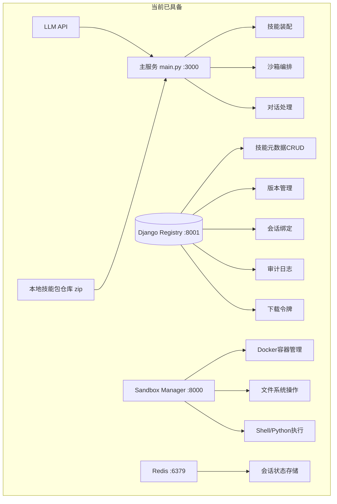
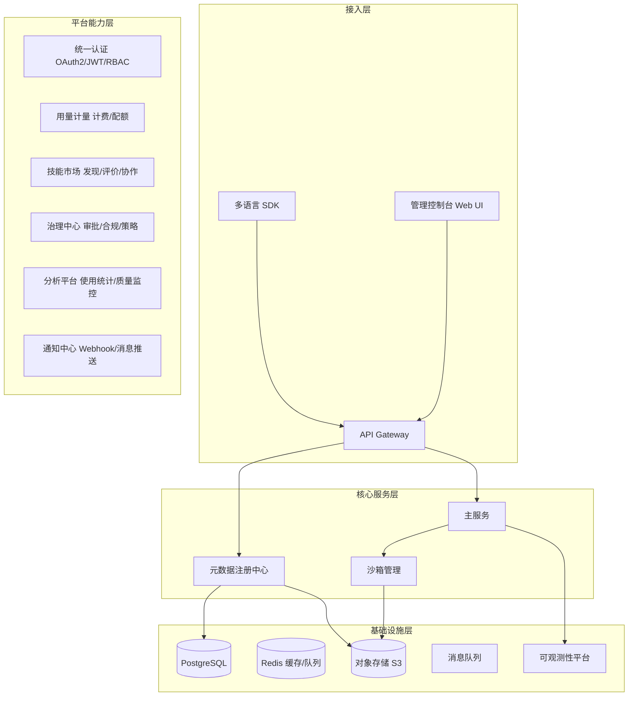
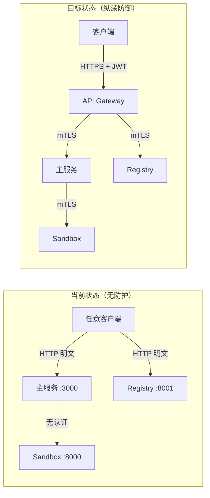
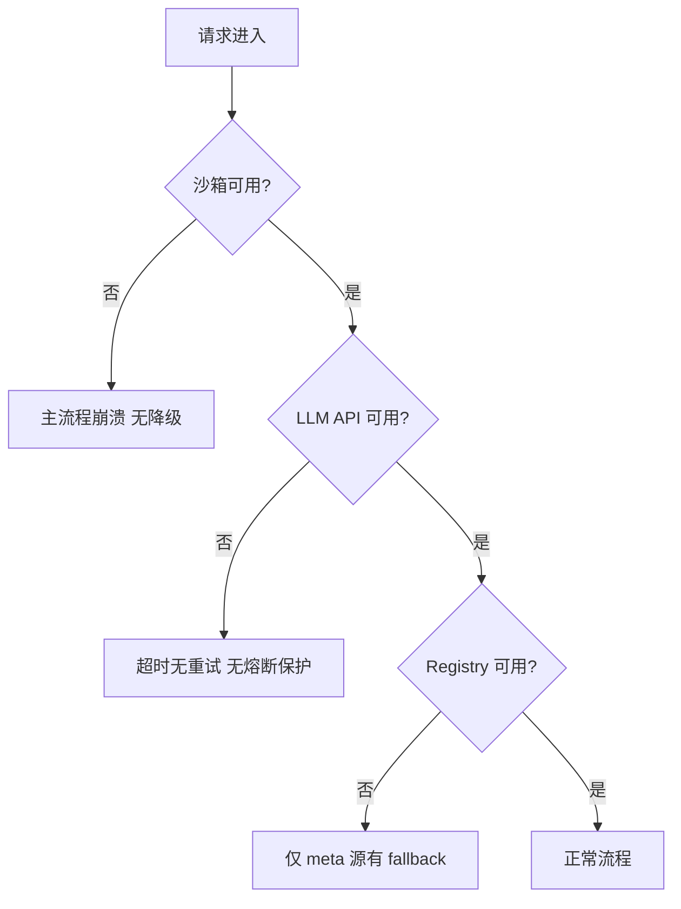
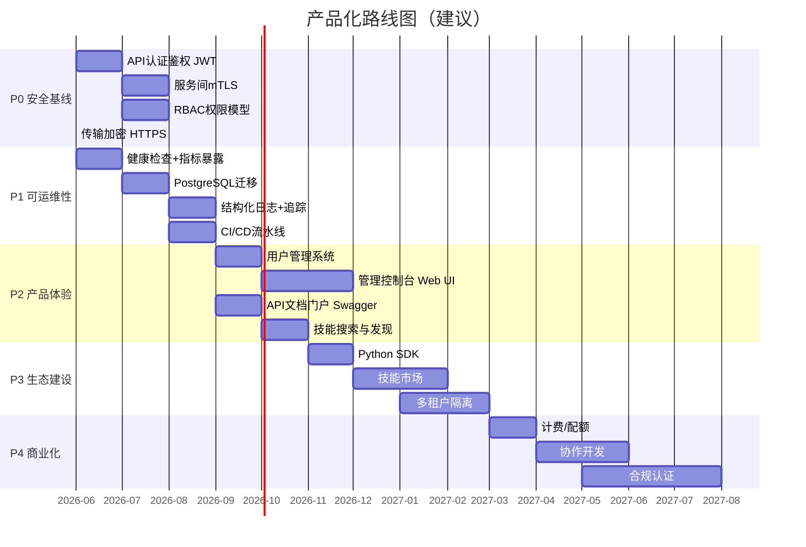
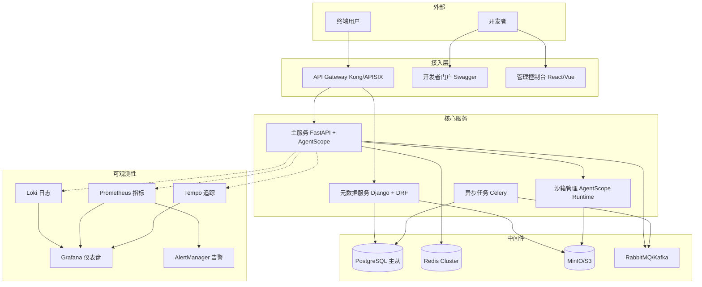
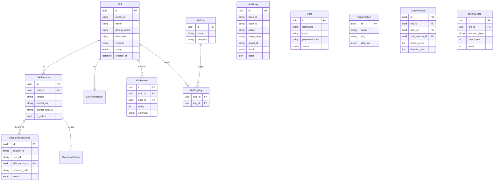

# open-skill-graph 产品化差距分析

> 分析日期：2026-05-13
> 视角：架构师 + 产品经理
> 状态：仅分析，不修改源码

---

## 一、项目现状画像



**已具备的核心能力：**
- 技能元数据的注册、版本化管理（Django Registry）
- 会话绑定与审计追踪
- Docker 沙箱隔离执行
- ReActAgent 计划型智能体（含 7 步技能创建流水线）
- 多模式运行（meta/registry/auto，json/redis 会话）
- 技能文件的上传、下载、编辑、列表
- 启动前依赖检查（preflight check）

---

## 二、目标产品画像（应达到的状态）



---

## 三、差距全景图

### 3.1 架构维度

#### 安全防护（🔴 最紧迫）



| 缺失项 | 严重度 | 当前表现 | 建议方案 |
|--------|:---:|----------|----------|
| API 认证 | 🔴 | 所有端点无需认证即可访问 | JWT + API Key 双模式 |
| 服务间鉴权 | 🟡 | sandbox/registry 无鉴权 | mTLS 或 shared secret |
| 传输加密 | 🟡 | 全链路 HTTP 明文 | TLS termination at gateway |
| 权限模型 | 🔴 | 无 RBAC | 基于 owner_id 的 ACL + RBAC |
| 密钥管理 | 🟠 | API Key 明文在 .env | 引入 Vault/KMS |
| 下载令牌 | 🟡 | 已实现但未接入主链路 | 完成分发闭环集成 |

#### 可观测性（🔴 运维盲区）

```
当前日志格式：
2026-05-13 10:00:00 - INFO - trace_abc123 - Built agent 'SKILL_AGENT_APP' with toolkit

缺失：
✗ 结构化日志（JSON 格式，可被 ELK/Loki 索引）
✗ 指标暴露（/metrics 端点，Prometheus 格式）
✗ 分布式追踪（OpenTelemetry 集成）
✗ 健康检查（/healthz, /readyz, /livez）
✗ 告警规则（错误率、延迟、沙箱可用性）
✗ 审计日志持久化策略（目前仅 Registry 有基础实现）
```

#### 数据架构（🟠 生产就绪差距）

| 问题 | 影响 |
|------|------|
| SQLite 不支持并发写入 | 无法支撑多实例部署 |
| 技能包存储在本地文件系统 | 无法跨实例共享，无备份 |
| 无数据库连接池管理 | 连接泄漏风险 |
| 无读写分离 | 报表查询影响在线业务 |
| 无数据备份恢复机制 | 灾难性数据丢失风险 |

#### 可靠性（🟡 故障场景薄弱）



缺失的韧性模式：熔断器/重试策略/优雅关闭/限流/沙箱TTL回收/降级方案

#### 工程化（🟡）

- 无 CI/CD 流水线
- 无自动化测试体系（仅一个手工测试脚本 test/test_api.py）
- 无容器化编排（K8s）
- 无 GitOps 部署方案

#### 代码质量（🟡 结构性债务）

- **Manager 类 828 行**：承担会话管理+技能关联+元数据获取+绑定管理+审计回写等过多职责
- **app.py**：端点定义、ProcessContext、文件上传/下载逻辑混在一起
- **service.py**：文件头注释为乱码（编码问题）
- **硬编码路径散布**：/workspace/skill/、/workspace/upload/ 出现在多处
- **mock.py**：装饰器与生产逻辑耦合，测试数据加载依赖本地文件
- **REACT_MAX_ITERS**：默认值 31 但 .env.example 设为 17，不一致
- **无统一异常处理层**：各层 try/except 返回格式不一致

---

### 3.2 产品维度

#### 用户体系（🔴）

- 无用户注册/登录
- 无组织/团队管理
- 无角色权限分配
- 无 SSO 集成

#### 技能市场（🔴 完全空白）

- 无技能发现/搜索
- 无技能分类/标签
- 无技能评价/打分
- 无使用热度排行
- 无技能依赖声明

#### 协作开发（🔴）

- 无技能 Fork/Clone
- 无协作编辑
- 无变更审批流
- 无版本对比 Diff

#### 运营管理（🟠）

- 无用量仪表盘
- 无配额/计费
- 无 SLA 承诺
- 无租户管理后台

#### 开发者体验（🟠）

- 无 API 文档门户（Swagger/Redoc）
- 无多语言 SDK
- 无交互式 Playground
- 无 Quick Start 教程
- 无技能模板库
- 无沙箱模板市场

#### 合规治理（🟡）

- 无数据留存策略
- 无审计报表导出
- 无合规认证（SOC2/GDPR）
- 无导出/导入迁移工具

---

## 四、竞争对比

| 维度 | open-skill-graph | OpenAI GPTs | Dify | Coze |
|------|:---:|:---:|:---:|:---:|
| 技能执行引擎 | ✅ 沙箱隔离 | ✅ 服务端 | ✅ Docker | ✅ 服务端 |
| 版本管理+审计 | ✅ 差异化优势 | ❌ | ✅ 基础 | ❌ |
| 用户体系 | ❌ | ✅ | ✅ | ✅ |
| 多租户 | ❌ | ✅ | ✅ | ✅ |
| 技能市场 | ❌ | ✅ GPT Store | ✅ | ✅ |
| 管理控制台 | ❌ | ✅ | ✅ | ✅ |
| SDK | ❌ | ❌ | ✅ | ✅ |
| 计费 | ❌ | ✅ | ✅ | ✅ |
| 团队协作 | ❌ | ❌ | ✅ | ✅ |
| 开源 | ✅ | ❌ | ✅ | ❌ |

**定位建议：** 差异化优势在于**企业级技能治理**（审计、版本、分发令牌、沙箱隔离）。应围绕此优势补齐周边体验。

---

## 五、分阶段产品化路线图建议



---

## 六、技术架构演进目标



---

## 七、数据模型演进



> 上半部分（Skill ~ AuditLog）为现有模型，下半部分（User ~ BillingQuota）为建议新增。

---

## 八、关键决策建议

### 立即需要做的（阻止性）

| # | 事项 | 理由 |
|---|------|------|
| 1 | 添加 API 认证层（至少 API Key） | 当前任何人都可以直接调用所有接口 |
| 2 | 添加健康检查端点 /healthz | 无健康检查，负载均衡器/K8s 无法工作 |
| 3 | 迁移 Registry 数据库到 PostgreSQL | SQLite 在并发写入和生产环境不可靠 |
| 4 | 完成分发闭环（sha256 + 令牌接入） | 技能包可能被篡改，缺少安全校验 |

### 短期应做的（竞争力）

| # | 事项 | 理由 |
|---|------|------|
| 5 | 实现用户注册/登录 + RBAC | 没有用户体系，无法区分不同用户/租户 |
| 6 | 构建管理控制台（最小可用） | Django Admin 不够，需要面向租户的界面 |
| 7 | 技能搜索与标签分类 | 技能多了以后，没有搜索等于不可用 |
| 8 | 统一错误码 + API 文档门户 | 开发者集成的第一道门槛 |

### 中期规划的（生态壁垒）

| # | 事项 | 理由 |
|---|------|------|
| 9 | 多租户隔离 | 企业客户的核心需求 |
| 10 | 技能市场 + 评价体系 | 形成技能生态飞轮 |
| 11 | 审批工作流 | 企业合规的刚性需求 |
| 12 | Python SDK | 降低集成门槛 |

---

## 九、风险清单

| 风险 | 概率 | 影响 | 缓解措施 |
|------|:---:|:---:|----------|
| 未授权访问导致数据泄露 | 高 | 严重 | P0 优先添加认证 |
| SQLite 并发写入损坏 | 中 | 严重 | 尽快迁移 PostgreSQL |
| Docker 依赖导致部署复杂 | 高 | 中 | 提供 docker-compose + K8s helm chart |
| 技能包本地存储单点故障 | 中 | 高 | 迁移到 S3/MinIO |
| 无监控导致故障发现延迟 | 高 | 中 | 接入 Prometheus + Grafana |
| AgentScope 框架升级不兼容 | 中 | 中 | 锁定版本 + 升级前集成测试 |
| LLM API 厂商锁定 | 低 | 中 | 保持 OpenAI 兼容接口抽象 |

---

## 十、总结

**open-skill-graph 当前处于「技术验证到产品化」的过渡阶段。**

- **做对了什么：** 核心链路（元数据 → 沙箱 → 执行 → 审计）架构合理，版本化、审计、分发令牌的设计有企业级基因
- **还差什么：** 安全防护几乎为零，可观测性空白，数据层未达到生产标准
- **缺失什么：** 完整的用户体系、管理界面、技能市场、开发者生态、计费系统

**一句话：这个项目有一个坚实的「引擎」，但现在还没有「车身」、「方向盘」和「仪表盘」。**

---

> 本文档由 DeepSeek TUI 生成。分析基于 2026-05-13 代码快照。所有 mermaid 图表可在支持 mermaid 渲染的 Markdown 阅读器中查看。
