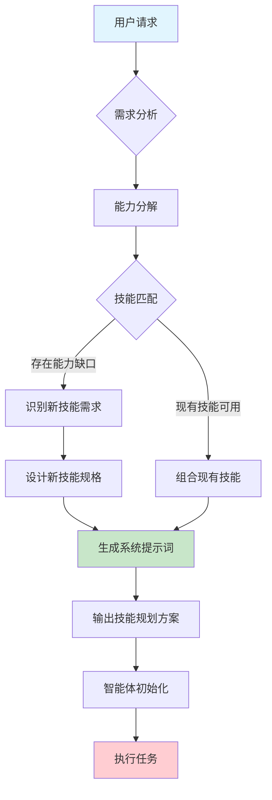
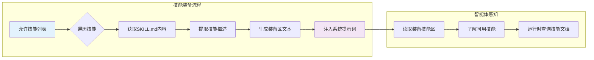
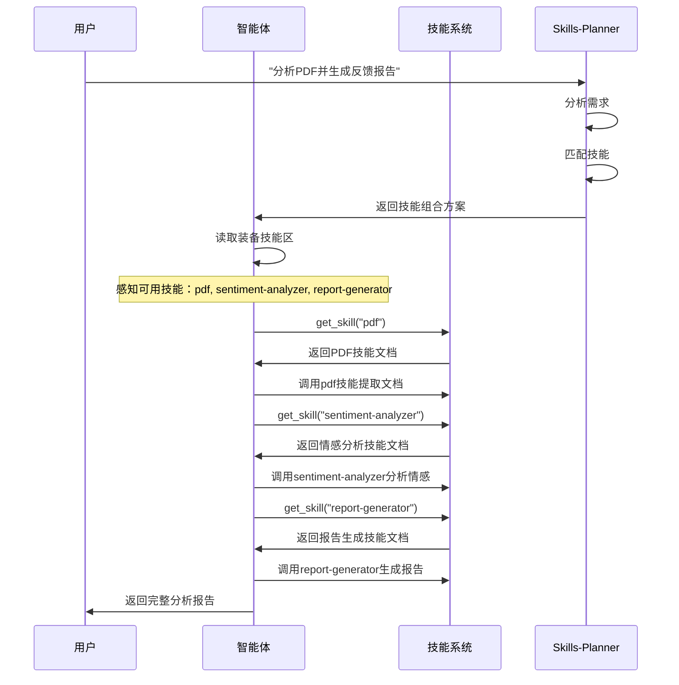
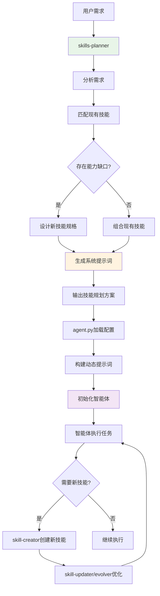
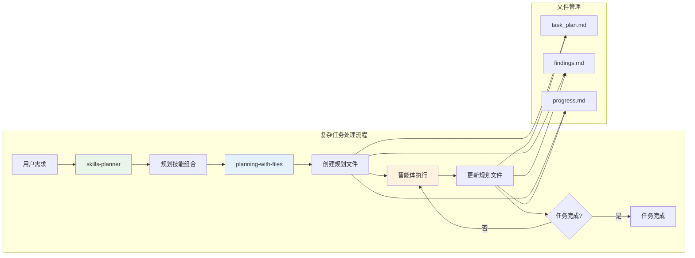
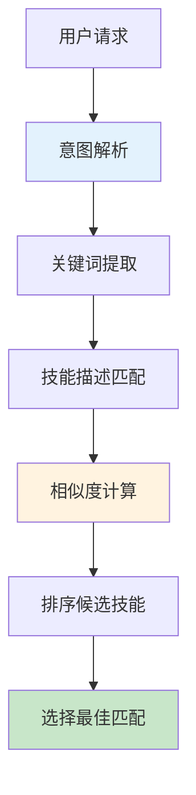
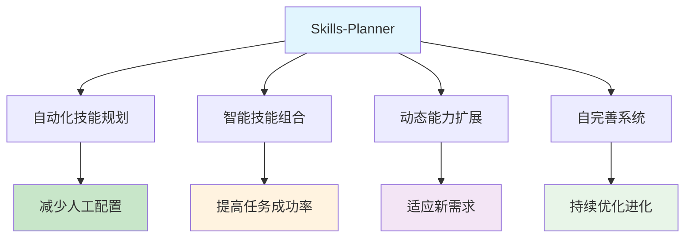

# Skills-Planner 技能作用详解

## 一、业务场景与触发机制

### 触发条件
`skills-planner` 是一个**元技能(meta skill)**，在以下场景被系统自动触发：

1. **用户需求设计** - 用户表述"我需要一个能做XX的代理"时
   - 示例："我需要一个能分析财务报表并生成报告的代理"
   - 示例："创建一个能处理客户支持工单的智能客服系统"

2. **技能组合规划** - 单个技能无法满足需求，需要组合多个技能时
   - 示例：PDF解析 + 数据分析 + 可视化 + 报告生成

3. **新技能需求识别** - 现有技能体系存在能力缺口时
   - 自动识别无法被现有技能覆盖的能力
   - 评估是否需要创建新技能

### 触发方式
- **自动加载**：在 `app/config.py` 中配置为 meta_skill，系统启动时加载
- **意图识别**：通过 LLM 分析用户请求，识别需要技能规划的场景
- **内部调用**：不是由用户直接调用，而是系统内部调用的元功能

### 技能规划流程图




## 二、技能组合机制

### 输出物结构

`skills-planner` 产生**三个核心输出物**，这些输出物直接构成智能体的工作指南：

#### 1. 选定技能清单（Curated Skills List）

```python
selected_skills = ["pdf", "sentiment-analyzer", "report-generator"]

# 这些技能被注入系统提示词的技能装备区
equipped_skills_section = """
## Equipped Skills
The following skills are equipped and ready to use:
- **pdf**: Extract text and tables from PDF documents
- **sentiment-analyzer**: Analyze sentiment and emotion in text  
- **report-generator**: Generate formatted reports from data
"""
```

#### 2. 系统提示词（System Prompt）- 核心组合机制

```markdown
You are a [任务类型] agent specialized in [领域].

## Your Capabilities
You have access to the following skills:
- **skill-name**: [技能描述]
- **skill-name2**: [技能描述]

## Workflow
When processing requests:
1. [第一步 - e.g., 使用 pdf 技能提取文档内容]
2. [第二步 - e.g., 使用 sentiment-analyzer 分析情感]
3. [第三步 - e.g., 使用 report-generator 生成报告]
4. [第四步 - e.g., 呈现最终结果]

## Guidelines
- [使用规则1 - e.g., 总是先验证输入]
- [使用规则2 - e.g., 遇到错误时优雅处理]

## Output Format
[指定输出格式 - e.g., 报告包含执行摘要、详细分析、建议]
```

#### 3. 技能使用配置（Runtime Configuration）

```python
config = {
    "skills": ["skill-a", "skill-b"],           # 允许的技能列表
    "allowed_tools": ["list_skills", "get_skill"],  # 允许的工具
    "system_prompt": "定制系统提示词",         # 组合后的系统提示词
    "custom_instructions": "额外指令",          # 补充说明
    "executor_name": "base"                     # 执行环境
}
```

---

## 三、智能体感知机制

### 1. 系统提示词注入（Dynamic Prompt Injection）

在 `app/agent/agent.py` 中实现：

```python
def _initialize():
    # 构建动态系统提示词
    skills_section = self._build_equipped_skills_section()
    mcp_section = _build_mcp_tools_section(self.tools)
    
    self.system_prompt = BASE_SYSTEM_PROMPT.format(
        current_date=current_date,
        custom_instructions=custom_instructions,
        equipped_skills_section=skills_section,  # 装备技能区
        mcp_tools_section=mcp_section,
        workspace_dir=str(self.workspace.workspace_dir),
        skills_dir=_SKILLS_DIR,
    )
```

### 2. 技能装备区构建（Skill Equipping）



```python
def _build_equipped_skills_section(self) -> str:
    """Build the equipped skills section for system prompt."""
    from app.agent.tools import _fetch_skill_content_from_registry
    
    if not self.allowed_skills:
        return "No skills equipped. Use `list_skills` to see available skills."
    
    lines = ["The following skills are equipped and ready to use:\n"]
    
    for skill_name in self.allowed_skills:
        content = _fetch_skill_content_from_registry(skill_name)
        lines.append(f"- **{skill_name}**: {content[:200]}...")
    
    return "\n".join(lines)
```

### 3. 运行时技能查询接口

智能体在运行时可以动态查询技能：

```python
# 查看所有可用技能
list_skills()  # 返回 {"skills": [{"name": "...", "description": "..."}], "count": N}

# 获取具体技能文档
get_skill("skill-name")  # 返回技能的 SKILL.md 内容
```

---

## 四、工作示例：文档分析代理

### 用户需求
> "创建一个能分析PDF文档并生成用户反馈报告的代理"

### Skills-Planner 组合过程

**步骤1：能力分析**
```
所需核心能力：
✗ 1. PDF读取/解析
✓ 2. 文本分析（Claude原生）
✗ 3. 情感分析
✗ 4. 报告生成
```

**步骤2：技能匹配**
```
- PDF解析 → "pdf" 技能 ✓
- 情感分析 → "sentiment-analyzer" 技能 ✓  
- 报告生成 → 无直接匹配 ✗（需要新建）
```

**步骤3：生成输出物**

**输出物1 - 技能清单**:
```yaml
existing_skills: ["pdf", "sentiment-analyzer"]
new_skills_needed: ["report-generator"]
```

**输出物2 - 系统提示词**:
```markdown
You are a Document Analysis Agent specialized in PDF processing 
and feedback report generation.

## Your Capabilities
- **pdf**: Extract text and tables from PDF documents
- **sentiment-analyzer**: Analyze sentiment and emotions in text
- **report-generator**: Create formatted reports with insights

## Workflow
1. Use pdf skill to extract content from the PDF document
2. Analyze the extracted text to identify feedback sections
3. Use sentiment-analyzer to assess sentiment of feedback
4. Use report-generator to create a comprehensive feedback report
5. Present the report with key findings and recommendations

## Guidelines
- Always validate PDF before processing
- Extract all text and tables systematically
- Analyze sentiment for each feedback section individually
- Include numerical summaries and visualizations in reports

## Output Format
Provide a structured report with:
- Executive Summary
- Sentiment Analysis Results
- Key Findings
- Recommendations
```

**输出物3 - 配置**:
```python
config = {
    "skills": ["pdf", "sentiment-analyzer", "report-generator"],
    "system_prompt": "上述系统提示词",
    "allowed_tools": ["list_skills", "get_skill", "execute_code", "bash"]
}
```

### 智能体执行流程



### 智能体运行时感知
```python
# 智能体运行时感知到的能力

1. 读取装备技能区
   → 知道有3个可用技能及其功能

2. 需要时查询技能文档
   → get_skill("pdf") → 了解pdf技能的具体用法
   
3. 按Workflow执行任务
   → 先调用pdf提取文档
   → 再调用sentiment-analyzer分析
   → 最后调用report-generator生成报告

4. 遵循Guidelines约束
   → 验证PDF、系统提取、生成可视化等
```

---

## 五、关键设计原则

### 最小化原则（Minimalism）
- 仅创建提供显著价值的新技能
- 优先考虑现有技能的组合使用
- 避免重复Claude已具备的能力

### 可重用性原则（Reusability）
- 新技能设计要适用于多个场景
- 技能边界清晰、职责单一
- 提供通用的输入输出接口

### 组合优先原则（Composition over Creation）
- 优先组合现有技能解决问题
- 只有当组合无法满足时才创建新技能
- 通过系统提示词指导技能协作流程

### 智能体感知透明化
- 所有装备技能在系统提示词中明确列出
- 提供技能查询接口供运行时探索
- 生成详细的工作流程和使用指南

---

## 六、与其他元技能的协作

### Skills-Planner 工作流



### 与 Planning-With-Files 的协作



---

## 七、技术实现细节

### 核心数据结构

```python
# 技能规划器输出数据结构
class SkillPlanningResult:
    existing_skills: List[str]          # 选定的现有技能
    new_skills_needed: List[dict]       # 需要创建的新技能规格
    system_prompt: str                   # 完整的系统提示词
    workflow: List[str]                  # 执行步骤
    guidelines: List[str]               # 使用规则
    output_format: str                   # 输出格式要求
    config: dict                         # 运行时配置
```

### 技能匹配算法



### 系统提示词模板结构

```markdown
## 基础模板结构
You are a [AGENT_ROLE] agent specialized in [DOMAIN].

## Equipped Skills
[装备技能区 - 动态生成]

## Workflow
1. [第一步: 理解输入]
2. [第二步: 调用相关技能]
3. [第三步: 处理结果]
4. [第四步: 生成输出]

## Guidelines
- [规则1: 输入验证]
- [规则2: 错误处理]
- [规则3: 质量保证]

## Output Format
[结构化输出格式]
```

## 八、总结

Skills-Planner 的核心价值在于**将抽象的用户需求转化为智能体可执行的具体方案**，其输出物直接构成了智能体的工作指南和能力清单。通过动态系统提示词、明确的技能装备区和详细的执行流程，智能体能够清晰感知：

1. **有什么技能可用** - 通过装备技能区了解每个技能的功能
2. **如何使用这些技能** - 通过Workflow和Guidelines获得操作指南
3. **如何协作完成任务** - 通过组合流程理解技能间的协作关系

这种设计使得整个技能管理系统具备**自完善**和**自适应**的能力，能够根据用户需求自动分析和扩展技能体系，真正实现了"用AI构建AI"的元循环。

### 核心优势


