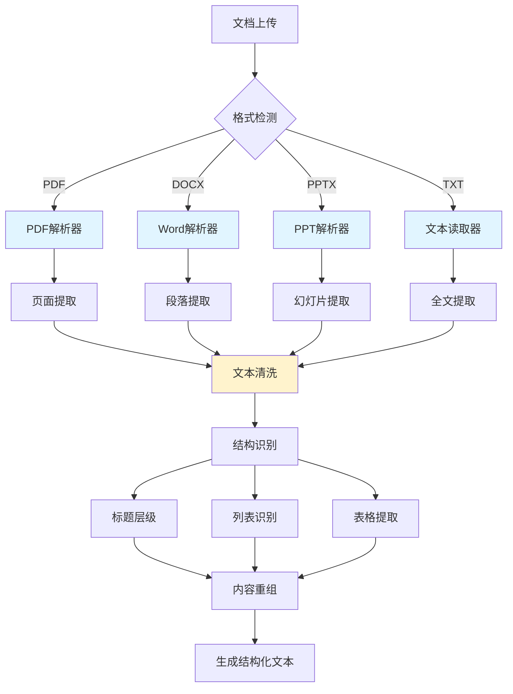
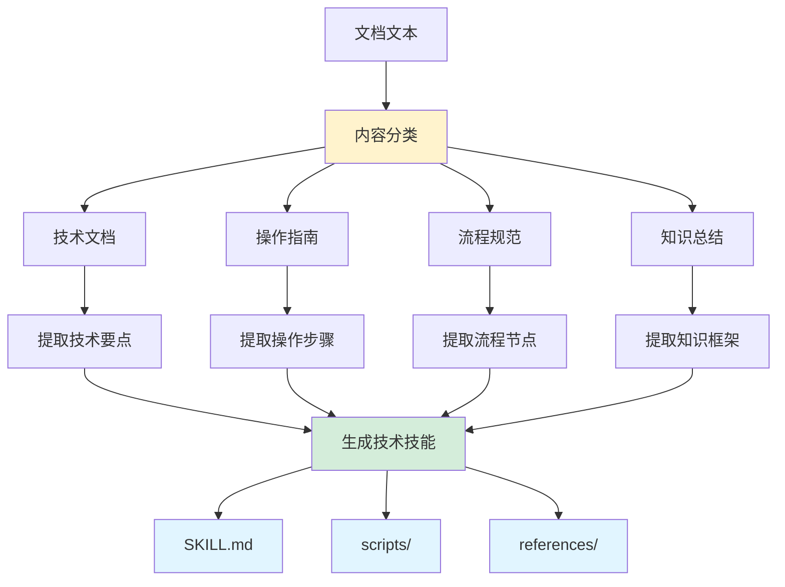
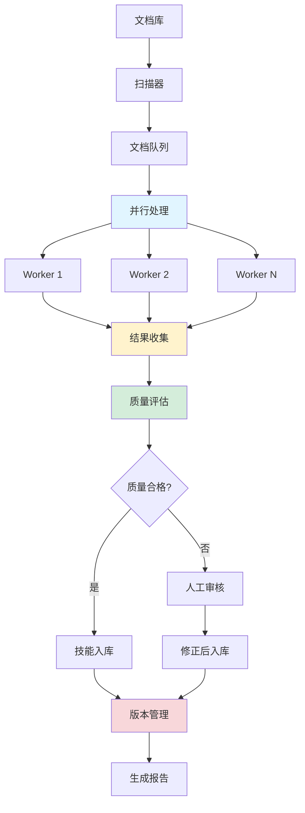

# 办公文档技能创建技术详解

## 概述

本文档深入解析 SkillNet 如何从办公文档（PDF、Word、PowerPoint）创建技能，提供企业级实施方案，帮助企业将存量文档资产转化为可复用的 AI 技能。

## 一、核心技术与架构

### 1.1 技术架构图


### 1.2 支持的文档格式

| 格式 | 扩展名 | 解析技术 | 特点 |
|------|--------|----------|------|
| **PDF** | .pdf | PyPDF2/pdfplumber | 复杂布局、表格、图片 |
| **Word** | .docx | python-docx | 结构化文本、样式 |
| **PowerPoint** | .pptx | python-pptx | 幻灯片结构、备注 |
| **文本** | .txt | 原生读取 | 简单高效 |

## 二、文档解析与文本提取

### 2.1 文档解析流程图



### 2.2 文档解析实现

**核心解析器类：**

```python
import os
import re
from pathlib import Path
from typing import Dict, List, Optional
import PyPDF2
import docx
from pptx import Presentation
import logging

logger = logging.getLogger(__name__)

class DocumentParser:
    """统一文档解析器"""
    
    # 支持的文件扩展名
    SUPPORTED_EXTENSIONS = {
        '.pdf': 'pdf',
        '.docx': 'docx', 
        '.pptx': 'pptx',
        '.txt': 'txt'
    }
    
    def __init__(self, max_file_size_mb: int = 50):
        self.max_file_size = max_file_size_mb * 1024 * 1024  # 转换为字节
    
    def is_supported(self, file_path: str) -> bool:
        """检查文件是否支持"""
        ext = Path(file_path).suffix.lower()
        return ext in self.SUPPORTED_EXTENSIONS
    
    def extract_text(self, file_path: str) -> str:
        """统一文本提取接口"""
        
        # 检查文件大小
        if os.path.getsize(file_path) > self.max_file_size:
            raise ValueError(f"文件过大 (>{self.max_file_size // (1024*1024)}MB)")
        
        ext = Path(file_path).suffix.lower()
        
        try:
            if ext == '.pdf':
                return self._extract_from_pdf(file_path)
            elif ext == '.docx':
                return self._extract_from_docx(file_path)
            elif ext == '.pptx':
                return self._extract_from_pptx(file_path)
            elif ext == '.txt':
                return self._extract_from_txt(file_path)
            else:
                raise ValueError(f"不支持的文件格式: {ext}")
                
        except Exception as e:
            logger.error(f"文档提取失败 {file_path}: {e}")
            raise

    def _extract_from_pdf(self, file_path: str) -> str:
        """从PDF提取文本"""
        text_parts = []
        
        with open(file_path, 'rb') as file:
            pdf_reader = PyPDF2.PdfReader(file)
            
            # 提取每页文本
            for page_num, page in enumerate(pdf_reader.pages):
                try:
                    page_text = page.extract_text()
                    if page_text.strip():
                        text_parts.append(f"=== 第{page_num + 1}页 ===")
                        text_parts.append(page_text.strip())
                except Exception as e:
                    logger.warning(f"第{page_num + 1}页提取失败: {e}")
                    continue
        
        return '\n\n'.join(text_parts)

    def _extract_from_docx(self, file_path: str) -> str:
        """从Word文档提取文本"""
        doc = docx.Document(file_path)
        text_parts = []
        
        # 提取段落
        for para in doc.paragraphs:
            if para.text.strip():
                text_parts.append(para.text.strip())
        
        # 提取表格内容
        for table in doc.tables:
            text_parts.append("=== 表格 ===")
            for row in table.rows:
                row_text = []
                for cell in row.cells:
                    if cell.text.strip():
                        row_text.append(cell.text.strip())
                if row_text:
                    text_parts.append(" | ".join(row_text))
        
        return '\n\n'.join(text_parts)

    def _extract_from_pptx(self, file_path: str) -> str:
        """从PowerPoint提取文本"""
        prs = Presentation(file_path)
        text_parts = []
        
        for slide_num, slide in enumerate(prs.slides):
            slide_text = []
            
            # 提取形状中的文本
            for shape in slide.shapes:
                if hasattr(shape, "text") and shape.text.strip():
                    slide_text.append(shape.text.strip())
            
            # 提取备注
            if slide.has_notes_slide and slide.notes_slide.notes_text_frame:
                notes_text = slide.notes_slide.notes_text_frame.text
                if notes_text.strip():
                    slide_text.append(f"备注: {notes_text.strip()}")
            
            if slide_text:
                text_parts.append(f"=== 幻灯片 {slide_num + 1} ===")
                text_parts.extend(slide_text)
        
        return '\n\n'.join(text_parts)

    def _extract_from_txt(self, file_path: str) -> str:
        """从文本文件提取"""
        try:
            with open(file_path, 'r', encoding='utf-8') as f:
                return f.read()
        except UnicodeDecodeError:
            # 尝试其他编码
            with open(file_path, 'r', encoding='gbk', errors='ignore') as f:
                return f.read()

# 使用示例
def test_document_parser():
    parser = DocumentParser()
    
    test_files = [
        "技术手册.pdf",
        "操作指南.docx", 
        "培训材料.pptx",
        "配置文件.txt"
    ]
    
    for file_path in test_files:
        try:
            if parser.is_supported(file_path):
                text = parser.extract_text(file_path)
                print(f"✅ {file_path}: 提取了 {len(text)} 字符")
            else:
                print(f"❌ {file_path}: 不支持的格式")
        except Exception as e:
            print(f"❌ {file_path}: 错误 - {e}")
```

## 三、LLM Prompt 工程与技能生成

### 3.1 Prompt 模板设计

**系统Prompt（引导LLM行为）：**

```python
OFFICE_SKILL_SYSTEM_PROMPT = """You are an expert Technical Writer specializing in creating Skills for AI agents.
Your task is to analyze text content extracted from an office document (PDF, PPT, or Word) and convert it into a structured skill package.

CRITICAL REQUIREMENTS:
1. Identify the core knowledge, procedures, or guidelines from the document
2. Structure the content as a reusable AI skill
3. Extract actionable instructions that an AI agent can follow
4. Preserve key information while organizing it into the skill format
5. Generate appropriate scripts if the document describes code procedures
6. Create reference files for supplementary information

Output files in parseable format with ## FILE: markers."""
```

**用户Prompt（提供具体上下文）：**

```python
    OFFICE_SKILL_USER_PROMPT_TEMPLATE = """
    Your task is to convert the following document content into a structured skill package.

    # Input: Document Content

    **Source File:** {filename}
    **File Type:** {file_type}

    ## Extracted Text Content:
    {document_content}

    # Skill Structure Standard
    You must output the skill using the following directory structure:

    ```text
    skill-name/
    ├── SKILL.md (required)
    │   ├── YAML frontmatter metadata (required)
    │   │   ├── name: (required)
    │   │   └── description: (required)
    │   └── Markdown instructions (required)
    └── Bundled Resources (optional but recommended)
        ├── scripts/          - Executable code if applicable
        └── references/       - Additional documentation or data
    ```

    # Content Analysis Guidelines

    1. **Identify the Skill Name**: Derive from document title or main topic
    2. **Create Description**: Write a "when-to-use" trigger statement
    3. **Extract Procedures**: Convert step-by-step instructions into actionable format
    4. **Identify Code/Commands**: If the document contains code, create scripts/
    5. **Supplementary Info**: Move detailed references to references/

    # SKILL.md Requirements

    ## YAML Frontmatter (REQUIRED)
    ```yaml
    ---
    name: skill-name-in-kebab-case
    description: When-to-use trigger statement explaining when this skill should be activated
    ---
    ```

    ## Content Sections to Include:
    - **Overview**: Brief summary of what this skill covers
    - **When to Use**: Clear triggers for skill activation
    - **Prerequisites**: Any required knowledge, tools, or setup
    - **Instructions/Procedures**: Main actionable content from document
    - **Examples**: Practical examples if available in source
    - **References**: Links to additional resources mentioned

    # Output Format (STRICT)
    For every file, use this exact pattern:

    ## FILE: <skill-name>/<path_to_file>
    ```<language_tag>
    <file_content_here>
    ```

    Generate a complete, practical skill package from this document content.
    Focus on making the knowledge actionable for an AI agent."""
```

### 3.2 LLM 分析流程

**文档内容分析步骤：**



### 3.3 技能生成实现

**核心生成逻辑：**

```python
class OfficeSkillCreator:
    """办公文档技能创建器"""
    
    def __init__(self, api_key: str, base_url: str = None):
        self.parser = DocumentParser()
        self.client = OpenAI(
            api_key=api_key,
            base_url=base_url or "https://api.openai.com/v1"
        )
    
    def create_from_office(self, file_path: str, 
                          output_dir: str = "./generated_skills") -> List[str]:
        """
        从办公文档创建技能
        
        Args:
            file_path: 文档路径
            output_dir: 输出目录
            
        Returns:
            生成的技能目录列表
        """
        logger.info(f"开始处理文档: {file_path}")
        
        # 1. 解析文档
        try:
            document_content = self.parser.extract_text(file_path)
            if not document_content.strip():
                logger.warning("文档内容为空")
                return []
        except Exception as e:
            logger.error(f"文档解析失败: {e}")
            return []
        
        # 2. 构建 Prompt
        filename = os.path.basename(file_path)
        file_type = Path(file_path).suffix.upper()
        
        system_prompt = OFFICE_SKILL_SYSTEM_PROMPT
        user_prompt = OFFICE_SKILL_USER_PROMPT_TEMPLATE.format(
            filename=filename,
            file_type=file_type,
            document_content=document_content[:50000]  # 限制长度
        )
        
        # 3. 调用 LLM
        try:
            response = self.client.chat.completions.create(
                model="gpt-4o",
                messages=[
                    {"role": "system", "content": system_prompt},
                    {"role": "user", "content": user_prompt}
                ],
                temperature=0.3
            )
            
            generated_content = response.choices[0].message.content
            
            # 4. 解析并保存文件
            created_files = self._parse_and_save_files(
                generated_content, output_dir
            )
            
            # 5. 提取技能目录
            skill_dirs = self._extract_skill_directories(
                created_files, output_dir
            )
            
            logger.info(f"成功创建 {len(skill_dirs)} 个技能")
            return skill_dirs
            
        except Exception as e:
            logger.error(f"技能生成失败: {e}")
            return []
    
    def _parse_and_save_files(self, content: str, 
                             output_base_dir: str) -> List[str]:
        """解析 LLM 输出并保存文件"""
        created_files = []
        
        # 正则表达式匹配文件块
        file_pattern = re.compile(
            r'##\s*FILE:\s*(.+?)\s*\n```(?:\w*)\n(.*?)```',
            re.DOTALL
        )
        
        matches = file_pattern.findall(content)
        
        for file_path, file_content in matches:
            file_path = file_path.strip()
            full_path = os.path.join(output_base_dir, file_path)
            
            # 创建目录
            os.makedirs(os.path.dirname(full_path), exist_ok=True)
            
            try:
                with open(full_path, 'w', encoding='utf-8') as f:
                    f.write(file_content)
                
                created_files.append(full_path)
                logger.info(f"保存文件: {full_path}")
                
            except IOError as e:
                logger.error(f"保存文件失败 {full_path}: {e}")
        
        return created_files
    
    def _extract_skill_directories(self, created_files: List[str], 
                                  output_dir: str) -> List[str]:
        """从创建的文件中提取技能目录"""
        skill_dirs = set()
        
        for file_path in created_files:
            rel_path = os.path.relpath(file_path, output_dir)
            # 提取顶级目录作为技能目录
            skill_dir = rel_path.split(os.sep)[0]
            skill_dirs.add(os.path.join(output_dir, skill_dir))
        
        return list(skill_dirs)

# 使用示例
def create_skill_from_document():
    creator = OfficeSkillCreator(api_key="your-api-key")
    
    # 创建单个技能
    skill_dirs = creator.create_from_office(
        "公司技术手册.pdf",
        output_dir="./company_skills"
    )
    
    print(f"成功创建技能: {skill_dirs}")

if __name__ == "__main__":
    create_skill_from_document()
```

## 四、企业级批量处理方案

### 4.1 批量处理架构



### 4.2 企业级批量处理器

**EnterpriseSkillCreator 实现：**

```python
import asyncio
import concurrent.futures
from dataclasses import dataclass
from typing import List, Dict
import pandas as pd
from datetime import datetime

@dataclass
class ProcessingResult:
    """处理结果数据类"""
    file_path: str
    skill_name: str
    status: str  # success, failed, skipped
    error_message: str = ""
    quality_score: float = 0.0
    processing_time: float = 0.0
    token_usage: int = 0

class EnterpriseSkillCreator:
    """企业级批量技能创建器"""
    
    def __init__(self, api_key: str, max_workers: int = 4):
        self.creator = OfficeSkillCreator(api_key)
        self.max_workers = max_workers
        self.results: List[ProcessingResult] = []
    
    def batch_create_from_directory(self, 
                                   input_dir: str,
                                   output_dir: str,
                                   file_pattern: str = "*.pdf,*.docx,*.pptx") -> Dict:
        """
        批量从目录创建技能
        
        Args:
            input_dir: 输入文档目录
            output_dir: 输出技能目录
            file_pattern: 文件模式
            
        Returns:
            处理统计信息
        """
        logger.info(f"开始批量处理目录: {input_dir}")
        
        # 1. 扫描文档
        documents = self._scan_documents(input_dir, file_pattern)
        logger.info(f"找到 {len(documents)} 个文档")
        
        if not documents:
            return {"status": "no_documents", "count": 0}
        
        # 2. 并行处理
        start_time = datetime.now()
        
        with concurrent.futures.ThreadPoolExecutor(max_workers=self.max_workers) as executor:
            futures = []
            
            for doc_path in documents:
                future = executor.submit(
                    self._process_single_document,
                    doc_path,
                    output_dir
                )
                futures.append(future)
            
            # 收集结果
            for future in concurrent.futures.as_completed(futures):
                try:
                    result = future.result()
                    self.results.append(result)
                except Exception as e:
                    logger.error(f"处理任务失败: {e}")
        
        # 3. 生成报告
        processing_time = (datetime.now() - start_time).total_seconds()
        report = self._generate_batch_report(processing_time)
        
        logger.info(f"批量处理完成，耗时 {processing_time:.2f} 秒")
        return report
    
    def _scan_documents(self, input_dir: str, 
                       file_pattern: str) -> List[str]:
        """扫描文档"""
        patterns = [p.strip() for p in file_pattern.split(',')]
        documents = []
        
        for pattern in patterns:
            ext = pattern.replace('*', '')
            for file_path in Path(input_dir).rglob(f"*{ext}"):
                if file_path.is_file():
                    documents.append(str(file_path))
        
        return sorted(documents)
    
    def _process_single_document(self, 
                                file_path: str,
                                output_dir: str) -> ProcessingResult:
        """处理单个文档"""
        start_time = datetime.now()
        
        try:
            # 提取文件名作为技能名
            skill_name = Path(file_path).stem.replace(' ', '-').lower()
            
            # 创建子目录
            skill_output_dir = os.path.join(output_dir, skill_name)
            os.makedirs(skill_output_dir, exist_ok=True)
            
            # 创建技能
            skill_dirs = self.creator.create_from_office(
                file_path,
                skill_output_dir
            )
            
            processing_time = (datetime.now() - start_time).total_seconds()
            
            if skill_dirs:
                # 质量评估
                quality_score = self._evaluate_quality(skill_dirs[0])
                
                return ProcessingResult(
                    file_path=file_path,
                    skill_name=skill_name,
                    status="success",
                    quality_score=quality_score,
                    processing_time=processing_time
                )
            else:
                return ProcessingResult(
                    file_path=file_path,
                    skill_name=skill_name,
                    status="failed",
                    error_message="技能生成失败",
                    processing_time=processing_time
                )
                
        except Exception as e:
            processing_time = (datetime.now() - start_time).total_seconds()
            
            return ProcessingResult(
                file_path=file_path,
                skill_name=Path(file_path).stem,
                status="failed",
                error_message=str(e),
                processing_time=processing_time
            )
    
    def _evaluate_quality(self, skill_dir: str) -> float:
        """简单质量评估"""
        try:
            # 检查 SKILL.md 是否存在
            skill_md_path = os.path.join(skill_dir, "SKILL.md")
            if not os.path.exists(skill_md_path):
                return 0.0
            
            # 读取并分析
            with open(skill_md_path, 'r', encoding='utf-8') as f:
                content = f.read()
            
            # 基础质量指标
            has_frontmatter = content.startswith('---')
            has_description = 'description:' in content
            has_instructions = len(content.split('\n')) > 20
            has_scripts = os.path.exists(os.path.join(skill_dir, "scripts"))
            
            # 计算得分
            score = 0.0
            if has_frontmatter: score += 0.25
            if has_description: score += 0.25
            if has_instructions: score += 0.25
            if has_scripts: score += 0.25
            
            return score
            
        except Exception:
            return 0.0
    
    def _generate_batch_report(self, total_time: float) -> Dict:
        """生成处理报告"""
        # 统计结果
        success_count = sum(1 for r in self.results if r.status == "success")
        failed_count = sum(1 for r in self.results if r.status == "failed")
        
        # 计算平均质量分
        quality_scores = [r.quality_score for r in self.results if r.status == "success"]
        avg_quality = sum(quality_scores) / len(quality_scores) if quality_scores else 0.0
        
        # 生成详细报告
        report = {
            "total_documents": len(self.results),
            "successful": success_count,
            "failed": failed_count,
            "success_rate": success_count / len(self.results) if self.results else 0.0,
            "average_quality": avg_quality,
            "total_time": total_time,
            "average_time_per_doc": total_time / len(self.results) if self.results else 0.0,
            "detailed_results": [
                {
                    "file": r.file_path,
                    "skill": r.skill_name,
                    "status": r.status,
                    "quality": r.quality_score,
                    "time": r.processing_time,
                    "error": r.error_message
                }
                for r in self.results
            ]
        }
        
        # 保存报告到文件
        report_file = f"batch_processing_report_{datetime.now().strftime('%Y%m%d_%H%M%S')}.json"
        with open(report_file, 'w', encoding='utf-8') as f:
            json.dump(report, f, indent=2, ensure_ascii=False)
        
        return report

# 企业级使用示例
def enterprise_batch_example():
    """企业级批量处理示例"""
    
    creator = EnterpriseSkillCreator(
        api_key="your-api-key",
        max_workers=4  # 并行工作线程数
    )
    
    # 批量处理
    report = creator.batch_create_from_directory(
        input_dir="./company_documents",
        output_dir="./company_skills",
        file_pattern="*.pdf,*.docx,*.pptx"
    )
    
    # 输出摘要
    print(f"批量处理完成:")
    print(f"- 总文档数: {report['total_documents']}")
    print(f"- 成功: {report['successful']} ({report['success_rate']:.1%})")
    print(f"- 失败: {report['failed']}")
    print(f"- 平均质量: {report['average_quality']:.2f}")
    print(f"- 总耗时: {report['total_time']:.2f}秒")
    
    # 显示失败案例
    if report['failed'] > 0:
        print("\n失败案例:")
        for result in report['detailed_results']:
            if result['status'] == 'failed':
                print(f"- {result['file']}: {result['error']}")

if __name__ == "__main__":
    enterprise_batch_example()
```

## 五、质量评估与优化策略

### 5.1 质量评估体系

**多维度质量评估：**

```python
class DocumentQualityEvaluator:
    """文档质量评估器"""
    
    def __init__(self, api_key: str):
        self.client = OpenAI(api_key=api_key)
    
    def evaluate_document_quality(self, document_path: str) -> Dict:
        """评估文档质量"""
        
        # 基础指标
        basic_metrics = self._calculate_basic_metrics(document_path)
        
        # 内容质量（使用LLM）
        content_quality = self._evaluate_content_quality(document_path)
        
        # 结构化程度
        structure_score = self._evaluate_structure(document_path)
        
        return {
            "basic_metrics": basic_metrics,
            "content_quality": content_quality,
            "structure_score": structure_score,
            "overall_score": self._calculate_overall_score(
                basic_metrics, content_quality, structure_score
            )
        }
    
    def _calculate_basic_metrics(self, file_path: str) -> Dict:
        """计算基础指标"""
        stats = os.stat(file_path)
        ext = Path(file_path).suffix.lower()
        
        metrics = {
            "file_size": stats.st_size,
            "file_type": ext,
            "modification_time": stats.st_mtime,
            "page_count": 0,
            "word_count": 0,
            "has_images": False,
            "has_tables": False
        }
        
        # 根据文件类型计算额外指标
        if ext == '.pdf':
            try:
                with open(file_path, 'rb') as f:
                    pdf = PyPDF2.PdfReader(f)
                    metrics["page_count"] = len(pdf.pages)
            except:
                pass
                
        elif ext == '.docx':
            try:
                doc = docx.Document(file_path)
                metrics["page_count"] = len(doc.paragraphs) // 50  # 估算
                metrics["word_count"] = sum(len(p.text.split()) for p in doc.paragraphs)
                metrics["has_tables"] = len(doc.tables) > 0
            except:
                pass
                
        elif ext == '.pptx':
            try:
                prs = Presentation(file_path)
                metrics["page_count"] = len(prs.slides)
            except:
                pass
        
        return metrics
    
    def _evaluate_content_quality(self, file_path: str) -> Dict:
        """使用LLM评估内容质量"""
        
        # 提取文本样本
        parser = DocumentParser()
        text_sample = parser.extract_text(file_path)[:5000]  # 限制长度
        
        prompt = f"""
        请评估以下文档内容的质量，从以下维度打分（0-1分）：
        
        1. 内容完整性 - 是否包含完整的信息
        2. 结构化程度 - 是否有清晰的结构
        3. 可操作性 - 是否包含可执行的指导
        4. 专业性 - 内容是否专业准确
        5. 实用性 - 对AI代理是否有用
        
        文档内容：
        {text_sample}
        
        返回格式：
        {{
          "completeness": 0.8,
          "structure": 0.7,
          "actionability": 0.6,
          "professionalism": 0.9,
          "practicality": 0.7,
          "reasoning": "简要说明"
        }}
        """
        
        try:
            response = self.client.chat.completions.create(
                model="gpt-4o-mini",
                messages=[{"role": "user", "content": prompt}],
                temperature=0.3
            )
            
            result = json.loads(response.choices[0].message.content)
            return result
            
        except Exception as e:
            logger.error(f"内容质量评估失败: {e}")
            return {
                "completeness": 0.5,
                "structure": 0.5,
                "actionability": 0.5,
                "professionalism": 0.5,
                "practicality": 0.5,
                "reasoning": "评估失败"
            }
    
    def _evaluate_structure(self, file_path: str) -> float:
        """评估文档结构化程度"""
        parser = DocumentParser()
        text = parser.extract_text(file_path)
        
        # 结构指标
        has_headers = bool(re.search(r'^#{1,6}\s+', text, re.MULTILINE))
        has_lists = bool(re.search(r'^[\-\*]\s+', text, re.MULTILINE))
        has_numbers = bool(re.search(r'^\d+\.\s+', text, re.MULTILINE))
        has_tables = "表格" in text or "table" in text.lower()
        
        # 计算结构分
        structure_elements = sum([
            has_headers,
            has_lists, 
            has_numbers,
            has_tables
        ])
        
        return structure_elements / 4.0

# 质量评估使用示例
def quality_evaluation_example():
    evaluator = DocumentQualityEvaluator(api_key="your-api-key")
    
    result = evaluator.evaluate_document_quality(
        "技术手册.pdf"
    )
    
    print("文档质量评估结果:")
    print(f"- 基础指标: {result['basic_metrics']}")
    print(f"- 内容质量: {result['content_quality']}")
    print(f"- 结构分数: {result['structure_score']}")
    print(f"- 综合评分: {result['overall_score']}")
```

### 5.2 成本优化策略

**Token 使用优化：**

```python
class TokenOptimizer:
    """Token 使用优化器"""
    
    def __init__(self, max_tokens_per_doc: int = 50000):
        self.max_tokens = max_tokens_per_doc
    
    def optimize_document_content(self, content: str) -> str:
        """优化文档内容长度"""
        
        # 估算 Token 数量 (粗略估算：1 token ≈ 4 字符)
        estimated_tokens = len(content) // 4
        
        if estimated_tokens <= self.max_tokens:
            return content
        
        # 需要截断，优先保留重要部分
        logger.info(f"文档过长 ({estimated_tokens} tokens)，进行优化")
        
        # 1. 提取标题和关键段落
        optimized = self._extract_key_sections(content)
        
        # 2. 如果仍然过长，按段落重要性排序
        if len(optimized) // 4 > self.max_tokens:
            optimized = self._rank_and_select_paragraphs(optimized)
        
        return optimized
    
    def _extract_key_sections(self, content: str) -> str:
        """提取关键章节"""
        lines = content.split('\n')
        key_lines = []
        
        current_section = ""
        section_content = []
        
        for line in lines:
            line = line.strip()
            
            # 检测标题
            if self._is_heading(line):
                # 保存上一章节
                if current_section and self._is_key_section(current_section):
                    key_lines.append(f"\n## {current_section}")
                    key_lines.extend(section_content[:20])  # 限制每章长度
                
                # 开始新章节
                current_section = line.lstrip('#').strip()
                section_content = []
            else:
                section_content.append(line)
        
        # 处理最后一个章节
        if current_section and self._is_key_section(current_section):
            key_lines.append(f"\n## {current_section}")
            key_lines.extend(section_content[:20])
        
        return '\n'.join(key_lines)
    
    def _is_heading(self, line: str) -> bool:
        """判断是否为标题"""
        return bool(re.match(r'^#{1,6}\s+', line))
    
    def _is_key_section(self, heading: str) -> bool:
        """判断是否为关键章节"""
        key_keywords = [
            '简介', '概述', '介绍', 'summary', 'overview',
            '步骤', '流程', 'procedure', 'steps',
            '配置', '设置', 'configuration', 'setup',
            '示例', '例子', 'example', 'demo',
            '注意', '警告', 'warning', 'caution'
        ]
        
        heading_lower = heading.lower()
        return any(keyword in heading_lower for keyword in key_keywords)
    
    def _rank_and_select_paragraphs(self, content: str) -> str:
        """按重要性排序选择段落"""
        paragraphs = content.split('\n\n')
        
        # 简单重要性评分
        scored_paragraphs = []
        for para in paragraphs:
            score = 0
            
            # 包含代码示例
            if '```' in para:
                score += 3
            
            # 包含列表
            if any(line.strip().startswith(('-', '*', '1.')) for line in para.split('\n')):
                score += 2
            
            # 包含关键词
            important_words = ['必须', '应该', '重要', '关键', '注意']
            score += sum(1 for word in important_words if word in para)
            
            scored_paragraphs.append((score, para))
        
        # 按分数排序并选择
        scored_paragraphs.sort(reverse=True)
        
        selected = []
        total_chars = 0
        target_chars = self.max_tokens * 4  # 转换回字符数
        
        for score, para in scored_paragraphs:
            if total_chars + len(para) <= target_chars:
                selected.append(para)
                total_chars += len(para)
            else:
                break
        
        return '\n\n'.join(selected)

# 使用示例
def token_optimization_example():
    optimizer = TokenOptimizer(max_tokens_per_doc=30000)
    
    # 长文档优化
    long_content = "..."  # 很长的文档内容
    optimized = optimizer.optimize_document_content(long_content)
    
    original_tokens = len(long_content) // 4
    optimized_tokens = len(optimized) // 4
    
    print(f"原始内容: {original_tokens} tokens")
    print(f"优化后: {optimized_tokens} tokens")
    print(f"压缩率: {(1 - optimized_tokens/original_tokens)*100:.1f}%")
```

## 六、最佳实践与实施指南

### 6.1 文档准备最佳实践

**文档质量检查清单：**

```markdown
## 📋 文档准备检查清单

### ✅ 内容质量
- [ ] 文档内容完整，无缺失章节
- [ ] 信息准确，无过时内容
- [ ] 结构清晰，有明确的标题层级
- [ ] 包含具体的操作步骤或指导

### ✅ 格式规范
- [ ] 使用标准字体和字号
- [ ] 标题使用统一的样式
- [ ] 列表和编号格式一致
- [ ] 表格有明确的表头

### ✅ 技术细节
- [ ] 代码示例完整可运行
- [ ] 配置参数有详细说明
- [ ] 错误处理有指导
- [ ] 性能考虑有提及

### ✅ 实用性
- [ ] 包含实际应用场景
- [ ] 提供故障排除指导
- [ ] 有最佳实践建议
- [ ] 适合自动化执行
```

### 6.2 实施流程模板

**企业实施步骤：**

```python
class ImplementationGuide:
    """企业实施指南"""
    
    @staticmethod
    def get_implementation_steps():
        return {
            "phase1_document_audit": {
                "title": "阶段1: 文档资产审计",
                "steps": [
                    "1. 扫描现有文档库，建立文档清单",
                    "2. 评估文档质量和适用性",
                    "3. 分类标记（技术文档、操作指南、流程规范等）",
                    "4. 制定优先级和处理计划"
                ],
                "deliverables": [
                    "文档资产清单",
                    "质量评估报告",
                    "处理优先级列表"
                ]
            },
            
            "phase2_pilot_project": {
                "title": "阶段2: 试点项目",
                "steps": [
                    "1. 选择10-20个高质量文档作为试点",
                    "2. 配置开发和测试环境",
                    "3. 运行批量处理，生成技能包",
                    "4. 质量评估和人工审核",
                    "5. 收集反馈，优化流程"
                ],
                "deliverables": [
                    "试点技能包集合",
                    "质量评估结果",
                    "流程优化建议"
                ]
            },
            
            "phase3_production": {
                "title": "阶段3: 生产部署",
                "steps": [
                    "1. 扩展处理规模，处理全部文档",
                    "2. 建立持续集成和自动化流程",
                    "3. 集成到现有知识管理系统",
                    "4. 培训用户使用新技能",
                    "5. 建立监控和维护机制"
                ],
                "deliverables": [
                    "生产环境技能库",
                    "自动化处理流水线",
                    "用户使用指南"
                ]
            },
            
            "phase4_optimization": {
                "title": "阶段4: 持续优化",
                "steps": [
                    "1. 监控技能使用情况和效果",
                    "2. 收集用户反馈和改进建议",
                    "3. 定期更新和优化技能内容",
                    "4. 扩展新类型文档的支持",
                    "5. 优化成本和性能"
                ],
                "deliverables": [
                    "性能监控报告",
                    "用户满意度调研",
                    "优化改进方案"
                ]
            }
        }
    
    @staticmethod
    def get_success_metrics():
        """成功指标定义"""
        return {
            "technical_metrics": {
                "文档转化率": "成功转换为技能的文档比例 > 80%",
                "平均质量分": "技能质量评估平均分 > 0.7",
                "处理效率": "单个文档处理时间 < 5分钟",
                "成本效益": "Token使用优化节省 > 30%"
            },
            
            "business_metrics": {
                "知识复用率": "技能被重复使用次数增长 > 200%",
                "工作效率提升": "相关任务处理时间减少 > 40%",
                "错误率降低": "操作错误率降低 > 60%",
                "用户满意度": "用户对技能满意度 > 85%"
            }
        }

# 实施指南使用示例
def show_implementation_guide():
    guide = ImplementationGuide()
    
    print("🎯 企业实施指南")
    print("=" * 50)
    
    steps = guide.get_implementation_steps()
    for phase_key, phase_info in steps.items():
        print(f"\n📋 {phase_info['title']}")
        print("步骤:")
        for step in phase_info['steps']:
            print(f"  • {step}")
        
        print("交付物:")
        for deliverable in phase_info['deliverables']:
            print(f"  📄 {deliverable}")
    
    print("\n📊 成功指标")
    print("=" * 50)
    
    metrics = guide.get_success_metrics()
    for category, category_metrics in metrics.items():
        print(f"\n{category.replace('_', ' ').title()}:")
        for metric, target in category_metrics.items():
            print(f"  📈 {metric}: {target}")

if __name__ == "__main__":
    show_implementation_guide()
```

## 七、总结与展望

### 7.1 核心价值总结

1. **知识资产数字化**: 将企业存量文档转化为可执行、可复用的AI技能
2. **标准化知识管理**: 建立统一的知识表示和技能组织体系
3. **智能化工作流**: 通过关系图谱实现技能智能组合和编排
4. **成本效益优化**: 通过Token优化和批量处理降低实施成本

### 7.2 未来发展方向

1. **多模态支持**: 集成图片、图表、视频内容的理解
2. **领域专业化**: 针对特定行业（金融、医疗、制造）的深度优化
3. **实时协作**: 支持多人协作编辑和版本控制
4. **智能推荐**: 基于使用模式的技能自动推荐和优化

通过这套完整的技术方案，企业可以高效地将存量文档资产转化为智能化的AI技能，构建现代化的知识管理和自动化体系。