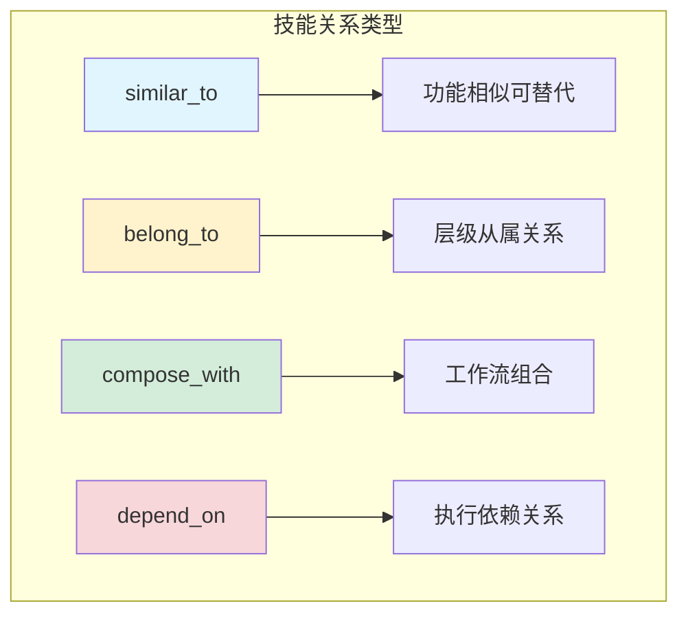
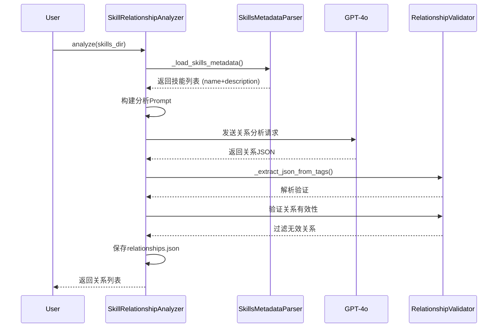
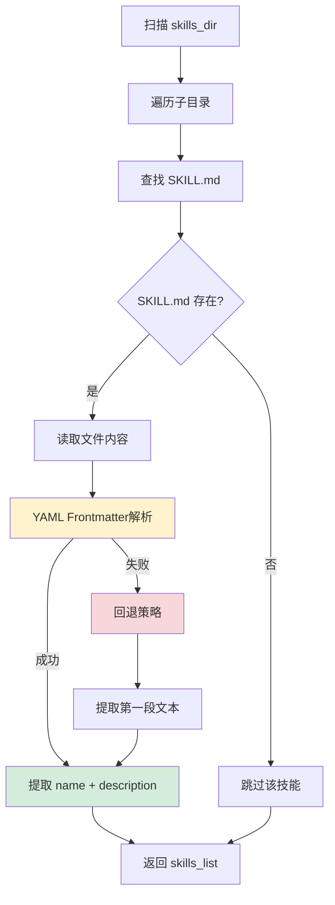
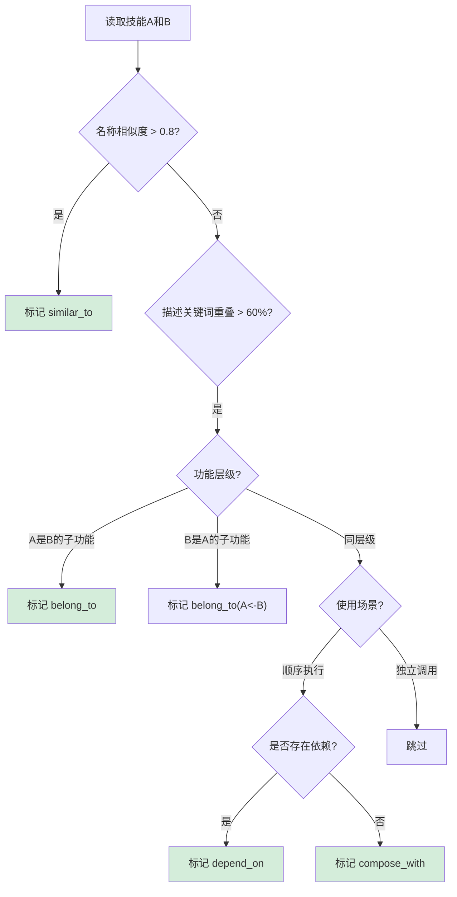
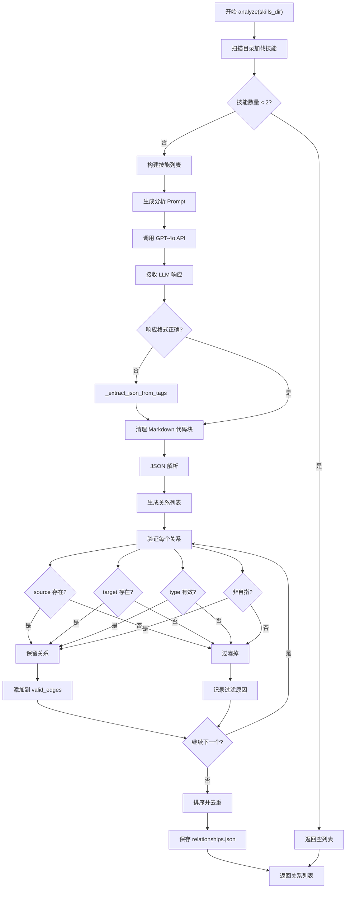
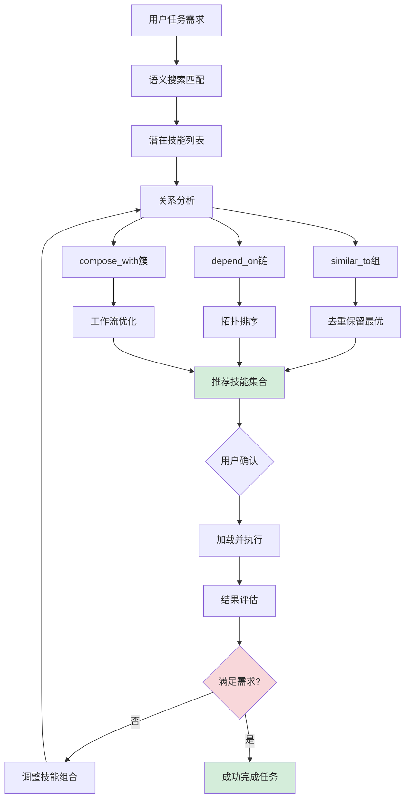

# 技能关系图谱技术详解

## 概述

本文档深入解析 SkillNet 如何自动构建技能关系图谱，包括关系判断标准、技术原理、实现细节，以及如何通过技能组合最大化发挥协同效应。

## 一、核心概念与架构

### 1.1 关系类型定义

SkillNet 定义了 **四种核心关系**，每种关系都有明确的业务含义和使用场景：



**四种关系详细说明：**

| 关系类型 | 方向性 | 业务含义 | 使用场景 | Example |
|----------|--------|----------|----------|---------|
| **similar_to** | 双向 | 功能相似，可相互替代 | 技能选择、版本管理 | Google Search ↔ Bing Search |
| **belong_to** | 单向 (子→父) | A是B的子模块或步骤 | 工作流分解、层级组织 | PDF解析 → 文档处理系统 |
| **compose_with** | 双向 | 功能互补，常一起使用 | 工作流编排、管道设计 | PDF Parser ↔ Text Summarizer |
| **depend_on** | 单向 (依赖→前置) | A执行依赖B | 依赖管理、执行顺序 | Web Scraper → 数据库连接 |

### 1.2 系统架构图



## 二、关系判断标准与技术原理

### 2.1 技能元数据解析

**技能元数据提取流程图：**



**关键实现代码：**

```python
# 从 skillnet_ai/analyzer.py
def _load_skills_metadata(self, root_dir: str) -> List[Dict[str, str]]:
    """遍历目录提取技能元数据"""
    skills = []
    
    for entry in os.scandir(root_dir):   # 扫描目录
        if entry.is_dir():               # 只处理目录
            skill_path = entry.path
            skill_name = entry.name      # 目录名作为技能名
            
            description = "No description provided."
            
            # 优先读取 SKILL.md
            skill_md_path = os.path.join(skill_path, "SKILL.md")
            if os.path.exists(skill_md_path):
                try:
                    with open(skill_md_path, 'r', encoding='utf-8') as f:
                        raw_content = f.read()
                        # 提取 description
                        description = self._extract_description(raw_content)
                except Exception as e:
                    logger.warning(f"无法读取 {skill_name} 的 SKILL.md: {e}")
            
            skills.append({
                "name": skill_name,
                "description": description
            })
    
    return skills

def _extract_description(self, content: str) -> str:
    """从 SKILL.md 提取描述"""
    # 1. 尝试 YAML Frontmatter
    frontmatter_match = re.search(
        r'^---\n(.*?)\n---', 
        content, 
        re.DOTALL
    )
    
    if frontmatter_match:
        fm_text = frontmatter_match.group(1)
        # 查找 description 字段
        desc_match = re.search(
            r'description:\s*(.+)$', 
            fm_text, 
            re.MULTILINE
        )
        if desc_match:
            # 清理引号和多余空白
            return desc_match.group(1).strip().strip('"').strip("'")
    
    # 2. 回退: 提取第一段文本
    # 移除标题
    clean_text = re.sub(r'#+\s.*', '', content)
    # 移除代码块
    clean_text = re.sub(r'```.*?```', '', clean_text, flags=re.DOTALL)
    lines = [line.strip() for line in clean_text.split('\n') if line.strip()]
    
    return lines[0] if lines else "No description available."
```

### 2.2 LLM 关系推断逻辑

**Prompt 工程核心设计：**

```python
# 从 skillnet_ai/prompts.py
RELATIONSHIP_ANALYSIS_USER_PROMPT_TEMPLATE = """
Your task is to map logical relationships between the provided skills based
on their names and descriptions.

You must strictly identify ONLY the following 4 types of relationships:

1. similar_to
   - A and B perform functionally equivalent tasks
   - Users can replace A with B
   - Example: "Google Search" and "Bing Search"

2. belong_to
   - A is a sub-component or specific step within B
   - B represents a larger workflow, A is one part of it
   - Direction: Child -> belong_to -> Parent

3. compose_with
   - A and B are independent but often used together
   - One produces data that the other consumes
   - Example: "PDF Parser" compose_with "Text Summarizer"

4. depend_on
   - A CANNOT execute without B
   - B is a hard dependency
   - Direction: Dependent -> depend_on -> Prerequisite

Skills List:
{skills_list}

Remember:
- Be conservative. Only create relationships if there is clear connection
- Do not hallucinate skills not in the list

Output Format:
[
    {
      "source": "skill_a",
      "target": "skill_b", 
      "type": "depend_on",
      "reason": "A requires B's output as input"
    },
    ...
]
"""
```

**关系判断逻辑树：**



## 三、详细实现流程

### 3.1 完整关系分析流程图



### 3.2 关键代码实现

**关系验证逻辑：**

```python
# 从 skillnet_ai/analyzer.py
def _generate_relationship_graph(self, skills: List[Dict]) -> List[Dict]:
    """调用 LLM 推断技能间的关系"""
    
    # 构建技能列表 JSON
    skills_json = json.dumps(skills, indent=2, ensure_ascii=False)
    
    # 构建消息
    messages = [
        {"role": "system", "content": RELATIONSHIP_ANALYSIS_SYSTEM_PROMPT},
        {"role": "user", "content": RELATIONSHIP_ANALYSIS_USER_PROMPT_TEMPLATE.format(
            skills_list=skills_json
        )}
    ]
    
    # 调用 LLM
    response = self.client.chat.completions.create(
        model=self.model,
        messages=messages,
    )
    content = response.choices[0].message.content
    
    # 提取 JSON (处理 XML 标签包装)
    json_str = self._extract_json_from_tags(content, "Skill_Relationships")
    
    # 解析 JSON
    try:
        parsed_data = json.loads(json_str)
        
        # 提取关系边
        edges = []
        if isinstance(parsed_data, list):
            edges = parsed_data
        elif isinstance(parsed_data, dict) and "relationships" in parsed_data:
            edges = parsed_data["relationships"]
        
        # 验证关系
        valid_edges = self._validate_relationships(edges, skills)
        
        logger.info(f"识别出 {len(valid_edges)} 个有效关系")
        return valid_edges
        
    except json.JSONDecodeError as e:
        logger.error(f"JSON 解析失败: {e}")
        return []
    except Exception as e:
        logger.error(f"关系分析失败: {e}")
        return []

def _validate_relationships(self, edges: List[Dict], 
                            skills: List[Dict]) -> List[Dict]:
    """验证关系的有效性"""
    valid_names = {skill['name'] for skill in skills}
    valid_types = {'similar_to', 'depend_on', 'compose_with', 'belong_to'}
    
    valid_edges = []
    
    for edge in edges:
        # 基本类型检查
        if not isinstance(edge, dict):
            continue
        
        source = edge.get('source')
        target = edge.get('target')
        rel_type = edge.get('type')
        
        # 验证名称存在且类型有效
        if (source in valid_names and 
            target in valid_names and 
            rel_type in valid_types and
            source != target):  # 不能自指
            
            valid_edges.append({
                "source": source,
                "target": target,
                "type": rel_type,
                "reason": edge.get("reason", "无原因说明")
            })
        else:
            logger.warning(
                f"过滤无效关系: {edge}. "
                f"原因: 名称无效或类型错误"
            )
    
    # 去重处理
    unique_edges = self._deduplicate_edges(valid_edges)
    
    return valid_edges

def _deduplicate_edges(self, edges: List[Dict]) -> List[Dict]:
    """关系去重"""
    seen = set()
    unique_edges = []
    
    for edge in edges:
        # 创建关系唯一标识 (排序技能名确保双向关系去重)
        edge_id = tuple(sorted([edge['source'], edge['target']]) + [edge['type']])
        
        if edge_id not in seen:
            seen.add(edge_id)
            unique_edges.append(edge)
    
    return unique_edges
```

**JSON 提取与清理：**

```python
def _extract_json_from_tags(self, content: str, 
                           tag_name: str) -> str:
    """从 XML 风格标签中提取 JSON"""
    
    start_tag = f"<{tag_name}>"
    end_tag = f"</{tag_name}>"
    
    # 1. 尝试提取标签内容
    if start_tag in content and end_tag in content:
        json_str = content.split(start_tag)[1].split(end_tag)[0].strip()
        
        # 2. 清理 Markdown 代码块
        json_str = json_str.replace("```json", "").replace("```", "").strip()
        
        return json_str
    
    # 3. 如果没有标签，尝试直接提取 JSON 代码块
    json_block = re.search(
        r'```json\s*\n(.*?)\n```', 
        content, 
        re.DOTALL
    )
    
    if json_block:
        return json_block.group(1).strip()
    
    # 4. 作为最后手段，返回整个内容
    logger.warning(
        f"未找到 {tag_name} 标签，尝试直接解析整个内容"
    )
    return content.strip()
```

## 四、关系图谱构建算法

### 4.1 图构建算法

```python
import networkx as nx

class SkillGraph:
    """技能关系图构建器"""
    
    def __init__(self, relationships: List[Dict]):
        self.relationships = relationships
        self.graph = self._build_graph()
    
    def _build_graph(self) -> Dict[str, Dict]:
        """将关系列表转换为图结构"""
        graph = {}
        
        for rel in self.relationships:
            source = rel['source']
            target = rel['target']
            rel_type = rel['type']
            
            # 初始化节点 (如果不存在)
            if source not in graph:
                graph[source] = {
                    'similar_to': [],
                    'belong_to': [],
                    'compose_with': [],
                    'depend_on': [],
                    'used_by': []  # 反向依赖
                }
            
            if target not in graph:
                graph[target] = {
                    'similar_to': [],
                    'belong_to': [],
                    'compose_with': [],
                    'depend_on': [],
                    'used_by': []
                }
            
            # 添加关系
            graph[source][rel_type].append({
                'target': target,
                'reason': rel.get('reason', '')
            })
            
            # 添加反向关系 (用于追踪使用方)
            if rel_type == 'depend_on':
                graph[target]['used_by'].append({
                    'user': source,
                    'reason': rel.get('reason', '')
                })
            elif rel_type == 'compose_with':
                graph[source]['compose_with'].append({
                    'target': target,
                    'reason': rel.get('reason', '')
                })
                graph[target]['compose_with'].append({
                    'target': source,
                    'reason': rel.get('reason', '')
                })
        
        return graph
    
    def get_execution_order(self, target_skill: str) -> List[str]:
        """获取技能执行顺序 (依赖解析)"""
        # 使用拓扑排序
        visited = set()
        order = []
        
        def dfs(skill: str):
            if skill in visited:
                return
            
            visited.add(skill)
            
            # 先执行依赖
            for dep in self.graph.get(skill, {}).get('depend_on', []):
                dfs(dep['target'])
            
            # 再添加当前技能
            order.append(skill)
        
        dfs(target_skill)
        
        return order
    
    def find_alternatives(self, skill_name: str) -> List[Dict]:
        """查找可替代技能"""
        alternatives = []
        
        # 查找 similar_to 关系
        similar_skills = self.graph.get(skill_name, {}).get('similar_to', [])
        for similar in similar_skills:
            alternatives.append({
                'skill': similar['target'],
                'relationship': 'similar_to',
                'reason': similar.get('reason', '')
            })
        
        return alternatives
    
    def find_composition(self, start_skill: str, 
                        max_depth: int = 3) -> List[List[Dict]]:
        """查找技能组合路径"""
        paths = []
        
        def find_paths(current: str, path: List[str], depth: int):
            if depth > max_depth:
                return
            
            path.append(current)
            
            # 查找可组合的技能
            compositions = self.graph.get(current, {}).get('compose_with', [])
            
            if not compositions:
                # 叶子节点，保存路径
                if len(path) > 1:
                    paths.append(path.copy())
            else:
                for comp in compositions:
                    next_skill = comp['target']
                    if next_skill not in path:  # 避免循环
                        find_paths(next_skill, path, depth + 1)
            
            path.pop()
        
        find_paths(start_skill, [], 0)
        
        # 转换为关系边
        edge_paths = []
        for path in paths:
            edges = []
            for i in range(len(path) - 1):
                edges.append({
                    'source': path[i],
                    'target': path[i + 1],
                    'type': 'compose_with'
                })
            edge_paths.append(edges)
        
        return edge_paths
```

### 4.2 执行顺序算法实现

**拓扑排序处理依赖关系：**

```python
def calculate_execution_order(skills_dir: str, 
                             target_task: str) -> List[str]:
    """计算多技能组合的执行顺序"""
    
    analyzer = SkillRelationshipAnalyzer()
    relationships = analyzer.analyze_local_skills(skills_dir)
    
    # 构建依赖图
    graph = {}
    in_degree = {}  # 入度计数
    
    for rel in relationships:
        if rel['type'] == 'depend_on':
            source = rel['source']
            target = rel['target']
            
            if target not in graph:
                graph[target] = []
            graph[target].append(source)
            
            # 更新入度
            in_degree[source] = in_degree.get(source, 0) + 1
            in_degree[target] = in_degree.get(target, 0)
    
    # 拓扑排序 (Kahn算法)
    queue = [skill for skill in in_degree if in_degree[skill] == 0]
    execution_order = []
    
    while queue:
        skill = queue.pop(0)
        execution_order.append(skill)
        
        for dependent in graph.get(skill, []):
            in_degree[dependent] -= 1
            if in_degree[dependent] == 0:
                queue.append(dependent)
    
    # 检查是否有循环依赖
    if len(execution_order) != len(in_degree):
        logger.warning("检测到循环依赖，执行顺序可能不准确")
    
    return execution_order
```

## 五、技能组合优化策略

### 5.1 组合发现流程



### 5.2 组合优化算法

**最优技能组合选择器：**

```python
class SkillComposer:
    """智能技能组合优化器"""
    
    def __init__(self, skills_dir: str, api_key: str):
        self.client = SkillNetClient(api_key=api_key)
        self.skills_dir = skills_dir
        self.graph = self._build_relationship_graph()
    
    def _build_relationship_graph(self) -> nx.DiGraph:
        """构建 NetworkX 关系图"""
        relationships = self.client.analyze(self.skills_dir)
        
        G = nx.DiGraph()
        
        for rel in relationships:
            G.add_edge(
                rel['source'],
                rel['target'],
                type=rel['type'],
                reason=rel.get('reason', '')
            )
        
        return G
    
    def find_optimal_combination(self, task_requirement: str) -> Dict:
        """
        查找给定任务的最优技能组合
        
        Args:
            task_requirement: 任务的自然语言描述
        
        Returns:
            {
                'skills': ['skill1', 'skill2', ...],
                'execution_order': ['skill1', 'skill2', ...],
                'estimated_quality': 0.85,
                'alternative_paths': [...]
            }
        """
        # 1. 语义搜索匹配技能
        search_results = self.client.search(
            q=task_requirement,
            mode='vector',
            limit=10
        )
        
        candidate_skills = [r.skill_name for r in search_results]
        
        # 2. 构建技能子图
        skill_subgraph = self._build_skill_subgraph(candidate_skills)
        
        # 3. 计算组合质量分数
        combinations = self._generate_combinations(skill_subgraph)
        
        # 4. 选择最优组合
        best_combination = max(combinations, key=lambda x: x['quality_score'])
        
        return best_combination
    
    def _build_skill_subgraph(self, skills: List[str]) -> nx.DiGraph:
        """构建技能子图"""
        subgraph = nx.DiGraph()
        
        for skill in skills:
            if skill in self.graph:
                # 添加节点
                subgraph.add_node(skill, **self.graph.nodes[skill])
                
                # 添加相关边
                for neighbor in self.graph.neighbors(skill):
                    if neighbor in skills:
                        subgraph.add_edge(skill, neighbor, 
                                        **self.graph.edges[skill, neighbor])
        
        return subgraph
    
    def _generate_combinations(self, subgraph: nx.DiGraph) -> List[Dict]:
        """生成可能的技能组合"""
        combinations = []
        
        # 获取所有连通分量
        connected_components = list(nx.weakly_connected_components(subgraph))
        
        for component in connected_components:
            if len(component) < 2:
                continue
            
            # 对每个连通分量生成组合
            component_list = list(component)
            
            # 计算拓扑顺序
            try:
                execution_order = list(nx.topological_sort(subgraph.subgraph(component)))
            except nx.NetworkXError:
                # 有循环依赖，使用简单排序
                execution_order = sorted(component_list)
            
            # 计算质量分数
            quality_score = self._calculate_combination_quality(component_list, subgraph)
            
            combinations.append({
                'skills': list(component_list),
                'execution_order': execution_order,
                'quality_score': quality_score,
                'component_size': len(component_list)
            })
        
        return combinations
    
    def _calculate_combination_quality(self, skills: List[str], 
                                     graph: nx.DiGraph) -> float:
        """计算组合质量分数"""
        
        # 基础分数：技能数量
        base_score = len(skills) * 0.1
        
        # 关系分数：检查各种关系
        relationship_score = 0.0
        relationship_counts = {
            'similar_to': 0,
            'depend_on': 0,
            'compose_with': 0,
            'belong_to': 0
        }
        
        for skill in skills:
            for neighbor in graph.neighbors(skill):
                if neighbor in skills:
                    edge_data = graph.edges[skill, neighbor]
                    rel_type = edge_data.get('type', '')
                    if rel_type in relationship_counts:
                        relationship_counts[rel_type] += 1
        
        # 依赖关系加分（确保工作流完整性）
        relationship_score += relationship_counts['depend_on'] * 0.3
        relationship_score += relationship_counts['compose_with'] * 0.2
        relationship_score += relationship_counts['belong_to'] * 0.15
        
        # 相似关系减分（避免重复功能）
        relationship_score -= relationship_counts['similar_to'] * 0.1
        
        # 连通性分数
        connectivity_score = 0.0
        if len(skills) > 1:
            # 计算连通度
            total_possible_edges = len(skills) * (len(skills) - 1)
            actual_edges = graph.subgraph(skills).number_of_edges()
            connectivity_score = (actual_edges / total_possible_edges) * 0.3
        
        # 标准化到0-1范围
        total_score = base_score + relationship_score + connectivity_score
        return min(total_score, 1.0)
    
    def find_alternative_combinations(self, task_requirement: str, 
                                    max_alternatives: int = 3) -> List[Dict]:
        """查找替代组合方案"""
        all_combinations = self.find_optimal_combination(task_requirement)
        
        # 获取所有可能的组合并按质量排序
        search_results = self.client.search(
            q=task_requirement,
            mode='vector',
            limit=20  # 扩大搜索范围
        )
        
        all_skills = [r.skill_name for r in search_results]
        
        # 生成多种组合方案
        alternative_paths = []
        
        for i in range(1, min(max_alternatives + 1, len(all_skills))):
            # 选择前i个技能作为候选
            candidate_skills = all_skills[:i]
            
            # 构建子图并评估
            subgraph = self._build_skill_subgraph(candidate_skills)
            combinations = self._generate_combinations(subgraph)
            
            if combinations:
                best_combo = max(combinations, key=lambda x: x['quality_score'])
                alternative_paths.append(best_combo)
        
        # 按质量排序并去重
        alternative_paths.sort(key=lambda x: x['quality_score'], reverse=True)
        
        # 返回前N个不同的方案
        unique_paths = []
        seen_skills = set()
        
        for path in alternative_paths:
            path_key = tuple(sorted(path['skills']))
            if path_key not in seen_skills:
                seen_skills.add(path_key)
                unique_paths.append(path)
                
                if len(unique_paths) >= max_alternatives:
                    break
        
        return unique_paths
```

## 六、实际应用案例

### 6.1 数据分析工作流案例

假设用户需要完成"销售数据分析"任务：

```python
# 实际应用示例
def sales_data_analysis_workflow():
    """销售数据分析工作流示例"""
    
    composer = SkillComposer(
        skills_dir="./company_skills",
        api_key="your-api-key"
    )
    
    # 1. 查找最优技能组合
    combination = composer.find_optimal_combination(
        "销售数据分析，生成可视化报告"
    )
    
    print("🔍 推荐技能组合:")
    print(f"技能列表: {combination['skills']}")
    print(f"执行顺序: {combination['execution_order']}")
    print(f"质量评分: {combination['quality_score']:.2f}")
    
    # 2. 获取替代方案
    alternatives = composer.find_alternative_combinations(
        "销售数据分析，生成可视化报告",
        max_alternatives=2
    )
    
    print("\n🔄 替代方案:")
    for i, alt in enumerate(alternatives, 1):
        print(f"方案 {i}: {alt['skills']} (评分: {alt['quality_score']:.2f})")
    
    # 3. 执行工作流
    client = SkillNetClient(api_key="your-api-key")
    
    for skill_name in combination['execution_order']:
        print(f"\n⚙️ 执行技能: {skill_name}")
        
        # 下载技能
        skill_path = client.download(
            url=f"https://github.com/company/skills/tree/main/{skill_name}",
            target_dir="./workflow_skills"
        )
        
        # 评估技能质量
        quality_report = client.evaluate(target=skill_path)
        print(f"  质量评估: {quality_report['overall']['level']}")
        
        # 执行技能逻辑
        execute_skill(skill_path)

def execute_skill(skill_path: str):
    """执行技能"""
    # 这里可以加载 SKILL.md 并执行其中的指令
    skill_md_path = os.path.join(skill_path, "SKILL.md")
    
    if os.path.exists(skill_md_path):
        with open(skill_md_path, 'r', encoding='utf-8') as f:
            skill_content = f.read()
        
        print(f"  执行逻辑: {skill_content[:200]}...")
        # 实际执行逻辑...

# 运行示例
if __name__ == "__main__":
    sales_data_analysis_workflow()
```

### 6.2 技能推荐系统

**智能技能推荐引擎：**

```python
class SkillRecommendationEngine:
    """技能推荐引擎"""
    
    def __init__(self, skills_dir: str, api_key: str):
        self.composer = SkillComposer(skills_dir, api_key)
        self.client = SkillNetClient(api_key=api_key)
        self.user_history = {}  # 用户历史记录
    
    def recommend_skills(self, user_id: str, context: str) -> Dict:
        """
        为用户推荐技能
        
        Args:
            user_id: 用户ID
            context: 当前任务上下文
            
        Returns:
            推荐结果
        """
        # 1. 分析用户历史偏好
        user_profile = self._build_user_profile(user_id)
        
        # 2. 语义搜索匹配
        search_results = self.client.search(
            q=context,
            mode='vector',
            limit=15
        )
        
        # 3. 过滤已使用过的技能
        new_skills = []
        for result in search_results:
            if result.skill_name not in user_profile.get('used_skills', []):
                new_skills.append(result)
        
        # 4. 生成推荐组合
        recommendations = []
        for skill in new_skills[:5]:  # 取前5个新技能
            # 查找相关组合
            combinations = self.composer.find_alternative_combinations(
                skill.skill_description,
                max_alternatives=1
            )
            
            if combinations:
                recommendations.append({
                    'primary_skill': skill.skill_name,
                    'combination': combinations[0],
                    'relevance_score': self._calculate_relevance(context, skill),
                    'reason': f"基于您的{user_profile['preference_category']}偏好推荐"
                })
        
        # 5. 排序并返回
        recommendations.sort(key=lambda x: x['relevance_score'], reverse=True)
        
        return {
            'recommendations': recommendations[:3],  # 返回前3个
            'user_profile': user_profile,
            'search_query': context
        }
    
    def _build_user_profile(self, user_id: str) -> Dict:
        """构建用户画像"""
        if user_id not in self.user_history:
            return {
                'used_skills': [],
                'preference_category': 'general',
                'avg_quality_score': 0.7
            }
        
        history = self.user_history[user_id]
        
        # 分析使用模式
        categories = {}
        quality_scores = []
        
        for usage in history:
            skill_name = usage['skill_name']
            quality_score = usage.get('quality_score', 0.7)
            quality_scores.append(quality_score)
            
            # 推断技能类别（简化实现）
            if 'data' in skill_name.lower():
                categories['data_analysis'] = categories.get('data_analysis', 0) + 1
            elif 'web' in skill_name.lower():
                categories['web_automation'] = categories.get('web_automation', 0) + 1
            elif 'pdf' in skill_name.lower():
                categories['document_processing'] = categories.get('document_processing', 0) + 1
        
        # 找出最偏好的类别
        preferred_category = max(categories.items(), key=lambda x: x[1])[0] if categories else 'general'
        
        return {
            'used_skills': [usage['skill_name'] for usage in history],
            'preference_category': preferred_category,
            'avg_quality_score': sum(quality_scores) / len(quality_scores) if quality_scores else 0.7
        }
    
    def _calculate_relevance(self, context: str, skill_result) -> float:
        """计算相关性分数"""
        # 简单实现：基于向量相似度和技能质量
        base_score = skill_result.stars / 100.0  # 标准化星标数
        
        # 关键词匹配加分
        context_words = set(context.lower().split())
        skill_words = set(skill_result.skill_description.lower().split())
        
        overlap = len(context_words & skill_words)
        keyword_bonus = overlap * 0.1
        
        return min(base_score + keyword_bonus, 1.0)
    
    def record_usage(self, user_id: str, skill_name: str, 
                    quality_score: float = None):
        """记录用户使用情况"""
        if user_id not in self.user_history:
            self.user_history[user_id] = []
        
        self.user_history[user_id].append({
            'skill_name': skill_name,
            'timestamp': datetime.now().isoformat(),
            'quality_score': quality_score or 0.7
        })
        
        # 限制历史记录长度
        if len(self.user_history[user_id]) > 100:
            self.user_history[user_id] = self.user_history[user_id][-100:]

# 推荐系统使用示例
def recommendation_example():
    engine = SkillRecommendationEngine(
        skills_dir="./company_skills",
        api_key="your-api-key"
    )
    
    # 模拟用户请求
    recommendation = engine.recommend_skills(
        user_id="user123",
        context="需要分析网站数据并生成报告"
    )
    
    print("🎯 技能推荐结果:")
    for i, rec in enumerate(recommendation['recommendations'], 1):
        print(f"\n{i}. 主要技能: {rec['primary_skill']}")
        print(f"   组合: {rec['combination']['skills']}")
        print(f"   相关度: {rec['relevance_score']:.2f}")
        print(f"   原因: {rec['reason']}")
    
    # 记录使用
    engine.record_usage("user123", "web-analyzer", quality_score=0.8)
```

## 七、总结与展望

### 7.1 核心技术总结

1. **语义关系识别**: 通过LLM实现深度的语义理解，准确识别技能间的四种核心关系
2. **图算法应用**: 运用图论算法（拓扑排序、连通分量分析）解决依赖管理和组合优化问题
3. **智能推荐系统**: 结合用户行为分析和内容理解，实现个性化的技能推荐
4. **工作流编排**: 自动化的技能组合和工作流生成，提升AI代理执行效率

### 7.2 实际应用价值

- **企业知识管理**: 将分散的技能组织成有机的知识图谱
- **智能工作流**: 自动发现和优化最佳执行路径
- **技能发现**: 帮助用户发现相关和替代技能
- **质量保证**: 通过关系分析确保技能组合的完整性和可靠性

### 7.3 未来发展方向

1. **动态关系学习**: 基于实际使用情况动态调整关系权重
2. **跨领域融合**: 支持不同领域技能的无缝组合
3. **实时优化**: 根据执行结果实时优化推荐算法
4. **可视化界面**: 提供交互式的技能关系图谱可视化工具

通过这套完整的技能关系图谱技术方案，企业可以构建智能化的知识管理体系，最大化发挥AI技能的协同效应，显著提升自动化和智能化水平。