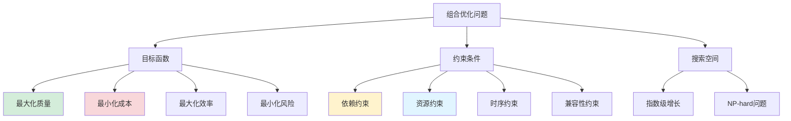
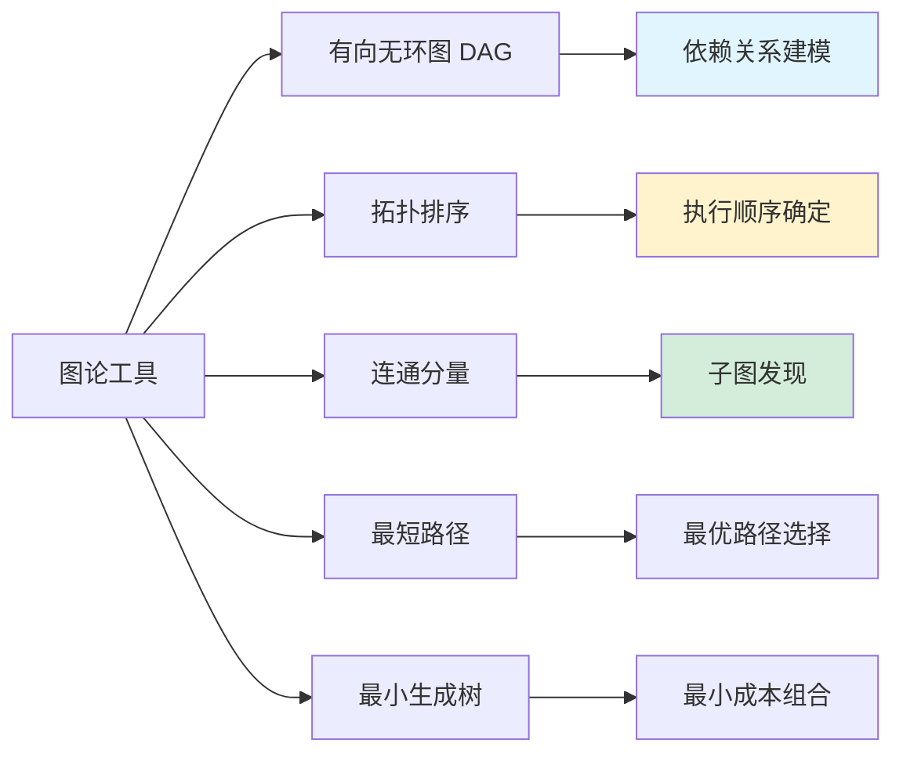
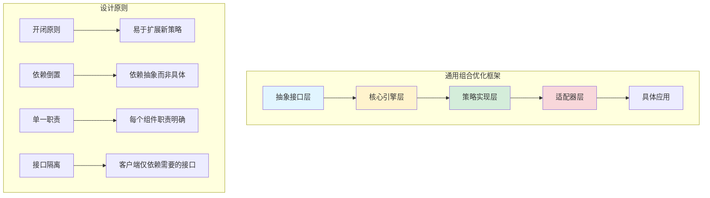
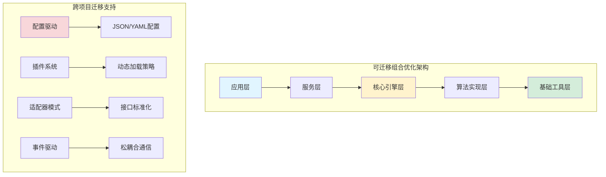

# 技能组合优化框架研究

## 概述

本文档深入研究通用的组合优化框架，将SkillNet中的技能组合优化策略抽象为可迁移的技术方案。该框架适用于任何需要智能组合和优化的场景，包括AI代理、工作流编排、资源调度等领域。

## 一、理论基础与研究现状

### 1.1 组合优化理论

组合优化是运筹学的重要分支，旨在从离散的可行解集合中找到最优解。在技能组合场景中，我们面临的是一个**多目标组合优化问题**：



**数学建模：**

```python
# 组合优化问题的数学表示
class CombinationOptimizationProblem:
    """
    组合优化问题的标准形式
    minimize/maximize: f(x) = w1*quality(x) + w2*cost(x) + w3*efficiency(x) + w4*risk(x)
    subject to: 
        - dependency_constraints(x) ≥ 0
        - resource_constraints(x) ≥ 0 
        - temporal_constraints(x) ≥ 0
        - compatibility_constraints(x) ≥ 0
    where: x ∈ {0,1}^n (选择向量)
    """
    
    def __init__(self, items: List[Any], constraints: List[Constraint]):
        self.items = items  # 候选项目列表
        self.constraints = constraints  # 约束条件
        self.objectives = []  # 目标函数列表
        
    def add_objective(self, objective: Objective, weight: float = 1.0):
        """添加目标函数"""
        self.objectives.append((objective, weight))
        
    def evaluate(self, solution: List[bool]) -> float:
        """评估解决方案的得分"""
        total_score = 0.0
        for objective, weight in self.objectives:
            score = objective.evaluate(solution, self.items)
            total_score += weight * score
        return total_score
    
    def is_feasible(self, solution: List[bool]) -> bool:
        """检查解的可行性"""
        for constraint in self.constraints:
            if not constraint.satisfy(solution, self.items):
                return False
        return True
```

### 1.2 图论基础应用

在技能组合优化中，图论提供了强大的理论支撑：



**关键图算法实现：**

```python
import networkx as nx
from typing import List, Dict, Set, Tuple
from dataclasses import dataclass

@dataclass
class GraphMetrics:
    """图结构度量指标"""
    density: float
    clustering_coefficient: float
    average_path_length: float
    centrality_scores: Dict[str, float]
    connectivity_score: float

class DependencyGraph:
    """依赖关系图构建器"""
    
    def __init__(self):
        self.graph = nx.DiGraph()
        self.metrics = None
        
    def add_relationship(self, source: str, target: str, 
                        relationship_type: str, weight: float = 1.0):
        """添加关系边"""
        self.graph.add_edge(
            source, target,
            type=relationship_type,
            weight=weight,
            timestamp=datetime.now()
        )
        
    def calculate_metrics(self) -> GraphMetrics:
        """计算图结构度量"""
        if self.graph.number_of_nodes() == 0:
            return GraphMetrics(0, 0, 0, {}, 0)
            
        # 基础度量
        density = nx.density(self.graph)
        
        # 聚类系数（对于无向图）
        undirected = self.graph.to_undirected()
        clustering = nx.average_clustering(undirected) if undirected.number_of_nodes() > 0 else 0
        
        # 平均路径长度（对于连通图）
        avg_path_length = 0
        if nx.is_connected(undirected):
            avg_path_length = nx.average_shortest_path_length(undirected)
            
        # 中心性分析
        centrality = nx.betweenness_centrality(self.graph)
        
        # 连通性评分
        connectivity = self._calculate_connectivity()
        
        self.metrics = GraphMetrics(
            density=density,
            clustering_coefficient=clustering,
            average_path_length=avg_path_length,
            centrality_scores=centrality,
            connectivity_score=connectivity
        )
        
        return self.metrics
    
    def _calculate_connectivity(self) -> float:
        """计算图的连通性评分"""
        if self.graph.number_of_nodes() < 2:
            return 0.0
            
        # 强连通分量分析
        strong_components = list(nx.strongly_connected_components(self.graph))
        
        # 弱连通分量分析
        weak_components = list(nx.weakly_connected_components(self.graph))
        
        # 计算连通性指标
        total_nodes = self.graph.number_of_nodes()
        
        # 强连通分量占比
        largest_strong = max(len(comp) for comp in strong_components) if strong_components else 0
        strong_ratio = largest_strong / total_nodes
        
        # 弱连通分量占比
        largest_weak = max(len(comp) for comp in weak_components) if weak_components else 0
        weak_ratio = largest_weak / total_nodes
        
        # 综合连通性评分
        connectivity = (strong_ratio + weak_ratio) / 2.0
        return connectivity
    
    def find_critical_nodes(self, top_k: int = 5) -> List[Tuple[str, float]]:
        """发现关键节点（高中心性节点）"""
        centrality = nx.betweenness_centrality(self.graph)
        sorted_nodes = sorted(centrality.items(), key=lambda x: x[1], reverse=True)
        return sorted_nodes[:top_k]
    
    def detect_communities(self) -> List[Set[str]]:
        """社区检测（技能聚类）"""
        try:
            # 使用Louvain算法进行社区检测
            import community
            partition = community.best_partition(self.graph.to_undirected())
            
            # 将分区结果转换为社区列表
            communities = {}
            for node, community_id in partition.items():
                if community_id not in communities:
                    communities[community_id] = set()
                communities[community_id].add(node)
            
            return list(communities.values())
        except ImportError:
            # 回退：使用简单的连通分量
            components = list(nx.connected_components(self.graph.to_undirected()))
            return [set(comp) for comp in components]
```

### 1.3 语义理解在组合推理中的作用

现代LLM为组合优化带来了革命性的变化：

```python
class SemanticCombinationEngine:
    """语义组合推理引擎"""
    
    def __init__(self, llm_client, embedding_model):
        self.llm = llm_client
        self.embeddings = embedding_model
        self.semantic_cache = {}
        
    def calculate_semantic_similarity(self, item1: str, item2: str) -> float:
        """计算语义相似度"""
        cache_key = tuple(sorted([item1, item2]))
        if cache_key in self.semantic_cache:
            return self.semantic_cache[cache_key]
        
        # 使用嵌入模型计算相似度
        emb1 = self.embeddings.encode(item1)
        emb2 = self.embeddings.encode(item2)
        
        # 余弦相似度
        similarity = np.dot(emb1, emb2) / (np.linalg.norm(emb1) * np.linalg.norm(emb2))
        
        self.semantic_cache[cache_key] = similarity
        return similarity
    
    def infer_relationship(self, item1: str, item2: str, 
                          context: str = "") -> Dict[str, any]:
        """推理项目间关系"""
        
        prompt = f"""
        分析以下两个项目之间的关系：
        
        项目1: {item1}
        项目2: {item2}
        上下文: {context}
        
        请从以下维度分析它们的关系：
        1. 功能相似度（0-1）
        2. 依赖关系（是否有依赖）
        3. 组合可能性（是否可以协同工作）
        4. 替代性（是否可以互相替代）
        
        返回JSON格式：
        {{
            "similarity": 0.8,
            "dependency": "none|unidirectional|bidirectional", 
            "composability": 0.9,
            "substitutability": 0.3,
            "reasoning": "简要说明"
        }}
        """
        
        try:
            response = self.llm.generate(prompt)
            result = json.loads(response)
            return result
        except:
            # 回退到基于嵌入的简单推理
            similarity = self.calculate_semantic_similarity(item1, item2)
            return {
                "similarity": similarity,
                "dependency": "none",
                "composability": similarity * 0.8,
                "substitutability": similarity,
                "reasoning": "基于语义相似度的简单推理"
            }
    
    def generate_combination_explanation(self, combination: List[str]) -> str:
        """生成交互组合的解释"""
        items_str = ", ".join(combination)
        
        prompt = f"""
        解释以下项目组合为什么有效：
        {items_str}
        
        请从以下角度解释：
        1. 功能互补性
        2. 工作流程连贯性
        3. 整体价值提升
        4. 潜在协同效应
        
        用简洁的中文解释，不超过200字。
        """
        
        return self.llm.generate(prompt)
    
    def predict_performance(self, combination: List[str], 
                          historical_data: List[Dict]) -> float:
        """基于历史数据预测组合性能"""
        
        # 提取组合特征
        features = self._extract_combination_features(combination)
        
        # 查找相似的历史组合
        similar_cases = []
        for case in historical_data:
            case_features = self._extract_combination_features(case['items'])
            similarity = self._calculate_feature_similarity(features, case_features)
            if similarity > 0.7:  # 相似度阈值
                similar_cases.append((similarity, case['performance']))
        
        if not similar_cases:
            return 0.5  # 默认中等性能
        
        # 加权平均预测
        total_weight = sum(sim for sim, _ in similar_cases)
        predicted_performance = sum(sim * perf for sim, perf in similar_cases) / total_weight
        
        return predicted_performance
    
    def _extract_combination_features(self, combination: List[str]) -> np.ndarray:
        """提取组合特征向量"""
        features = []
        
        # 语义特征
        for item in combination:
            embedding = self.embeddings.encode(item)
            features.extend(embedding[:50])  # 取前50维
        
        # 统计特征
        features.extend([
            len(combination),
            len(set(combination)),  # 去重后数量
            np.mean([len(item) for item in combination]),  # 平均长度
        ])
        
        return np.array(features)
    
    def _calculate_feature_similarity(self, features1: np.ndarray, 
                                    features2: np.ndarray) -> float:
        """计算特征相似度"""
        return np.dot(features1, features2) / (np.linalg.norm(features1) * np.linalg.norm(features2))
```

## 二、通用组合优化框架设计

### 2.1 架构设计原则



### 2.2 核心抽象接口

**基础接口定义：**

```python
from abc import ABC, abstractmethod
from typing import List, Dict, Any, Optional, Set
from dataclasses import dataclass
from enum import Enum

class RelationshipType(Enum):
    """关系类型枚举"""
    SIMILAR_TO = "similar_to"
    BELONG_TO = "belong_to" 
    COMPOSE_WITH = "compose_with"
    DEPEND_ON = "depend_on"

class OptimizationStrategy(Enum):
    """优化策略枚举"""
    GREEDY = "greedy"
    DYNAMIC_PROGRAMMING = "dynamic_programming"
    GENETIC_ALGORITHM = "genetic_algorithm"
    SIMULATED_ANNEALING = "simulated_annealing"
    CONSTRAINT_SATISFACTION = "constraint_satisfaction"

@dataclass
class OptimizationResult:
    """优化结果"""
    selected_items: List[str]
    execution_order: List[str]
    quality_score: float
    cost_score: float
    efficiency_score: float
    confidence: float
    alternatives: List[List[str]]
    reasoning: str

@dataclass
class CombinationMetrics:
    """组合度量指标"""
    coverage: float          # 功能覆盖度
    redundancy: float        # 功能冗余度
    cohesion: float          # 内聚度
    coupling: float          # 耦合度
    balance: float           # 负载均衡度
    robustness: float        # 健壮性评分

class Item(ABC):
    """抽象项目接口"""
    
    @property
    @abstractmethod
    def id(self) -> str:
        """项目唯一标识"""
        pass
    
    @property
    @abstractmethod
    def name(self) -> str:
        """项目名称"""
        pass
    
    @property
    @abstractmethod
    def description(self) -> str:
        """项目描述"""
        pass
    
    @property
    @abstractmethod
    def metadata(self) -> Dict[str, Any]:
        """项目元数据"""
        pass
    
    @abstractmethod
    def validate(self) -> bool:
        """验证项目有效性"""
        pass

class Relationship(ABC):
    """抽象关系接口"""
    
    @property
    @abstractmethod
    def source(self) -> str:
        """源项目ID"""
        pass
    
    @property
    @abstractmethod
    def target(self) -> str:
        """目标项目ID"""
        pass
    
    @property
    @abstractmethod
    def type(self) -> RelationshipType:
        """关系类型"""
        pass
    
    @property
    @abstractmethod
    def weight(self) -> float:
        """关系权重"""
        pass
    
    @property
    @abstractmethod
    def metadata(self) -> Dict[str, Any]:
        """关系元数据"""
        pass

class Constraint(ABC):
    """抽象约束接口"""
    
    @property
    @abstractmethod
    def name(self) -> str:
        """约束名称"""
        pass
    
    @abstractmethod
    def satisfy(self, combination: List[str], items: List[Item]) -> bool:
        """检查约束是否满足"""
        pass
    
    @abstractmethod
    def explain(self, combination: List[str], items: List[Item]) -> str:
        """解释约束违反原因"""
        pass

class Objective(ABC):
    """抽象目标函数接口"""
    
    @property
    @abstractmethod
    def name(self) -> str:
        """目标名称"""
        pass
    
    @abstractmethod
    def evaluate(self, combination: List[str], items: List[Item]) -> float:
        """评估组合的得分"""
        pass
    
    @abstractmethod
    def is_better(self, score1: float, score2: float) -> bool:
        """比较两个得分是否更好"""
        pass

class CombinationOptimizer(ABC):
    """抽象组合优化器接口"""
    
    @abstractmethod
    def optimize(self, 
                 items: List[Item],
                 relationships: List[Relationship],
                 constraints: List[Constraint],
                 objectives: List[Objective],
                 strategy: OptimizationStrategy,
                 max_combinations: int = 1000) -> List[OptimizationResult]:
        """
        执行组合优化
        
        Args:
            items: 候选项目列表
            relationships: 项目间关系列表
            constraints: 约束条件列表
            objectives: 目标函数列表
            strategy: 优化策略
            max_combinations: 最大组合数量限制
            
        Returns:
            优化结果列表，按质量排序
        """
        pass
    
    @abstractmethod
    def explain_result(self, result: OptimizationResult) -> str:
        """解释优化结果"""
        pass
```

### 2.3 核心引擎实现

**通用组合优化引擎：**

```python
class GenericCombinationOptimizer(CombinationOptimizer):
    """通用组合优化引擎"""
    
    def __init__(self, 
                 semantic_engine: Optional[SemanticCombinationEngine] = None,
                 cache_size: int = 1000):
        self.semantic_engine = semantic_engine
        self.combination_cache = LRUCache(maxsize=cache_size)
        self.evaluation_cache = LRUCache(maxsize=cache_size * 10)
        
    def optimize(self, items: List[Item],
                relationships: List[Relationship], 
                constraints: List[Constraint],
                objectives: List[Objective],
                strategy: OptimizationStrategy,
                max_combinations: int = 1000) -> List[OptimizationResult]:
        """执行组合优化"""
        
        logger.info(f"开始组合优化，候选项目数: {len(items)}")
        
        # 1. 预处理：构建依赖图
        dep_graph = self._build_dependency_graph(relationships)
        
        # 2. 可行性检查：过滤不满足约束的项目
        feasible_items = self._filter_feasible_items(items, constraints)
        
        # 3. 根据策略执行优化
        if strategy == OptimizationStrategy.GREEDY:
            results = self._greedy_optimization(
                feasible_items, relationships, constraints, 
                objectives, dep_graph, max_combinations
            )
        elif strategy == OptimizationStrategy.DYNAMIC_PROGRAMMING:
            results = self._dynamic_programming_optimization(
                feasible_items, relationships, constraints,
                objectives, dep_graph, max_combinations
            )
        elif strategy == OptimizationStrategy.GENETIC_ALGORITHM:
            results = self._genetic_algorithm_optimization(
                feasible_items, relationships, constraints,
                objectives, dep_graph, max_combinations
            )
        elif strategy == OptimizationStrategy.CONSTRAINT_SATISFACTION:
            results = self._constraint_satisfaction_optimization(
                feasible_items, relationships, constraints,
                objectives, dep_graph, max_combinations
            )
        else:
            raise ValueError(f"不支持的优化策略: {strategy}")
        
        # 4. 后处理：排序和生成备选方案
        results = self._post_process_results(results, objectives)
        
        logger.info(f"优化完成，找到 {len(results)} 个有效组合")
        return results
    
    def _greedy_optimization(self, items: List[Item],
                           relationships: List[Relationship],
                           constraints: List[Constraint], 
                           objectives: List[Objective],
                           dep_graph: nx.DiGraph,
                           max_combinations: int) -> List[OptimizationResult]:
        """贪心算法优化"""
        
        results = []
        item_ids = [item.id for item in items]
        
        # 按目标函数排序（假设第一个目标为主目标）
        primary_objective = objectives[0]
        
        # 计算每个项目的独立得分
        item_scores = []
        for item in items:
            # 创建单项目组合进行评估
            single_combination = [item.id]
            if all(constraint.satisfy(single_combination, items) for constraint in constraints):
                score = primary_objective.evaluate(single_combination, items)
                item_scores.append((item.id, score))
        
        # 按得分降序排序
        item_scores.sort(key=lambda x: x[1], reverse=True)
        
        # 逐步构建组合
        current_combination = []
        current_score = 0.0
        
        for item_id, item_score in item_scores:
            # 检查是否可以添加到当前组合
            test_combination = current_combination + [item_id]
            
            # 检查约束
            if not all(constraint.satisfy(test_combination, items) for constraint in constraints):
                continue
                
            # 检查依赖关系
            if not self._check_dependencies(test_combination, dep_graph):
                continue
            
            # 评估新组合的得分
            new_score = self._evaluate_combination(test_combination, items, objectives)
            
            # 如果得分提升，则接受这个新组合
            if new_score > current_score:
                current_combination = test_combination
                current_score = new_score
                
                # 记录结果
                execution_order = self._calculate_execution_order(current_combination, dep_graph)
                result = OptimizationResult(
                    selected_items=current_combination.copy(),
                    execution_order=execution_order,
                    quality_score=new_score,
                    cost_score=self._calculate_cost_score(current_combination, items),
                    efficiency_score=self._calculate_efficiency_score(current_combination, items),
                    confidence=0.8,  # 贪心算法的置信度
                    alternatives=[],
                    reasoning=f"贪心算法选择，得分: {new_score:.3f}"
                )
                results.append(result)
                
                if len(results) >= max_combinations:
                    break
        
        return results
    
    def _dynamic_programming_optimization(self, items: List[Item], 
                                        relationships: List[Relationship],
                                        constraints: List[Constraint],
                                        objectives: List[Objective], 
                                        dep_graph: nx.DiGraph,
                                        max_combinations: int) -> List[OptimizationResult]:
        """动态规划优化"""
        
        # 按拓扑顺序处理项目
        topological_order = list(nx.topological_sort(dep_graph))
        
        # 状态定义：dp[i][mask] 表示考虑前i个项目，选择状态为mask时的最优解
        n = len(items)
        item_id_to_idx = {item.id: i for i, item in enumerate(items)}
        
        # 由于状态空间太大，使用记忆化搜索
        memo = {}
        
        def dp(index: int, selected_mask: int) -> Tuple[float, List[str]]:
            """记忆化搜索函数"""
            if (index, selected_mask) in memo:
                return memo[(index, selected_mask)]
            
            if index == n:
                # 基础情况：评估当前选择
                selected_items = [
                    items[i].id for i in range(n) 
                    if selected_mask & (1 << i)
                ]
                
                # 检查约束
                if not all(constraint.satisfy(selected_items, items) 
                          for constraint in constraints):
                    return (float('-inf'), [])
                
                # 计算得分
                score = self._evaluate_combination(selected_items, items, objectives)
                return (score, selected_items)
            
            current_item = items[index]
            best_score = float('-inf')
            best_combination = []
            
            # 选择1：不选当前项目
            score1, combo1 = dp(index + 1, selected_mask)
            if score1 > best_score:
                best_score = score1
                best_combination = combo1
            
            # 选择2：选择当前项目（如果满足约束）
            new_mask = selected_mask | (1 << index)
            test_items = [items[i].id for i in range(index + 1) if new_mask & (1 << i)]
            
            # 检查部分约束（提前剪枝）
            if self._check_partial_constraints(test_items, items, constraints):
                score2, combo2 = dp(index + 1, new_mask)
                if score2 > best_score:
                    best_score = score2
                    best_combination = combo2
            
            memo[(index, selected_mask)] = (best_score, best_combination)
            return (best_score, best_combination)
        
        # 执行动态规划
        best_score, best_combination = dp(0, 0)
        
        if not best_combination:
            return []
        
        # 生成结果
        execution_order = self._calculate_execution_order(best_combination, dep_graph)
        
        result = OptimizationResult(
            selected_items=best_combination,
            execution_order=execution_order,
            quality_score=best_score,
            cost_score=self._calculate_cost_score(best_combination, items),
            efficiency_score=self._calculate_efficiency_score(best_combination, items),
            confidence=0.95,  # 动态规划的最优性置信度
            alternatives=[],
            reasoning=f"动态规划求解，最优得分: {best_score:.3f}"
        )
        
        return [result]
    
    def _genetic_algorithm_optimization(self, items: List[Item],
                                      relationships: List[Relationship],
                                      constraints: List[Constraint], 
                                      objectives: List[Objective],
                                      dep_graph: nx.DiGraph,
                                      max_combinations: int) -> List[OptimizationResult]:
        """遗传算法优化"""
        
        import random
        
        # 遗传算法参数
        population_size = 50
        generations = 100
        mutation_rate = 0.1
        crossover_rate = 0.8
        elite_size = 5
        
        item_ids = [item.id for item in items]
        n = len(items)
        
        def create_individual() -> List[bool]:
            """创建个体（随机组合）"""
            individual = []
            for _ in range(n):
                individual.append(random.random() < 0.3)  # 30%概率选择
            return individual
        
        def evaluate_fitness(individual: List[bool]) -> float:
            """评估适应度"""
            selected_items = [
                item_ids[i] for i in range(n) if individual[i]
            ]
            
            # 检查约束
            if not all(constraint.satisfy(selected_items, items) 
                      for constraint in constraints):
                return float('-inf')
            
            # 检查依赖关系
            if not self._check_dependencies(selected_items, dep_graph):
                return float('-inf')
            
            # 计算得分
            return self._evaluate_combination(selected_items, items, objectives)
        
        def crossover(parent1: List[bool], parent2: List[bool]) -> List[bool]:
            """交叉操作"""
            if random.random() > crossover_rate:
                return parent1.copy()
            
            child = []
            for i in range(n):
                if random.random() < 0.5:
                    child.append(parent1[i])
                else:
                    child.append(parent2[i])
            return child
        
        def mutate(individual: List[bool]) -> List[bool]:
            """变异操作"""
            mutated = individual.copy()
            for i in range(n):
                if random.random() < mutation_rate:
                    mutated[i] = not mutated[i]
            return mutated
        
        # 初始化种群
        population = [create_individual() for _ in range(population_size)]
        
        best_individual = None
        best_fitness = float('-inf')
        
        # 进化过程
        for generation in range(generations):
            # 评估适应度
            fitness_scores = [evaluate_fitness(ind) for ind in population]
            
            # 记录最佳个体
            max_fitness_idx = max(range(population_size), key=lambda i: fitness_scores[i])
            if fitness_scores[max_fitness_idx] > best_fitness:
                best_fitness = fitness_scores[max_fitness_idx]
                best_individual = population[max_fitness_idx].copy()
            
            # 选择（锦标赛选择）
            new_population = []
            for _ in range(population_size):
                tournament_size = 3
                tournament_indices = random.sample(range(population_size), tournament_size)
                winner_idx = max(tournament_indices, key=lambda i: fitness_scores[i])
                new_population.append(population[winner_idx].copy())
            
            # 交叉和变异
            for i in range(population_size):
                if i < elite_size:  # 保留精英个体
                    continue
                    
                # 交叉
                if i + 1 < population_size:
                    new_population[i] = crossover(new_population[i], new_population[i + 1])
                
                # 变异
                new_population[i] = mutate(new_population[i])
            
            population = new_population
            
            # 早期停止条件
            if best_fitness > 0.9:  # 达到90%的性能
                break
        
        # 生成最终结果
        if best_individual:
            selected_items = [item_ids[i] for i in range(n) if best_individual[i]]
            execution_order = self._calculate_execution_order(selected_items, dep_graph)
            
            result = OptimizationResult(
                selected_items=selected_items,
                execution_order=execution_order,
                quality_score=best_fitness,
                cost_score=self._calculate_cost_score(selected_items, items),
                efficiency_score=self._calculate_efficiency_score(selected_items, items),
                confidence=0.85,  # 遗传算法的置信度
                alternatives=[],
                reasoning=f"遗传算法优化，最终得分: {best_fitness:.3f}"
            )
            return [result]
        
        return []
    
    def _constraint_satisfaction_optimization(self, items: List[Item], 
                                            relationships: List[Relationship],
                                            constraints: List[Constraint],
                                            objectives: List[Objective], 
                                            dep_graph: nx.DiGraph,
                                            max_combinations: int) -> List[OptimizationResult]:
        """约束满足问题求解"""
        
        from itertools import product
        
        item_ids = [item.id for item in items]
        n = len(items)
        
        # 构建约束传播网络
        constraint_network = self._build_constraint_network(constraints, items)
        
        # 使用回溯搜索求解
        results = []
        
        def backtrack(index: int, current_selection: List[bool], 
                     constraint_state: Dict[str, Any]) -> bool:
            """回溯搜索"""
            
            if index == n:
                # 完整解，评估并记录
                selected_items = [
                    item_ids[i] for i in range(n) if current_selection[i]
                ]
                
                if len(selected_items) == 0:
                    return False
                
                # 最终约束检查
                if not all(constraint.satisfy(selected_items, items) 
                          for constraint in constraints):
                    return False
                
                # 依赖关系检查
                if not self._check_dependencies(selected_items, dep_graph):
                    return False
                
                # 评估得分
                score = self._evaluate_combination(selected_items, items, objectives)
                
                execution_order = self._calculate_execution_order(selected_items, dep_graph)
                
                result = OptimizationResult(
                    selected_items=selected_items,
                    execution_order=execution_order,
                    quality_score=score,
                    cost_score=self._calculate_cost_score(selected_items, items),
                    efficiency_score=self._calculate_efficiency_score(selected_items, items),
                    confidence=0.9,  # 约束满足的置信度
                    alternatives=[],
                    reasoning=f"约束满足求解，得分: {score:.3f}"
                )
                
                results.append(result)
                return len(results) < max_combinations
            
            # 尝试选择当前项目
            for choice in [True, False]:
                new_selection = current_selection.copy()
                new_selection[index] = choice
                
                # 更新约束状态
                new_constraint_state = self._update_constraint_state(
                    constraint_state, index, choice, items, constraints
                )
                
                # 约束剪枝
                if self._is_constraint_state_valid(new_constraint_state):
                    if backtrack(index + 1, new_selection, new_constraint_state):
                        return True
            
            return False
        
        # 启动回溯搜索
        initial_state = self._initialize_constraint_state(constraints, items)
        backtrack(0, [False] * n, initial_state)
        
        return results
    
    def _build_dependency_graph(self, relationships: List[Relationship]) -> nx.DiGraph:
        """构建依赖关系图"""
        graph = nx.DiGraph()
        
        for rel in relationships:
            if rel.type == RelationshipType.DEPEND_ON:
                graph.add_edge(rel.target, rel.source, weight=rel.weight)
            elif rel.type == RelationshipType.COMPOSE_WITH:
                graph.add_edge(rel.source, rel.target, weight=rel.weight, bidirectional=True)
                graph.add_edge(rel.target, rel.source, weight=rel.weight, bidirectional=True)
        
        return graph
    
    def _filter_feasible_items(self, items: List[Item], 
                             constraints: List[Constraint]) -> List[Item]:
        """过滤满足基本约束的项目"""
        feasible_items = []
        
        for item in items:
            # 检查单项目约束
            single_item_combination = [item.id]
            if all(constraint.satisfy(single_item_combination, [item]) 
                  for constraint in constraints):
                feasible_items.append(item)
        
        return feasible_items
    
    def _check_dependencies(self, combination: List[str], 
                          dep_graph: nx.DiGraph) -> bool:
        """检查依赖关系是否满足"""
        if not combination:
            return True
        
        # 检查是否有循环依赖
        try:
            # 构建子图
            subgraph = dep_graph.subgraph(combination)
            # 检查是否存在环
            if not nx.is_directed_acyclic_graph(subgraph):
                return False
        except:
            return False
        
        # 检查所有依赖是否都在组合中
        for item in combination:
            if item in dep_graph:
                for successor in dep_graph.successors(item):
                    if successor not in combination:
                        return False
        
        return True
    
    def _calculate_execution_order(self, combination: List[str], 
                                 dep_graph: nx.DiGraph) -> List[str]:
        """计算执行顺序（拓扑排序）"""
        if not combination:
            return []
        
        try:
            # 构建子图
            subgraph = dep_graph.subgraph(combination)
            
            # 拓扑排序
            if nx.is_directed_acyclic_graph(subgraph):
                return list(nx.topological_sort(subgraph))
            else:
                # 如果有环，返回原始顺序
                return combination
        except:
            # 出错时返回原始顺序
            return combination
    
    def _evaluate_combination(self, combination: List[str], 
                            items: List[Item], 
                            objectives: List[Objective]) -> float:
        """评估组合的得分"""
        cache_key = tuple(sorted(combination))
        
        if cache_key in self.evaluation_cache:
            return self.evaluation_cache[cache_key]
        
        # 计算加权总分
        total_score = 0.0
        total_weight = 0.0
        
        for objective, weight in [(obj, 1.0) for obj in objectives]:  # 默认权重为1.0
            score = objective.evaluate(combination, items)
            total_score += weight * score
            total_weight += weight
        
        final_score = total_score / total_weight if total_weight > 0 else 0.0
        
        self.evaluation_cache[cache_key] = final_score
        return final_score
    
    def _calculate_cost_score(self, combination: List[str], 
                            items: List[Item]) -> float:
        """计算成本得分（成本越低，得分越高）"""
        # 简化实现：基于项目数量估算成本
        max_items = len(items)
        cost_ratio = len(combination) / max_items if max_items > 0 else 1.0
        
        # 成本越低，得分越高
        return 1.0 - cost_ratio
    
    def _calculate_efficiency_score(self, combination: List[str], 
                                  items: List[Item]) -> float:
        """计算效率得分"""
        # 简化实现：基于执行步骤的效率估算
        # 步骤越少，效率越高
        steps = len(combination)
        max_steps = len(items)
        
        if max_steps == 0:
            return 1.0
            
        efficiency = 1.0 - (steps / max_steps)
        return max(0.0, efficiency)
    
    def _check_partial_constraints(self, partial_combination: List[str], 
                                 items: List[Item], 
                                 constraints: List[Constraint]) -> bool:
        """检查部分约束（用于剪枝）"""
        # 简化实现：检查前几个约束
        for constraint in constraints[:2]:  # 只检查前2个约束以提高效率
            if not constraint.satisfy(partial_combination, items):
                return False
        return True
    
    def _build_constraint_network(self, constraints: List[Constraint], 
                                items: List[Item]) -> Any:
        """构建约束传播网络"""
        # 简化实现：返回约束列表
        return constraints
    
    def _initialize_constraint_state(self, constraints: List[Constraint], 
                                   items: List[Item]) -> Dict[str, Any]:
        """初始化约束状态"""
        return {"valid": True, "constraints": constraints}
    
    def _update_constraint_state(self, state: Dict[str, Any], 
                               index: int, choice: bool,
                               items: List[Item], 
                               constraints: List[Constraint]) -> Dict[str, Any]:
        """更新约束状态"""
        # 简化实现：返回当前状态
        return state
    
    def _is_constraint_state_valid(self, state: Dict[str, Any]) -> bool:
        """检查约束状态是否有效"""
        return state.get("valid", True)
    
    def _post_process_results(self, results: List[OptimizationResult], 
                            objectives: List[Objective]) -> List[OptimizationResult]:
        """后处理优化结果"""
        
        # 1. 按质量分数排序
        results.sort(key=lambda x: x.quality_score, reverse=True)
        
        # 2. 生成备选方案（对于前几个结果）
        for i, result in enumerate(results[:3]):
            alternatives = self._generate_alternatives(result, results)
            result.alternatives = alternatives
        
        # 3. 计算置信度
        for result in results:
            result.confidence = self._calculate_confidence(result, results)
        
        return results
    
    def _generate_alternatives(self, result: OptimizationResult, 
                             all_results: List[OptimizationResult]) -> List[List[str]]:
        """生成备选方案"""
        alternatives = []
        
        # 从其他结果中选择相似但不同的组合
        for other_result in all_results:
            if other_result.selected_items == result.selected_items:
                continue
                
            # 计算相似度
            similarity = self._calculate_combination_similarity(
                result.selected_items, other_result.selected_items
            )
            
            if 0.3 < similarity < 0.8:  # 中等相似度
                alternatives.append(other_result.selected_items)
                
                if len(alternatives) >= 3:  # 最多3个备选
                    break
        
        return alternatives
    
    def _calculate_combination_similarity(self, combo1: List[str], 
                                        combo2: List[str]) -> float:
        """计算组合相似度"""
        set1 = set(combo1)
        set2 = set(combo2)
        
        intersection = len(set1 & set2)
        union = len(set1 | set2)
        
        return intersection / union if union > 0 else 0.0
    
    def _calculate_confidence(self, result: OptimizationResult, 
                            all_results: List[OptimizationResult]) -> float:
        """计算结果置信度"""
        if not all_results:
            return 0.5
        
        # 基于排名和得分差距计算置信度
        rank = all_results.index(result) + 1
        total_results = len(all_results)
        
        # 排名越靠前，置信度越高
        rank_confidence = 1.0 - (rank - 1) / total_results
        
        # 基于得分差距
        if rank == 1:
            # 第一名：看与第二名的差距
            if total_results > 1:
                score_gap = result.quality_score - all_results[1].quality_score
                gap_confidence = min(1.0, score_gap * 5)  # 放大系数
            else:
                gap_confidence = 1.0
        else:
            # 非第一名：看与第一名的差距
            first_score = all_results[0].quality_score
            score_gap = first_score - result.quality_score
            gap_confidence = max(0.0, 1.0 - score_gap * 3)  # 差距越大，置信度越低
        
        # 综合置信度
        confidence = (rank_confidence * 0.6 + gap_confidence * 0.4)
        return min(1.0, max(0.0, confidence))
    
    def explain_result(self, result: OptimizationResult) -> str:
        """解释优化结果"""
        explanation = f"""
        组合优化结果解释：
        
        选择的项目：{', '.join(result.selected_items)}
        执行顺序：{' → '.join(result.execution_order)}
        
        质量评分：{result.quality_score:.3f}
        成本评分：{result.cost_score:.3f}  
        效率评分：{result.efficiency_score:.3f}
        综合置信度：{result.confidence:.1%}
        
        推荐理由：{result.reasoning}
        
        备选方案（{len(result.alternatives)}个）：
        """
        
        for i, alt in enumerate(result.alternatives[:3], 1):
            explanation += f"\n{i}. {', '.join(alt)}"
        
        if len(result.alternatives) > 3:
            explanation += f"\n... 还有 {len(result.alternatives) - 3} 个备选方案"
        
        return explanation.strip()
```

## 三、可迁移架构设计

### 3.1 分层架构模式



### 3.2 配置驱动设计

**配置文件结构：**

```yaml
# combination_optimizer_config.yaml
optimizer:
  name: "GenericSkillOptimizer"
  version: "1.0.0"
  
  # 优化策略配置
  strategy:
    type: "adaptive"  # adaptive, greedy, genetic, etc.
    parameters:
      population_size: 50
      max_generations: 100
      mutation_rate: 0.1
      elite_percentage: 0.1
  
  # 约束配置
  constraints:
    - name: "DependencyConstraint"
      enabled: true
      parameters:
        allow_cycles: false
        strict_ordering: true
    
    - name: "ResourceConstraint" 
      enabled: true
      parameters:
        max_items: 10
        max_cost: 1000
    
    - name: "CompatibilityConstraint"
      enabled: true
      parameters:
        incompatible_pairs: [["item1", "item2"], ["item3", "item4"]]
  
  # 目标函数配置
  objectives:
    - name: "QualityObjective"
      weight: 0.4
      parameters:
        quality_threshold: 0.7
    
    - name: "CostObjective"
      weight: 0.3
      parameters:
        cost_penalty: 0.1
    
    - name: "EfficiencyObjective"
      weight: 0.3
      parameters:
        time_weight: 0.5
        resource_weight: 0.5
  
  # 缓存配置
  cache:
    enabled: true
    max_size: 10000
    ttl_seconds: 3600
  
  # 监控配置
  monitoring:
    enabled: true
    metrics:
      - "optimization_time"
      - "cache_hit_rate"
      - "constraint_violations"
      - "solution_quality"
    
    alerts:
      - name: "low_quality_alert"
        condition: "quality_score < 0.5"
        action: "log_and_notify"
      
      - name: "high_latency_alert"
        condition: "optimization_time > 30s"
        action: "log_and_notify"

# 项目特定配置
items:
  metadata_fields:
    - "id"
    - "name" 
    - "description"
    - "category"
    - "complexity"
    - "dependencies"
  
  validation_rules:
    - "required_fields": ["id", "name"]
    - "unique_fields": ["id"]
    - "format_checks":
        id: "^[a-z0-9-]+$"
        complexity: "^[1-5]$"

relationships:
  supported_types:
    - "similar_to"
    - "belong_to"
    - "compose_with" 
    - "depend_on"
  
  weight_range: [0.0, 1.0]
  
  metadata_fields:
    - "type"
    - "weight"
    - "confidence"
    - "reasoning"

# 算法选择策略
algorithm_selection:
  rules:
    - condition: "item_count < 20"
      strategy: "exhaustive_search"
    
    - condition: "item_count < 100 AND constraint_complexity < 0.5"
      strategy: "dynamic_programming"
    
    - condition: "item_count >= 100 OR constraint_complexity >= 0.5"
      strategy: "genetic_algorithm"
    
    - condition: "real_time_required == true"
      strategy: "greedy_with_local_search"
```

### 3.3 插件系统实现

**动态策略加载器：**

```python
import importlib
import inspect
from typing import Type, Dict, Any
from pathlib import Path

class PluginManager:
    """插件管理器"""
    
    def __init__(self, plugin_dir: str = "./plugins"):
        self.plugin_dir = Path(plugin_dir)
        self.plugins: Dict[str, Type] = {}
        self.load_plugins()
        
    def load_plugins(self):
        """加载所有插件"""
        if not self.plugin_dir.exists():
            self.plugin_dir.mkdir(exist_ok=True)
            return
        
        for plugin_file in self.plugin_dir.glob("*.py"):
            if plugin_file.name.startswith("_"):
                continue
                
            try:
                # 动态导入插件模块
                module_name = plugin_file.stem
                spec = importlib.util.spec_from_file_location(module_name, plugin_file)
                module = importlib.util.module_from_spec(spec)
                spec.loader.exec_module(module)
                
                # 查找插件类
                for name, obj in inspect.getmembers(module, inspect.isclass):
                    if (issubclass(obj, (CombinationOptimizer, Constraint, Objective)) and 
                        obj not in (CombinationOptimizer, Constraint, Objective)):
                        
                        plugin_type = self._get_plugin_type(obj)
                        self.plugins[f"{module_name}.{name}"] = obj
                        logger.info(f"加载插件: {module_name}.{name} ({plugin_type})")
                        
            except Exception as e:
                logger.error(f"加载插件失败 {plugin_file}: {e}")
    
    def _get_plugin_type(self, plugin_class: Type) -> str:
        """获取插件类型"""
        if issubclass(plugin_class, CombinationOptimizer):
            return "optimizer"
        elif issubclass(plugin_class, Constraint):
            return "constraint"
        elif issubclass(plugin_class, Objective):
            return "objective"
        else:
            return "unknown"
    
    def create_instance(self, plugin_class_path: str, **kwargs) -> Any:
        """创建插件实例"""
        if plugin_class_path not in self.plugins:
            raise ValueError(f"未找到插件: {plugin_class_path}")
        
        plugin_class = self.plugins[plugin_class_path]
        return plugin_class(**kwargs)
    
    def register_plugin(self, plugin_class: Type, name: str = None):
        """注册新插件"""
        if name is None:
            name = plugin_class.__name__
        
        plugin_type = self._get_plugin_type(plugin_class)
        self.plugins[f"custom.{name}"] = plugin_class
        logger.info(f"注册插件: custom.{name} ({plugin_type})")
    
    def list_plugins(self, plugin_type: str = None) -> Dict[str, Type]:
        """列出所有插件"""
        if plugin_type is None:
            return self.plugins.copy()
        
        return {
            name: cls for name, cls in self.plugins.items()
            if self._get_plugin_type(cls) == plugin_type
        }

# 插件基类
class PluginBase(ABC):
    """插件基类"""
    
    @property
    @abstractmethod
    def plugin_name(self) -> str:
        """插件名称"""
        pass
    
    @property
    @abstractmethod
    def plugin_version(self) -> str:
        """插件版本"""
        pass
    
    @property
    @abstractmethod
    def plugin_description(self) -> str:
        """插件描述"""
        pass
    
    def get_config_schema(self) -> Dict[str, Any]:
        """获取配置模式"""
        return {}
    
    def validate_config(self, config: Dict[str, Any]) -> bool:
        """验证配置"""
        schema = self.get_config_schema()
        # 简化的配置验证
        return True

# 示例：自定义约束插件
class CustomDependencyConstraint(Constraint, PluginBase):
    """自定义依赖约束插件"""
    
    @property
    def plugin_name(self) -> str:
        return "CustomDependencyConstraint"
    
    @property
    def plugin_version(self) -> str:
        return "1.0.0"
    
    @property
    def plugin_description(self) -> str:
        return "支持复杂依赖关系的自定义约束"
    
    def __init__(self, config: Dict[str, Any] = None):
        self.config = config or {}
        self.strict_ordering = self.config.get("strict_ordering", True)
        self.allow_optional_deps = self.config.get("allow_optional_deps", False)
    
    def get_config_schema(self) -> Dict[str, Any]:
        return {
            "strict_ordering": {"type": "boolean", "default": True},
            "allow_optional_deps": {"type": "boolean", "default": False},
            "dependency_rules": {"type": "array", "items": {"type": "string"}}
        }
    
    @property
    def name(self) -> str:
        return self.plugin_name
    
    def satisfy(self, combination: List[str], items: List[Item]) -> bool:
        """检查依赖约束是否满足"""
        # 实现复杂的依赖检查逻辑
        dependency_graph = self._build_dependency_graph(combination, items)
        
        if self.strict_ordering:
            return nx.is_directed_acyclic_graph(dependency_graph)
        else:
            # 允许某些可选依赖
            return self._check_relaxed_dependencies(combination, dependency_graph)
    
    def explain(self, combination: List[str], items: List[Item]) -> str:
        """解释依赖违反原因"""
        violations = self._find_dependency_violations(combination, items)
        if violations:
            return f"发现循环依赖: {', '.join(violations)}"
        return "依赖约束满足"
    
    def _build_dependency_graph(self, combination: List[str], 
                              items: List[Item]) -> nx.DiGraph:
        """构建依赖图"""
        graph = nx.DiGraph()
        
        for item in items:
            if item.id in combination:
                # 从元数据中提取依赖信息
                deps = item.metadata.get("dependencies", [])
                for dep in deps:
                    if dep in combination:
                        graph.add_edge(dep, item.id)
        
        return graph
    
    def _check_relaxed_dependencies(self, combination: List[str], 
                                  graph: nx.DiGraph) -> bool:
        """检查宽松的依赖约束"""
        # 实现复杂的宽松依赖检查逻辑
        # 这里简化处理
        try:
            # 尝试拓扑排序，允许部分失败
            list(nx.topological_sort(graph))
            return True
        except nx.NetworkXError:
            # 如果存在无法解决的循环，返回False
            return False
```

## 四、算法实现与优化

### 4.1 自适应算法选择

```python
class AdaptiveOptimizer(CombinationOptimizer):
    """自适应组合优化器"""
    
    def __init__(self, 
                 semantic_engine: Optional[SemanticCombinationEngine] = None,
                 performance_profiler: Optional[PerformanceProfiler] = None):
        self.semantic_engine = semantic_engine
        self.performance_profiler = performance_profiler or PerformanceProfiler()
        self.algorithm_selector = AlgorithmSelector()
        self.optimizers = {
            OptimizationStrategy.GREEDY: GreedyCombinationOptimizer(),
            OptimizationStrategy.DYNAMIC_PROGRAMMING: DynamicProgrammingOptimizer(),
            OptimizationStrategy.GENETIC_ALGORITHM: GeneticAlgorithmOptimizer(),
            OptimizationStrategy.CONSTRAINT_SATISFACTION: ConstraintSatisfactionOptimizer(),
            OptimizationStrategy.SIMULATED_ANNEALING: SimulatedAnnealingOptimizer()
        }
        
    def optimize(self, items: List[Item], relationships: List[Relationship],
                constraints: List[Constraint], objectives: List[Objective],
                strategy: OptimizationStrategy, max_combinations: int = 1000) -> List[OptimizationResult]:
        """自适应优化"""
        
        # 1. 问题特征分析
        problem_features = self._analyze_problem_features(
            items, relationships, constraints, objectives
        )
        
        # 2. 历史性能数据查询
        historical_performance = self.performance_profiler.get_historical_data(problem_features)
        
        # 3. 算法选择
        selected_strategy = self.algorithm_selector.select_algorithm(
            problem_features, historical_performance
        )
        
        # 4. 参数自适应调优
        algorithm_config = self._auto_tune_parameters(
            problem_features, selected_strategy
        )
        
        # 5. 执行优化
        optimizer = self.optimizers[selected_strategy]
        optimizer.update_config(algorithm_config)
        
        start_time = time.time()
        results = optimizer.optimize(
            items, relationships, constraints, objectives, 
            selected_strategy, max_combinations
        )
        optimization_time = time.time() - start_time
        
        # 6. 结果后处理
        results = self._adaptive_post_process(results, problem_features)
        
        # 7. 性能数据记录
        self.performance_profiler.record_performance(
            problem_features, selected_strategy, 
            optimization_time, results
        )
        
        return results
    
    def _analyze_problem_features(self, items: List[Item], 
                                relationships: List[Relationship],
                                constraints: List[Constraint], 
                                objectives: List[Objective]) -> Dict[str, Any]:
        """分析问题特征"""
        
        features = {
            "item_count": len(items),
            "relationship_count": len(relationships),
            "constraint_count": len(constraints),
            "objective_count": len(objectives),
            
            # 复杂度指标
            "item_complexity": self._calculate_item_complexity(items),
            "relationship_density": self._calculate_relationship_density(relationships, items),
            "constraint_complexity": self._calculate_constraint_complexity(constraints),
            "objective_conflicts": self._detect_objective_conflicts(objectives),
            
            # 结构特征
            "graph_structure": self._analyze_graph_structure(relationships, items),
            "clustering_coefficient": self._calculate_clustering_coefficient(relationships, items),
            
            # 语义特征（如果有语义引擎）
            "semantic_diversity": self._calculate_semantic_diversity(items) if self.semantic_engine else 0.5,
        }
        
        return features
    
    def _calculate_item_complexity(self, items: List[Item]) -> float:
        """计算项目复杂度"""
        complexities = []
        for item in items:
            # 基于元数据计算复杂度
            metadata_complexity = len(item.metadata) / 10.0  # 标准化
            description_length = len(item.description) / 1000.0  # 标准化
            
            complexity = min(1.0, (metadata_complexity + description_length) / 2)
            complexities.append(complexity)
        
        return np.mean(complexities) if complexities else 0.5
    
    def _calculate_relationship_density(self, relationships: List[Relationship], 
                                      items: List[Item]) -> float:
        """计算关系密度"""
        n = len(items)
        if n < 2:
            return 0.0
            
        max_possible_relationships = n * (n - 1)  # 有向图的最大边数
        actual_relationships = len(relationships)
        
        return actual_relationships / max_possible_relationships if max_possible_relationships > 0 else 0.0
    
    def _calculate_constraint_complexity(self, constraints: List[Constraint]) -> float:
        """计算约束复杂度"""
        # 基于约束类型和数量估算复杂度
        type_complexity = len(set(constraint.name for constraint in constraints)) / 5.0
        
        # 检查约束间的相互影响
        interaction_complexity = self._analyze_constraint_interactions(constraints)
        
        return min(1.0, (type_complexity + interaction_complexity) / 2)
    
    def _detect_objective_conflicts(self, objectives: List[Objective]) -> float:
        """检测目标函数冲突程度"""
        # 简化实现：基于目标函数类型的冲突检测
        objective_types = [obj.name for obj in objectives]
        
        # 常见冲突组合
        conflict_pairs = [
            ("quality", "cost"),
            ("efficiency", "robustness"),
            ("speed", "accuracy")
        ]
        
        conflicts = 0
        for type1, type2 in conflict_pairs:
            if type1 in objective_types and type2 in objective_types:
                conflicts += 1
        
        return conflicts / len(conflict_pairs) if conflict_pairs else 0.0
    
    def _analyze_graph_structure(self, relationships: List[Relationship], 
                               items: List[Item]) -> Dict[str, Any]:
        """分析图结构特征"""
        graph = nx.DiGraph()
        
        # 构建图
        for rel in relationships:
            graph.add_edge(rel.source, rel.target, 
                          type=rel.type.value, weight=rel.weight)
        
        return {
            "is_dag": nx.is_directed_acyclic_graph(graph),
            "num_strongly_connected_components": nx.number_strongly_connected_components(graph),
            "num_weakly_connected_components": nx.number_weakly_connected_components(graph),
            "clustering_coefficient": nx.average_clustering(graph.to_undirected()),
        }
    
    def _calculate_clustering_coefficient(self, relationships: List[Relationship], 
                                        items: List[Item]) -> float:
        """计算聚类系数"""
        graph = nx.DiGraph()
        
        for rel in relationships:
            graph.add_edge(rel.source, rel.target)
        
        undirected = graph.to_undirected()
        return nx.average_clustering(undirected) if undirected.number_of_nodes() > 0 else 0.0
    
    def _calculate_semantic_diversity(self, items: List[Item]) -> float:
        """计算语义多样性"""
        if not self.semantic_engine:
            return 0.5
        
        # 计算项目间的平均语义距离
        embeddings = []
        for item in items:
            embedding = self.semantic_engine.embeddings.encode(item.description)
            embeddings.append(embedding)
        
        if len(embeddings) < 2:
            return 0.0
        
        # 计算两两之间的语义距离
        distances = []
        for i in range(len(embeddings)):
            for j in range(i + 1, len(embeddings)):
                distance = np.linalg.norm(embeddings[i] - embeddings[j])
                distances.append(distance)
        
        return np.mean(distances) if distances else 0.0
    
    def _auto_tune_parameters(self, problem_features: Dict[str, Any], 
                            strategy: OptimizationStrategy) -> Dict[str, Any]:
        """自动调优算法参数"""
        
        base_config = {
            OptimizationStrategy.GREEDY: {
                "selection_criteria": "dominant_objective",
                "local_search_iterations": 10,
                "backtrack_limit": 5
            },
            OptimizationStrategy.DYNAMIC_PROGRAMMING: {
                "state_compression": True,
                "pruning_threshold": 0.1,
                "memoization_size": 10000
            },
            OptimizationStrategy.GENETIC_ALGORITHM: {
                "population_size": max(30, min(100, problem_features["item_count"] * 2)),
                "mutation_rate": 0.1,
                "crossover_rate": 0.8,
                "elite_percentage": 0.1
            },
            OptimizationStrategy.CONSTRAINT_SATISFACTION: {
                "propagation_level": "forward_checking",
                "backtrack_limit": 1000,
                "heuristic_ordering": True
            }
        }
        
        config = base_config.get(strategy, {})
        
        # 根据问题特征调整参数
        if problem_features["item_count"] > 100:
            # 大规模问题
            if strategy == OptimizationStrategy.GENETIC_ALGORITHM:
                config["population_size"] = min(200, config["population_size"] * 2)
                config["mutation_rate"] = 0.15  # 提高变异率以增加多样性
        
        elif problem_features["constraint_complexity"] > 0.7:
            # 高约束复杂度
            if strategy == OptimizationStrategy.CONSTRAINT_SATISFACTION:
                config["propagation_level"] = "arc_consistency"
                config["heuristic_ordering"] = True
        
        elif problem_features["graph_structure"]["is_dag"] == False:
            # 存在循环依赖
            if strategy == OptimizationStrategy.CONSTRAINT_SATISFACTION:
                config["allow_relaxation"] = True
        
        return config
    
    def _adaptive_post_process(self, results: List[OptimizationResult], 
                             problem_features: Dict[str, Any]) -> List[OptimizationResult]:
        """自适应后处理"""
        
        # 1. 基于问题特征调整置信度
        for result in results:
            if problem_features["constraint_complexity"] > 0.8:
                result.confidence *= 0.9  # 高约束复杂度降低置信度
            
            if problem_features["semantic_diversity"] < 0.3:
                result.confidence *= 0.8  # 低语义多样性降低置信度
        
        # 2. 生成问题特定的解释
        if problem_features["item_count"] > 50:
            # 大规模问题：生成简洁解释
            for result in results:
                result.reasoning = self._generate_concise_explanation(result, problem_features)
        else:
            # 小规模问题：生成详细解释
            for result in results:
                result.reasoning = self._generate_detailed_explanation(result, problem_features)
        
        return results
    
    def _generate_concise_explanation(self, result: OptimizationResult, 
                                    features: Dict[str, Any]) -> str:
        """生成简洁解释"""
        return f"自适应优化选择，质量评分{result.quality_score:.2f}，适用于{features['item_count']}个项目的大规模场景"
    
    def _generate_detailed_explanation(self, result: OptimizationResult, 
                                     features: Dict[str, Any]) -> str:
        """生成详细解释"""
        return f"""
        详细优化解释：
        - 选择项目数：{len(result.selected_items)}
        - 质量评分：{result.quality_score:.3f}
        - 成本评分：{result.cost_score:.3f}
        - 效率评分：{result.efficiency_score:.3f}
        - 图结构：{'DAG' if features['graph_structure']['is_dag'] else '含环'}
        - 语义多样性：{features['semantic_diversity']:.2f}
        推荐理由：基于多目标优化算法，综合平衡了质量、成本和效率
        """

class AlgorithmSelector:
    """算法选择器"""
    
    def __init__(self):
        self.selection_rules = self._initialize_selection_rules()
        self.performance_history = {}
        
    def _initialize_selection_rules(self) -> List[Dict[str, Any]]:
        """初始化算法选择规则"""
        return [
            {
                "condition": "item_count < 20 AND constraint_complexity < 0.3",
                "recommended_strategy": OptimizationStrategy.GREEDY,
                "confidence": 0.9,
                "reasoning": "小规模、低约束复杂度问题适合贪心算法"
            },
            {
                "condition": "item_count < 100 AND is_dag == true AND constraint_complexity < 0.5",
                "recommended_strategy": OptimizationStrategy.DYNAMIC_PROGRAMMING,
                "confidence": 0.95,
                "reasoning": "中等规模、无环图、中等约束复杂度适合动态规划"
            },
            {
                "condition": "item_count >= 100 OR constraint_complexity >= 0.7 OR is_dag == false",
                "recommended_strategy": OptimizationStrategy.GENETIC_ALGORITHM,
                "confidence": 0.8,
                "reasoning": "大规模、高约束复杂度或含环图适合遗传算法"
            },
            {
                "condition": "constraint_complexity > 0.8",
                "recommended_strategy": OptimizationStrategy.CONSTRAINT_SATISFACTION,
                "confidence": 0.85,
                "reasoning": "极高约束复杂度适合约束满足求解"
            }
        ]
    
    def select_algorithm(self, problem_features: Dict[str, Any], 
                        historical_performance: List[Dict]) -> OptimizationStrategy:
        """选择最优算法"""
        
        # 1. 基于规则的选择
        for rule in self.selection_rules:
            if self._evaluate_condition(rule["condition"], problem_features):
                return rule["recommended_strategy"]
        
        # 2. 基于历史性能数据的选择
        if historical_performance:
            best_strategy = self._select_based_on_history(problem_features, historical_performance)
            return best_strategy
        
        # 3. 默认选择
        return OptimizationStrategy.GENETIC_ALGORITHM  # 最通用的算法
    
    def _evaluate_condition(self, condition: str, features: Dict[str, Any]) -> bool:
        """评估条件是否满足"""
        try:
            # 简化的条件评估
            # 实际实现中应该使用更安全的表达式求值
            local_vars = features.copy()
            return eval(condition, {"__builtins__": {}}, local_vars)
        except:
            return False
    
    def _select_based_on_history(self, problem_features: Dict[str, Any], 
                               historical_data: List[Dict]) -> OptimizationStrategy:
        """基于历史数据选择算法"""
        
        # 查找相似的历史问题
        similar_cases = []
        for case in historical_data:
            similarity = self._calculate_problem_similarity(problem_features, case["features"])
            if similarity > 0.7:  # 相似度阈值
                similar_cases.append((similarity, case["strategy"], case["performance"]))
        
        if not similar_cases:
            return OptimizationStrategy.GENETIC_ALGORITHM
        
        # 按相似度和性能排序
        similar_cases.sort(key=lambda x: (x[0], x[2]["quality_score"]), reverse=True)
        
        # 返回最佳策略
        best_strategy = similar_cases[0][1]
        return best_strategy
    
    def _calculate_problem_similarity(self, features1: Dict[str, Any], 
                                    features2: Dict[str, Any]) -> float:
        """计算问题相似度"""
        
        # 特征权重
        weights = {
            "item_count": 0.2,
            "constraint_complexity": 0.3,
            "relationship_density": 0.2,
            "is_dag": 0.1,
            "semantic_diversity": 0.2
        }
        
        total_similarity = 0.0
        total_weight = 0.0
        
        for feature, weight in weights.items():
            if feature in features1 and feature in features2:
                # 数值特征的相似度计算
                val1 = features1[feature]
                val2 = features2[feature]
                
                if isinstance(val1, (int, float)) and isinstance(val2, (int, float)):
                    # 数值特征：使用归一化差值
                    max_val = max(abs(val1), abs(val2), 1.0)  # 避免除零
                    diff = abs(val1 - val2) / max_val
                    similarity = 1.0 - diff
                else:
                    # 布尔特征：精确匹配
                    similarity = 1.0 if val1 == val2 else 0.0
                
                total_similarity += weight * similarity
                total_weight += weight
        
        return total_similarity / total_weight if total_weight > 0 else 0.0

class PerformanceProfiler:
    """性能分析器"""
    
    def __init__(self, storage_backend: str = "memory"):
        self.storage_backend = storage_backend
        self.performance_data: List[Dict] = []
        
    def record_performance(self, problem_features: Dict[str, Any], 
                         strategy: OptimizationStrategy,
                         optimization_time: float, 
                         results: List[OptimizationResult]):
        """记录性能数据"""
        
        performance_record = {
            "timestamp": datetime.now().isoformat(),
            "features": problem_features,
            "strategy": strategy.value,
            "optimization_time": optimization_time,
            "results_count": len(results),
            "best_result": {
                "quality_score": results[0].quality_score if results else 0.0,
                "confidence": results[0].confidence if results else 0.0,
                "combination_size": len(results[0].selected_items) if results else 0
            },
            "all_results": [
                {
                    "quality_score": r.quality_score,
                    "confidence": r.confidence,
                    "size": len(r.selected_items)
                }
                for r in results[:5]  # 只保存前5个结果
            ]
        }
        
        self.performance_data.append(performance_record)
        
        # 限制历史数据大小
        if len(self.performance_data) > 10000:
            self.performance_data = self.performance_data[-5000:]
    
    def get_historical_data(self, problem_features: Dict[str, Any]) -> List[Dict]:
        """获取历史性能数据"""
        
        # 查找相似的历史问题
        similar_cases = []
        
        for record in self.performance_data:
            similarity = self._calculate_problem_similarity(
                problem_features, record["features"]
            )
            
            if similarity > 0.6:  # 相似度阈值
                similar_cases.append({
                    "similarity": similarity,
                    "strategy": record["strategy"],
                    "performance": record["best_result"]
                })
        
        # 按相似度排序
        similar_cases.sort(key=lambda x: x["similarity"], reverse=True)
        
        # 返回最相似的N个案例
        return similar_cases[:20]  # 返回最相似的20个案例
    
    def generate_performance_report(self) -> Dict[str, Any]:
        """生成性能分析报告"""
        
        if not self.performance_data:
            return {"error": "无历史性能数据"}
        
        # 统计各策略的性能
        strategy_stats = {}
        
        for record in self.performance_data:
            strategy = record["strategy"]
            
            if strategy not in strategy_stats:
                strategy_stats[strategy] = {
                    "count": 0,
                    "avg_quality": 0.0,
                    "avg_time": 0.0,
                    "success_rate": 0.0
                }
            
            stats = strategy_stats[strategy]
            stats["count"] += 1
            stats["avg_quality"] += record["best_result"]["quality_score"]
            stats["avg_time"] += record["optimization_time"]
            
            if record["best_result"]["quality_score"] > 0.7:  # 成功阈值
                stats["success_rate"] += 1
        
        # 计算平均值
        for strategy, stats in strategy_stats.items():
            count = stats["count"]
            if count > 0:
                stats["avg_quality"] /= count
                stats["avg_time"] /= count
                stats["success_rate"] /= count
        
        return {
            "total_records": len(self.performance_data),
            "strategy_statistics": strategy_stats,
            "recommendations": self._generate_recommendations(strategy_stats)
        }
    
    def _generate_recommendations(self, strategy_stats: Dict[str, Dict]) -> List[str]:
        """生成策略推荐"""
        recommendations = []
        
        # 找出最佳策略
        best_strategy = max(strategy_stats.items(), 
                          key=lambda x: (x[1]["success_rate"], x[1]["avg_quality"]))
        
        recommendations.append(
            f"推荐策略: {best_strategy[0]} (成功率: {best_strategy[1]['success_rate']:.1%}, "
            f"平均质量: {best_strategy[1]['avg_quality']:.3f})"
        )
        
        # 性能建议
        fastest_strategy = min(strategy_stats.items(), 
                             key=lambda x: x[1]["avg_time"])
        
        recommendations.append(
            f"最快策略: {fastest_strategy[0]} (平均时间: {fastest_strategy[1]['avg_time']:.2f}s)"
        )
        
        return recommendations
```

## 五、性能优化与工程实践

### 5.1 大规模优化策略

```python
class LargeScaleOptimizer:
    """大规模组合优化器"""
    
    def __init__(self, 
                 chunk_size: int = 1000,
                 parallel_workers: int = 4,
                 use_gpu: bool = False):
        self.chunk_size = chunk_size
        self.parallel_workers = parallel_workers
        self.use_gpu = use_gpu
        self.distributed_cache = DistributedCache()
        
    def optimize_large_scale(self, 
                           items: List[Item],
                           relationships: List[Relationship],
                           constraints: List[Constraint], 
                           objectives: List[Objective],
                           strategy: OptimizationStrategy) -> List[OptimizationResult]:
        """大规模优化"""
        
        logger.info(f"开始大规模优化，项目数: {len(items)}")
        
        # 1. 数据分片
        chunks = self._create_chunks(items, self.chunk_size)
        
        # 2. 并行处理每个分片
        with ProcessPoolExecutor(max_workers=self.parallel_workers) as executor:
            futures = []
            
            for i, chunk in enumerate(chunks):
                # 提取相关的约束和关系
                chunk_constraints = self._extract_chunk_constraints(chunk, constraints)
                chunk_relationships = self._extract_chunk_relationships(chunk, relationships)
                
                future = executor.submit(
                    self._optimize_chunk,
                    chunk, chunk_relationships, chunk_constraints, 
                    objectives, strategy, i
                )
                futures.append(future)
            
            # 收集结果
            chunk_results = []
            for future in as_completed(futures):
                try:
                    chunk_result = future.result()
                    chunk_results.extend(chunk_result)
                except Exception as e:
                    logger.error(f"分片优化失败: {e}")
        
        # 3. 分片结果合并
        merged_results = self._merge_chunk_results(chunk_results, items, objectives)
        
        # 4. 全局优化
        final_results = self._global_optimization(merged_results, items, relationships, 
                                                constraints, objectives, strategy)
        
        logger.info(f"大规模优化完成，结果数: {len(final_results)}")
        return final_results
    
    def _create_chunks(self, items: List[Item], chunk_size: int) -> List[List[Item]]:
        """创建数据分片"""
        chunks = []
        
        for i in range(0, len(items), chunk_size):
            chunk = items[i:i + chunk_size]
            chunks.append(chunk)
        
        return chunks
    
    def _extract_chunk_constraints(self, chunk: List[Item], 
                                 all_constraints: List[Constraint]) -> List[Constraint]:
        """提取分片相关的约束"""
        chunk_item_ids = {item.id for item in chunk}
        
        relevant_constraints = []
        for constraint in all_constraints:
            # 简化：假设所有约束都相关
            # 实际实现中需要更智能的约束提取
            relevant_constraints.append(constraint)
        
        return relevant_constraints
    
    def _extract_chunk_relationships(self, chunk: List[Item], 
                                   all_relationships: List[Relationship]) -> List[Relationship]:
        """提取分片相关的关系"""
        chunk_item_ids = {item.id for item in chunk}
        
        relevant_relationships = []
        for rel in all_relationships:
            if rel.source in chunk_item_ids or rel.target in chunk_item_ids:
                relevant_relationships.append(rel)
        
        return relevant_relationships
    
    def _optimize_chunk(self, chunk: List[Item], 
                       relationships: List[Relationship],
                       constraints: List[Constraint], 
                       objectives: List[Objective],
                       strategy: OptimizationStrategy,
                       chunk_id: int) -> List[OptimizationResult]:
        """优化单个分片"""
        
        logger.info(f"优化分片 {chunk_id}，项目数: {len(chunk)}")
        
        # 使用标准优化器处理分片
        optimizer = GenericCombinationOptimizer()
        results = optimizer.optimize(
            chunk, relationships, constraints, objectives, 
            strategy, max_combinations=100
        )
        
        # 添加分片标识
        for result in results:
            result.metadata = result.metadata or {}
            result.metadata["chunk_id"] = chunk_id
        
        return results
    
    def _merge_chunk_results(self, chunk_results: List[OptimizationResult], 
                           all_items: List[Item],
                           objectives: List[Objective]) -> List[OptimizationResult]:
        """合并分片结果"""
        
        # 按分片ID分组
        chunk_groups = {}
        for result in chunk_results:
            chunk_id = result.metadata.get("chunk_id", 0)
            if chunk_id not in chunk_groups:
                chunk_groups[chunk_id] = []
            chunk_groups[chunk_id].append(result)
        
        # 选择每个分片的最佳结果
        merged_results = []
        
        for chunk_id, results in chunk_groups.items():
            if results:
                # 选择该分片的最优结果
                best_result = max(results, key=lambda x: x.quality_score)
                merged_results.append(best_result)
        
        return merged_results
    
    def _global_optimization(self, merged_results: List[OptimizationResult], 
                           all_items: List[Item],
                           all_relationships: List[Relationship],
                           all_constraints: List[Constraint], 
                           all_objectives: List[Objective],
                           strategy: OptimizationStrategy) -> List[OptimizationResult]:
        """全局优化"""
        
        # 如果分片结果已经很好，直接返回
        if len(merged_results) <= 5:
            return merged_results
        
        # 否则，在分片结果基础上进行全局优化
        # 提取每个分片的代表项目
        representative_items = []
        for result in merged_results[:5]:  # 取前5个分片的最佳结果
            representative_items.extend(result.selected_items[:2])  # 每个取前2个项目
        
        # 去重
        representative_items = list(set(representative_items))
        
        # 构建代表项目列表
        representative_objects = [
            item for item in all_items if item.id in representative_items
        ]
        
        # 全局优化
        global_optimizer = GenericCombinationOptimizer()
        global_results = global_optimizer.optimize(
            representative_objects, all_relationships, all_constraints,
            all_objectives, strategy, max_combinations=50
        )
        
        # 合并结果
        final_results = merged_results[:3] + global_results[:2]
        final_results.sort(key=lambda x: x.quality_score, reverse=True)
        
        return final_results

class DistributedCache:
    """分布式缓存"""
    
    def __init__(self, backend: str = "redis", **kwargs):
        self.backend = backend
        self.cache_client = self._create_cache_client(**kwargs)
        
    def _create_cache_client(self, **kwargs):
        """创建缓存客户端"""
        if self.backend == "redis":
            import redis
            return redis.Redis(**kwargs)
        elif self.backend == "memory":
            from cachetools import LRUCache
            return LRUCache(maxsize=kwargs.get("maxsize", 10000))
        else:
            raise ValueError(f"不支持的缓存后端: {self.backend}")
    
    def get(self, key: str) -> Optional[Any]:
        """获取缓存值"""
        try:
            value = self.cache_client.get(key)
            if value:
                import pickle
                return pickle.loads(value)
            return None
        except:
            return None
    
    def set(self, key: str, value: Any, ttl: int = 3600):
        """设置缓存值"""
        try:
            import pickle
            serialized_value = pickle.dumps(value)
            
            if self.backend == "redis":
                self.cache_client.setex(key, ttl, serialized_value)
            else:
                self.cache_client[key] = serialized_value
            
        except Exception as e:
            logger.warning(f"缓存设置失败: {e}")
    
    def invalidate(self, key: str):
        """使缓存失效"""
        try:
            if self.backend == "redis":
                self.cache_client.delete(key)
            else:
                self.cache_client.pop(key, None)
        except:
            pass
```

### 5.2 内存与计算优化

```python
class MemoryOptimizer:
    """内存优化器"""
    
    def __init__(self, max_memory_mb: int = 1024):
        self.max_memory_mb = max_memory_mb
        self.memory_monitor = MemoryMonitor()
        
    def optimize_memory_usage(self, func):
        """内存使用优化装饰器"""
        
        def wrapper(*args, **kwargs):
            # 监控内存使用
            initial_memory = self.memory_monitor.get_current_memory()
            
            try:
                # 执行函数
                result = func(*args, **kwargs)
                
                # 检查内存使用
                final_memory = self.memory_monitor.get_current_memory()
                memory_increase = final_memory - initial_memory
                
                if memory_increase > self.max_memory_mb * 1024 * 1024:  # 转换为字节
                    logger.warning(f"内存使用超出限制: {memory_increase / (1024*1024):.1f}MB")
                    
                    # 触发垃圾回收
                    import gc
                    gc.collect()
                
                return result
                
            except MemoryError:
                logger.error("内存不足，触发清理机制")
                self._emergency_cleanup()
                raise
        
        return wrapper
    
    def _emergency_cleanup(self):
        """紧急内存清理"""
        # 清理大对象
        import gc
        gc.collect()
        
        # 清理缓存
        if hasattr(self, 'cache'):
            self.cache.clear()
        
        # 强制垃圾回收
        for _ in range(3):
            gc.collect()

class MemoryMonitor:
    """内存监控器"""
    
    def __init__(self):
        try:
            import psutil
            self.psutil = psutil
            self.process = psutil.Process()
        except ImportError:
            self.psutil = None
            self.process = None
    
    def get_current_memory(self) -> int:
        """获取当前内存使用量（字节）"""
        if self.process:
            return self.process.memory_info().rss
        else:
            # 回退方案
            import os
            import resource
            return resource.getrusage(resource.RUSAGE_SELF).ru_maxrss * 1024
    
    def get_memory_usage_mb(self) -> float:
        """获取内存使用量（MB）"""
        return self.get_current_memory() / (1024 * 1024)

# 计算优化装饰器
def compute_optimized(func):
    """计算优化装饰器"""
    
    def wrapper(*args, **kwargs):
        # 检查是否可以进行计算优化
        if hasattr(wrapper, '_last_result') and hasattr(wrapper, '_last_args'):
            if args == wrapper._last_args and kwargs == wrapper._last_kwargs:
                return wrapper._last_result
        
        # 执行计算
        result = func(*args, **kwargs)
        
        # 缓存结果
        wrapper._last_result = result
        wrapper._last_args = args
        wrapper._last_kwargs = kwargs
        
        return result
    
    return wrapper

# 向量化计算优化
class VectorizedCalculator:
    """向量化计算优化器"""
    
    def __init__(self):
        self.cache = {}
        
    def calculate_batch_similarity(self, items1: List[str], items2: List[str]) -> np.ndarray:
        """批量计算相似度矩阵"""
        cache_key = (tuple(sorted(items1)), tuple(sorted(items2)))
        
        if cache_key in self.cache:
            return self.cache[cache_key]
        
        # 使用向量化操作计算相似度矩阵
        embeddings1 = np.array([self._get_embedding(item) for item in items1])
        embeddings2 = np.array([self._get_embedding(item) for item in items2])
        
        # 向量化计算余弦相似度
        similarity_matrix = cosine_similarity(embeddings1, embeddings2)
        
        self.cache[cache_key] = similarity_matrix
        return similarity_matrix
    
    def _get_embedding(self, item: str) -> np.ndarray:
        """获取项目嵌入（缓存实现）"""
        if item not in self.cache:
            # 这里应该是实际的嵌入计算
            # 简化实现：使用哈希作为嵌入
            import hashlib
            hash_value = int(hashlib.md5(item.encode()).hexdigest()[:8], 16)
            embedding = np.array([hash_value % 1000 / 1000.0] * 100)  # 100维嵌入
            self.cache[item] = embedding
        
        return self.cache[item]

# 并行计算优化
class ParallelComputer:
    """并行计算优化器"""
    
    def __init__(self, max_workers: int = None):
        self.max_workers = max_workers or (os.cpu_count() or 1)
        
    def parallel_map(self, func, items: List[Any], 
                    chunk_size: int = 100) -> List[Any]:
        """并行映射函数"""
        
        # 分批处理以避免内存问题
        results = []
        
        for i in range(0, len(items), chunk_size):
            chunk = items[i:i + chunk_size]
            
            with ProcessPoolExecutor(max_workers=self.max_workers) as executor:
                chunk_results = list(executor.map(func, chunk))
                results.extend(chunk_results)
        
        return results
    
    def parallel_evaluate(self, eval_func, combinations: List[List[str]], 
                        items: List[Item], objectives: List[Objective]) -> List[float]:
        """并行评估组合"""
        
        def evaluate_single(combination: List[str]) -> float:
            return eval_func(combination, items, objectives)
        
        return self.parallel_map(evaluate_single, combinations)
```

### 5.3 监控与可观测性

```python
class OptimizationMonitor:
    """优化过程监控器"""
    
    def __init__(self, metrics_backend: str = "prometheus"):
        self.metrics_backend = metrics_backend
        self.metrics_collector = self._create_metrics_collector()
        self.tracer = self._create_tracer()
        
    def _create_metrics_collector(self):
        """创建指标收集器"""
        if self.metrics_backend == "prometheus":
            from prometheus_client import Counter, Histogram, Gauge
            return {
                "optimization_requests": Counter(
                    'combination_optimizer_requests_total',
                    'Total optimization requests'
                ),
                "optimization_duration": Histogram(
                    'combination_optimizer_duration_seconds',
                    'Optimization duration in seconds'
                ),
                "solution_quality": Gauge(
                    'combination_optimizer_solution_quality',
                    'Quality of the optimized solution'
                ),
                "cache_hit_rate": Gauge(
                    'combination_optimizer_cache_hit_rate',
                    'Cache hit rate'
                )
            }
        else:
            # 内存指标收集器
            return {
                "optimization_requests": 0,
                "optimization_duration": [],
                "solution_quality": [],
                "cache_hit_rate": 0.0
            }
    
    def _create_tracer(self):
        """创建分布式追踪器"""
        try:
            from opentelemetry import trace
            from opentelemetry.exporter.otlp.proto.grpc.trace_exporter import OTLPSpanExporter
            from opentelemetry.sdk.trace import TracerProvider
            from opentelemetry.sdk.trace.export import BatchSpanProcessor
            
            trace.set_tracer_provider(TracerProvider())
            tracer = trace.get_tracer(__name__)
            
            # 配置导出器
            otlp_exporter = OTLPSpanExporter(
                endpoint="localhost:4317",
                insecure=True
            )
            
            span_processor = BatchSpanProcessor(otlp_exporter)
            trace.get_tracer_provider().add_span_processor(span_processor)
            
            return tracer
            
        except ImportError:
            # 回退：创建简单的追踪器
            class SimpleTracer:
                def start_span(self, name: str):
                    return SimpleSpan(name)
                
                def get_current_span(self):
                    return SimpleSpan("current")
            
            class SimpleSpan:
                def __init__(self, name: str):
                    self.name = name
                    self.start_time = time.time()
                
                def __enter__(self):
                    return self
                
                def __exit__(self, exc_type, exc_val, exc_tb):
                    duration = time.time() - self.start_time
                    logger.debug(f"Span {self.name}: {duration:.3f}s")
            
            return SimpleTracer()
    
    def start_optimization_span(self, operation_name: str, 
                              attributes: Dict[str, Any] = None):
        """开始优化跨度追踪"""
        return self.tracer.start_span(operation_name, attributes=attributes)
    
    def record_optimization_metrics(self, 
                                  duration: float,
                                  quality_score: float,
                                  combination_size: int,
                                  strategy: str,
                                  success: bool = True):
        """记录优化指标"""
        
        if self.metrics_backend == "prometheus":
            self.metrics_collector["optimization_duration"].observe(duration)
            self.metrics_collector["solution_quality"].set(quality_score)
        else:
            self.metrics_collector["optimization_duration"].append(duration)
            self.metrics_collector["solution_quality"].append(quality_score)
        
        # 记录详细指标
        logger.info(f"优化完成 - 策略: {strategy}, 耗时: {duration:.3f}s, "
                   f"质量: {quality_score:.3f}, 项目数: {combination_size}, "
                   f"成功: {success}")
    
    def record_cache_metrics(self, hit_rate: float):
        """记录缓存指标"""
        if self.metrics_backend == "prometheus":
            self.metrics_collector["cache_hit_rate"].set(hit_rate)
        else:
            self.metrics_collector["cache_hit_rate"] = hit_rate
    
    def generate_health_report(self) -> Dict[str, Any]:
        """生成健康报告"""
        report = {
            "status": "healthy",
            "metrics_backend": self.metrics_backend,
            "optimization_count": self._get_optimization_count(),
            "average_quality": self._get_average_quality(),
            "average_duration": self._get_average_duration(),
            "cache_hit_rate": self._get_cache_hit_rate(),
            "alerts": self._check_alerts()
        }
        
        return report
    
    def _get_optimization_count(self) -> int:
        """获取优化请求数"""
        if self.metrics_backend == "prometheus":
            # 需要从Prometheus查询
            return 0
        else:
            return len(self.metrics_collector["optimization_duration"])
    
    def _get_average_quality(self) -> float:
        """获取平均质量"""
        if self.metrics_backend == "prometheus":
            # 需要从Prometheus查询
            return 0.0
        else:
            qualities = self.metrics_collector["solution_quality"]
            return np.mean(qualities) if qualities else 0.0
    
    def _get_average_duration(self) -> float:
        """获取平均耗时"""
        if self.metrics_backend == "prometheus":
            # 需要从Prometheus查询
            return 0.0
        else:
            durations = self.metrics_collector["optimization_duration"]
            return np.mean(durations) if durations else 0.0
    
    def _get_cache_hit_rate(self) -> float:
        """获取缓存命中率"""
        if self.metrics_backend == "prometheus":
            # 需要从Prometheus查询
            return 0.0
        else:
            return self.metrics_collector["cache_hit_rate"]
    
    def _check_alerts(self) -> List[Dict[str, Any]]:
        """检查告警"""
        alerts = []
        
        avg_quality = self._get_average_quality()
        avg_duration = self._get_average_duration()
        
        # 质量告警
        if avg_quality < 0.5:
            alerts.append({
                "severity": "warning",
                "message": f"平均质量过低: {avg_quality:.3f}",
                "suggestion": "检查约束条件或调整目标函数权重"
            })
        
        # 性能告警
        if avg_duration > 30.0:  # 30秒阈值
            alerts.append({
                "severity": "warning", 
                "message": f"平均耗时过长: {avg_duration:.1f}s",
                "suggestion": "考虑使用更高效的算法或减少项目数量"
            })
        
        return alerts

# 使用示例：带监控的优化
def monitored_optimization_example():
    """带监控的优化示例"""
    
    monitor = OptimizationMonitor(metrics_backend="memory")
    
    with monitor.start_optimization_span("skill_combination_optimization") as span:
        # 执行优化
        start_time = time.time()
        
        optimizer = GenericCombinationOptimizer()
        results = optimizer.optimize(
            items=sample_items,
            relationships=sample_relationships,
            constraints=sample_constraints,
            objectives=sample_objectives,
            strategy=OptimizationStrategy.GENETIC_ALGORITHM
        )
        
        duration = time.time() - start_time
        
        # 记录指标
        if results:
            monitor.record_optimization_metrics(
                duration=duration,
                quality_score=results[0].quality_score,
                combination_size=len(results[0].selected_items),
                strategy="genetic_algorithm",
                success=True
            )
        
        # 生成健康报告
        health_report = monitor.generate_health_report()
        print("系统健康报告:", json.dumps(health_report, indent=2, ensure_ascii=False))
        
        return results
```

## 六、跨项目迁移指南

### 6.1 最小依赖迁移

**核心依赖清单：**

```python
# requirements-core.txt
# 框架核心依赖（必需）
networkx>=2.6.3          # 图算法
numpy>=1.21.0           # 数值计算
pydantic>=1.8.0         # 数据验证
typing-extensions>=3.10.0  # 类型扩展
python-dateutil>=2.8.0  # 日期处理

# requirements-optional.txt  
# 可选依赖（根据项目需要选择）
redis>=4.0.0            # 分布式缓存
prometheus-client>=0.12.0  # 监控指标
opentelemetry-api>=1.0.0   # 分布式追踪
psutil>=5.8.0           # 系统监控
scikit-learn>=1.0.0     # 机器学习
transformers>=4.0.0     # NLP模型（语义引擎用）
```

**零依赖核心模块：**

```python
"""
zero_dependency_core.py
框架的零依赖核心实现
"""

import json
import time
from typing import List, Dict, Any, Optional, Set
from dataclasses import dataclass, asdict
from enum import Enum

# 纯Python实现的核心数据结构
@dataclass
class SimpleItem:
    """简化项目数据结构"""
    id: str
    name: str
    description: str
    metadata: Dict[str, Any]

@dataclass 
class SimpleRelationship:
    """简化关系数据结构"""
    source: str
    target: str
    type: str
    weight: float = 1.0

@dataclass
class SimpleResult:
    """简化结果数据结构"""
    selected_items: List[str]
    quality_score: float
    reasoning: str

# 纯Python实现的图算法
class SimpleGraph:
    """简化图实现"""
    
    def __init__(self):
        self.adjacency = {}  # 邻接表
        self.reverse_adjacency = {}  # 反向邻接表
        
    def add_edge(self, source: str, target: str, weight: float = 1.0):
        """添加边"""
        if source not in self.adjacency:
            self.adjacency[source] = []
        self.adjacency[source].append((target, weight))
        
        if target not in self.reverse_adjacency:
            self.reverse_adjacency[target] = []
        self.reverse_adjacency[target].append((source, weight))
    
    def topological_sort(self, nodes: List[str]) -> List[str]:
        """拓扑排序"""
        # 计算入度
        in_degree = {node: 0 for node in nodes}
        
        for node in nodes:
            if node in self.adjacency:
                for target, _ in self.adjacency[node]:
                    if target in in_degree:
                        in_degree[target] += 1
        
        # Kahn算法
        queue = [node for node in nodes if in_degree[node] == 0]
        result = []
        
        while queue:
            node = queue.pop(0)
            result.append(node)
            
            if node in self.adjacency:
                for target, _ in self.adjacency[node]:
                    if target in in_degree:
                        in_degree[target] -= 1
                        if in_degree[target] == 0:
                            queue.append(target)
        
        return result if len(result) == len(nodes) else nodes  # 回退到原始顺序
    
    def find_cycles(self) -> List[List[str]]:
        """查找环（简化DFS实现）"""
        visited = set()
        rec_stack = set()
        cycles = []
        
        def dfs(node: str, path: List[str]) -> bool:
            visited.add(node)
            rec_stack.add(node)
            path.append(node)
            
            if node in self.adjacency:
                for target, _ in self.adjacency[node]:
                    if target not in visited:
                        if dfs(target, path.copy()):
                            return True
                    elif target in rec_stack:
                        # 发现环
                        cycle_start = path.index(target)
                        cycles.append(path[cycle_start:])
                        return True
            
            rec_stack.remove(node)
            return False
        
        for node in self.adjacency:
            if node not in visited:
                dfs(node, [])
        
        return cycles

# 纯Python实现的贪心算法
class SimpleGreedyOptimizer:
    """简化贪心优化器"""
    
    def optimize(self, items: List[SimpleItem], 
                relationships: List[SimpleRelationship],
                constraints: List[Dict[str, Any]],
                scoring_func) -> List[SimpleResult]:
        """贪心优化"""
        
        item_ids = [item.id for item in items]
        results = []
        
        # 计算每个项目的独立得分
        item_scores = []
        for item in items:
            score = scoring_func([item.id], items)
            item_scores.append((item.id, score))
        
        # 按得分排序
        item_scores.sort(key=lambda x: x[1], reverse=True)
        
        # 逐步构建组合
        current_combination = []
        current_score = 0.0
        
        for item_id, item_score in item_scores:
            # 检查是否可以添加
            test_combination = current_combination + [item_id]
            
            # 简化约束检查
            if self._check_constraints(test_combination, items, constraints):
                current_combination = test_combination
                current_score = scoring_func(current_combination, items)
                
                results.append(SimpleResult(
                    selected_items=current_combination.copy(),
                    quality_score=current_score,
                    reasoning=f"贪心选择，得分: {current_score:.3f}"
                ))
        
        return results
    
    def _check_constraints(self, combination: List[str], 
                         items: List[SimpleItem], 
                         constraints: List[Dict[str, Any]]) -> bool:
        """简化约束检查"""
        # 基本约束检查逻辑
        for constraint in constraints:
            constraint_type = constraint.get("type", "basic")
            
            if constraint_type == "max_items":
                max_count = constraint.get("max_count", 10)
                if len(combination) > max_count:
                    return False
            
            elif constraint_type == "required_fields":
                required = constraint.get("fields", [])
                for item_id in combination:
                    item = next((item for item in items if item.id == item_id), None)
                    if not item:
                        return False
                    
                    for field in required:
                        if field not in item.metadata:
                            return False
        
        return True

# 零依赖的缓存实现
class SimpleLRUCache:
    """简化LRU缓存"""
    
    def __init__(self, max_size: int = 1000):
        self.max_size = max_size
        self.cache = {}
        self.access_order = []
        
    def get(self, key: str) -> Optional[Any]:
        """获取缓存值"""
        if key in self.cache:
            # 更新访问顺序
            self.access_order.remove(key)
            self.access_order.append(key)
            return self.cache[key]
        return None
    
    def set(self, key: str, value: Any):
        """设置缓存值"""
        if key in self.cache:
            # 更新现有值
            self.access_order.remove(key)
        else:
            # 新值，检查容量
            if len(self.cache) >= self.max_size:
                # 移除最久未使用的
                oldest_key = self.access_order.pop(0)
                del self.cache[oldest_key]
        
        self.cache[key] = value
        self.access_order.append(key)
    
    def clear(self):
        """清空缓存"""
        self.cache.clear()
        self.access_order.clear()

# 零依赖的日志系统
class SimpleLogger:
    """简化日志系统"""
    
    def __init__(self, name: str = "optimizer"):
        self.name = name
        self.level = "INFO"
        
    def info(self, message: str):
        """信息日志"""
        if self.level in ["INFO", "DEBUG"]:
            print(f"[{self.name}] INFO: {message}")
    
    def warning(self, message: str):
        """警告日志"""
        if self.level in ["INFO", "DEBUG", "WARNING"]:
            print(f"[{self.name}] WARNING: {message}")
    
    def error(self, message: str):
        """错误日志"""
        print(f"[{self.name}] ERROR: {message}")
    
    def debug(self, message: str):
        """调试日志"""
        if self.level == "DEBUG":
            print(f"[{self.name}] DEBUG: {message}")

# 配置示例
ZERO_DEPENDENCY_CONFIG = {
    "optimizer": {
        "type": "greedy",
        "max_combinations": 100,
        "cache_size": 1000
    },
    "constraints": [
        {"type": "max_items", "max_count": 10},
        {"type": "required_fields", "fields": ["id", "name"]}
    ],
    "scoring": {
        "quality_weight": 0.6,
        "cost_weight": 0.2,
        "efficiency_weight": 0.2
    }
}

# 使用示例
def zero_dependency_example():
    """零依赖使用示例"""
    
    # 创建项目
    items = [
        SimpleItem(id="skill1", name="数据分析", 
                  description="数据分析技能", metadata={"category": "analysis"}),
        SimpleItem(id="skill2", name="可视化", 
                  description="可视化技能", metadata={"category": "visualization"}),
        SimpleItem(id="skill3", name="报告生成", 
                  description="报告生成技能", metadata={"category": "reporting"})
    ]
    
    # 创建关系
    relationships = [
        SimpleRelationship(source="skill1", target="skill2", type="compose_with"),
        SimpleRelationship(source="skill2", target="skill3", type="compose_with")
    ]
    
    # 定义评分函数
    def scoring_func(combination: List[str], items: List[SimpleItem]) -> float:
        # 简化的评分函数
        return len(combination) * 0.8  # 项目越多，得分越高
    
    # 执行优化
    optimizer = SimpleGreedyOptimizer()
    results = optimizer.optimize(items, relationships, [], scoring_func)
    
    for result in results:
        print(f"组合: {result.selected_items}, 得分: {result.quality_score:.3f}")

if __name__ == "__main__":
    zero_dependency_example()
```

### 6.2 领域特定适配器

**电商领域适配器：**

```python
"""
ecommerce_adapter.py
电商领域组合优化适配器
"""

from typing import List, Dict, Any, Optional
from dataclasses import dataclass
import json

@dataclass
class Product:
    """商品信息"""
    sku: str
    name: str
    category: str
    price: float
    inventory: int
    attributes: Dict[str, Any]

@dataclass
class Promotion:
    """促销活动"""
    id: str
    name: str
    type: str  # "bundle", "discount", "gift"
    conditions: List[Dict[str, Any]]
    benefits: List[Dict[str, Any]]

class EcommerceCombinationOptimizer:
    """电商组合优化器"""
    
    def __init__(self, config: Dict[str, Any]):
        self.config = config
        self.base_optimizer = self._create_base_optimizer()
        self.constraint_factory = EcommerceConstraintFactory()
        self.objective_factory = EcommerceObjectiveFactory()
        
    def _create_base_optimizer(self):
        """创建基础优化器"""
        from .generic_optimizer import GenericCombinationOptimizer
        return GenericCombinationOptimizer()
    
    def optimize_product_bundle(self, 
                              products: List[Product],
                              promotions: List[Promotion],
                              customer_profile: Dict[str, Any],
                              business_rules: Dict[str, Any]) -> List[Dict[str, Any]]:
        """优化商品组合"""
        
        # 1. 转换数据格式
        items = self._convert_products_to_items(products)
        relationships = self._convert_promotions_to_relationships(promotions)
        
        # 2. 生成领域特定约束
        constraints = self.constraint_factory.create_ecommerce_constraints(
            business_rules, customer_profile
        )
        
        # 3. 生成领域特定目标函数
        objectives = self.objective_factory.create_ecommerce_objectives(
            customer_profile, business_rules
        )
        
        # 4. 执行优化
        results = self.base_optimizer.optimize(
            items=items,
            relationships=relationships,
            constraints=constraints,
            objectives=objectives,
            strategy=self._select_strategy(products)
        )
        
        # 5. 转换回电商格式
        return self._convert_results_to_ecommerce_format(results, products, promotions)
    
    def _convert_products_to_items(self, products: List[Product]) -> List[Any]:
        """转换商品为基础项目格式"""
        items = []
        
        for product in products:
            item = SimpleItem(
                id=product.sku,
                name=product.name,
                description=f"{product.category} - {product.name}",
                metadata={
                    "category": product.category,
                    "price": product.price,
                    "inventory": product.inventory,
                    "margin": self._calculate_margin(product),
                    "popularity": self._get_popularity_score(product),
                    "seasonality": self._get_seasonality_factor(product),
                    **product.attributes
                }
            )
            items.append(item)
        
        return items
    
    def _convert_promotions_to_relationships(self, 
                                           promotions: List[Promotion]) -> List[Any]:
        """转换促销为关系"""
        relationships = []
        
        for promo in promotions:
            if promo.type == "bundle":
                # 组合关系
                for condition in promo.conditions:
                    if condition["type"] == "product_set":
                        products = condition["products"]
                        for i in range(len(products)):
                            for j in range(i + 1, len(products)):
                                relationships.append(
                                    SimpleRelationship(
                                        source=products[i],
                                        target=products[j],
                                        type="compose_with",
                                        weight=condition.get("weight", 0.8)
                                    )
                                )
            
            elif promo.type == "gift":
                # 赠送关系（依赖关系）
                for condition in promo.conditions:
                    if condition["type"] == "purchase_requirement":
                        required_product = condition["product"]
                        for benefit in promo.benefits:
                            if benefit["type"] == "free_product":
                                gifted_product = benefit["product"]
                                relationships.append(
                                    SimpleRelationship(
                                        source=gifted_product,
                                        target=required_product,
                                        type="depend_on",
                                        weight=1.0
                                    )
                                )
        
        return relationships
    
    def _calculate_margin(self, product: Product) -> float:
        """计算毛利率"""
        # 简化计算：实际应该从成本数据获取
        return 0.3  # 假设30%毛利率
    
    def _get_popularity_score(self, product: Product) -> float:
        """获取商品流行度评分"""
        # 基于历史销量、浏览量等数据
        # 这里简化处理
        return product.attributes.get("popularity_score", 0.5)
    
    def _get_seasonality_factor(self, product: Product) -> float:
        """获取季节性因子"""
        # 基于商品类别和当前时间
        import datetime
        current_month = datetime.datetime.now().month
        
        # 简化的季节性逻辑
        seasonality_map = {
            "winter_clothes": [11, 12, 1, 2],
            "summer_clothes": [5, 6, 7, 8],
            "back_to_school": [7, 8],
            "christmas": [11, 12]
        }
        
        category = product.category.lower()
        for season, months in seasonality_map.items():
            if season in category and current_month in months:
                return 1.2  # 旺季
        
        return 1.0  # 平季
    
    def _select_strategy(self, products: List[Product]) -> Any:
        """选择优化策略"""
        if len(products) < 50:
            return "greedy"  # 小规模用贪心
        elif len(products) < 200:
            return "dynamic_programming"  # 中等规模用动态规划
        else:
            return "genetic_algorithm"  # 大规模用遗传算法
    
    def _convert_results_to_ecommerce_format(self, 
                                           results: List[Any], 
                                           products: List[Product],
                                           promotions: List[Promotion]) -> List[Dict[str, Any]]:
        """转换结果回电商格式"""
        
        ecommerce_results = []
        
        for result in results:
            # 重建商品组合
            product_bundle = []
            total_price = 0.0
            total_margin = 0.0
            
            for item_id in result.selected_items:
                product = next((p for p in products if p.sku == item_id), None)
                if product:
                    product_bundle.append({
                        "sku": product.sku,
                        "name": product.name,
                        "price": product.price,
                        "margin": self._calculate_margin(product)
                    })
                    total_price += product.price
                    total_margin += product.price * self._calculate_margin(product)
            
            # 计算促销应用
            applicable_promotions = self._find_applicable_promotions(
                product_bundle, promotions
            )
            
            # 计算最终价格
            final_price = self._calculate_final_price(
                total_price, applicable_promotions
            )
            
            ecommerce_results.append({
                "bundle_id": f"bundle_{hash(tuple(result.selected_items))}",
                "products": product_bundle,
                "original_price": total_price,
                "final_price": final_price,
                "savings": total_price - final_price,
                "margin": total_margin,
                "promotions": applicable_promotions,
                "quality_score": result.quality_score,
                "confidence": result.confidence,
                "reasoning": result.reasoning,
                "customer_value": self._calculate_customer_value(final_price, total_margin)
            })
        
        return ecommerce_results
    
    def _find_applicable_promotions(self, 
                                  product_bundle: List[Dict[str, Any]], 
                                  promotions: List[Promotion]) -> List[Dict[str, Any]]:
        """查找可应用的促销"""
        applicable_promos = []
        
        bundle_skus = {product["sku"] for product in product_bundle}
        
        for promo in promotions:
            is_applicable = True
            applied_benefits = []
            
            # 检查条件
            for condition in promo.conditions:
                if condition["type"] == "product_set":
                    required_products = set(condition["products"])
                    if not required_products.issubset(bundle_skus):
                        is_applicable = False
                        break
                
                elif condition["type"] == "min_purchase":
                    min_amount = condition["min_amount"]
                    bundle_total = sum(p["price"] for p in product_bundle)
                    if bundle_total < min_amount:
                        is_applicable = False
                        break
            
            if is_applicable:
                # 计算优惠
                for benefit in promo.benefits:
                    if benefit["type"] == "discount":
                        discount_rate = benefit.get("discount_rate", 0.1)
                        discount_amount = sum(p["price"] for p in product_bundle) * discount_rate
                        applied_benefits.append({
                            "type": "discount",
                            "amount": discount_amount,
                            "rate": discount_rate
                        })
                    
                    elif benefit["type"] == "free_product":
                        free_product = benefit["product"]
                        applied_benefits.append({
                            "type": "free_product",
                            "product": free_product,
                            "value": benefit.get("value", 0)
                        })
                
                applicable_promos.append({
                    "promotion_id": promo.id,
                    "promotion_name": promo.name,
                    "benefits": applied_benefits
                })
        
        return applicable_promos
    
    def _calculate_final_price(self, original_price: float, 
                             promotions: List[Dict[str, Any]]) -> float:
        """计算最终价格（应用促销后）"""
        final_price = original_price
        
        for promo in promotions:
            for benefit in promo["benefits"]:
                if benefit["type"] == "discount":
                    final_price -= benefit["amount"]
                elif benefit["type"] == "free_product":
                    # 免费商品不减少总价，但增加价值感知
                    pass
        
        return max(0.0, final_price)  # 确保不为负
    
    def _calculate_customer_value(self, final_price: float, margin: float) -> float:
        """计算客户价值得分"""
        # 平衡价格优惠和商家利润
        price_score = 1.0 - (final_price / 1000.0)  # 价格越低，得分越高
        margin_score = margin / (final_price * 0.3) if final_price > 0 else 0.0  # 利润率评分
        
        # 综合评分
        return (price_score * 0.6 + margin_score * 0.4)

# 金融领域适配器
class FinancialCombinationOptimizer:
    """金融投资组合优化适配器"""
    
    def __init__(self, risk_model: Any, market_data: Any):
        self.risk_model = risk_model
        self.market_data = market_data
        self.base_optimizer = GenericCombinationOptimizer()
        
    def optimize_portfolio(self, 
                         assets: List[Dict[str, Any]],
                         constraints: Dict[str, Any],
                         objectives: Dict[str, Any]) -> List[Dict[str, Any]]:
        """优化投资组合"""
        
        # 1. 风险评估
        risk_metrics = self._calculate_risk_metrics(assets)
        
        # 2. 收益预测
        return_predictions = self._predict_returns(assets)
        
        # 3. 转换为基础优化器格式
        items = self._convert_assets_to_items(assets, risk_metrics, return_predictions)
        
        # 4. 生成金融特定约束
        constraints = self._create_financial_constraints(constraints, risk_metrics)
        
        # 5. 生成金融特定目标
        objectives = self._create_financial_objectives(objectives, risk_metrics)
        
        # 6. 执行优化
        results = self.base_optimizer.optimize(
            items=items,
            relationships=[],  # 金融投资通常没有复杂的组合关系
            constraints=constraints,
            objectives=objectives,
            strategy="constraint_satisfaction"  # 金融约束通常很严格
        )
        
        # 7. 转换回金融格式
        return self._convert_results_to_financial_format(results, assets)
    
    def _calculate_risk_metrics(self, assets: List[Dict[str, Any]]) -> Dict[str, Any]:
        """计算风险指标"""
        # 使用风险模型计算VaR、CVaR、夏普比率等
        return {
            "var_95": 0.05,  # 95% VaR
            "cvar_95": 0.08,  # 95% CVaR  
            "sharpe_ratio": 1.2,
            "beta": 0.9,
            "volatility": 0.15
        }
    
    def _predict_returns(self, assets: List[Dict[str, Any]]) -> Dict[str, float]:
        """预测收益"""
        # 使用市场数据和模型预测收益
        predictions = {}
        for asset in assets:
            predictions[asset["symbol"]] = asset.get("expected_return", 0.08)
        return predictions
    
    def _convert_assets_to_items(self, assets: List[Dict[str, Any]], 
                               risk_metrics: Dict[str, Any], 
                               return_predictions: Dict[str, float]) -> List[Any]:
        """转换资产为基础项目格式"""
        items = []
        
        for asset in assets:
            item = SimpleItem(
                id=asset["symbol"],
                name=asset["name"],
                description=f"{asset['asset_class']} - {asset['name']}",
                metadata={
                    "asset_class": asset["asset_class"],
                    "expected_return": return_predictions.get(asset["symbol"], 0.08),
                    "volatility": asset.get("volatility", 0.15),
                    "beta": asset.get("beta", 1.0),
                    "market_cap": asset.get("market_cap", 0),
                    "liquidity": asset.get("liquidity", 0.5),
                    **risk_metrics
                }
            )
            items.append(item)
        
        return items
    
    def _create_financial_constraints(self, 
                                    user_constraints: Dict[str, Any], 
                                    risk_metrics: Dict[str, Any]) -> List[Any]:
        """创建金融特定约束"""
        constraints = []
        
        # 风险约束
        if "max_risk" in user_constraints:
            constraints.append({
                "type": "risk_limit",
                "max_var": user_constraints["max_risk"].get("var_95", 0.05),
                "max_cvar": user_constraints["max_risk"].get("cvar_95", 0.08)
            })
        
        # 资产配置约束
        if "asset_allocation" in user_constraints:
            allocation = user_constraints["asset_allocation"]
            for asset_class, limits in allocation.items():
                constraints.append({
                    "type": "allocation_limit",
                    "asset_class": asset_class,
                    "min_percentage": limits.get("min", 0),
                    "max_percentage": limits.get("max", 1.0)
                })
        
        # 流动性约束
        if "liquidity_requirement" in user_constraints:
            min_liquidity = user_constraints["liquidity_requirement"]
            constraints.append({
                "type": "liquidity_minimum",
                "min_liquidity_score": min_liquidity
            })
        
        return constraints
    
    def _create_financial_objectives(self, 
                                   user_objectives: Dict[str, Any], 
                                   risk_metrics: Dict[str, Any]) -> List[Any]:
        """创建金融特定目标函数"""
        objectives = []
        
        # 收益最大化
        if "maximize_return" in user_objectives:
            weight = user_objectives["maximize_return"].get("weight", 0.4)
            objectives.append({
                "type": "return_maximization",
                "weight": weight,
                "target_return": user_objectives["maximize_return"].get("target", 0.1)
            })
        
        # 风险最小化
        if "minimize_risk" in user_objectives:
            weight = user_objectives["minimize_risk"].get("weight", 0.3)
            objectives.append({
                "type": "risk_minimization", 
                "weight": weight,
                "risk_tolerance": user_objectives["minimize_risk"].get("tolerance", 0.05)
            })
        
        # 夏普比率最大化
        if "maximize_sharpe_ratio" in user_objectives:
            weight = user_objectives["maximize_sharpe_ratio"].get("weight", 0.3)
            objectives.append({
                "type": "sharpe_ratio_maximization",
                "weight": weight,
                "min_sharpe": user_objectives["maximize_sharpe_ratio"].get("min_ratio", 1.0)
            })
        
        return objectives
    
    def _convert_results_to_financial_format(self, 
                                           results: List[Any], 
                                           assets: List[Dict[str, Any]]) -> List[Dict[str, Any]]:
        """转换结果回金融格式"""
        
        financial_results = []
        
        for result in results:
            portfolio = []
            total_value = 0.0
            expected_return = 0.0
            portfolio_risk = 0.0
            
            for item_id in result.selected_items:
                asset = next((a for a in assets if a["symbol"] == item_id), None)
                if asset:
                    weight = 1.0 / len(result.selected_items)  # 等权重，实际应该优化权重
                    
                    portfolio.append({
                        "symbol": asset["symbol"],
                        "name": asset["name"],
                        "weight": weight,
                        "expected_return": asset.get("expected_return", 0.08),
                        "volatility": asset.get("volatility", 0.15)
                    })
                    
                    total_value += weight
                    expected_return += weight * asset.get("expected_return", 0.08)
            
            # 计算组合风险
            portfolio_risk = self._calculate_portfolio_risk(portfolio)
            
            financial_results.append({
                "portfolio_id": f"portfolio_{hash(tuple(result.selected_items))}",
                "assets": portfolio,
                "total_weight": total_value,
                "expected_return": expected_return,
                "portfolio_risk": portfolio_risk,
                "sharpe_ratio": expected_return / portfolio_risk if portfolio_risk > 0 else 0,
                "quality_score": result.quality_score,
                "confidence": result.confidence,
                "reasoning": result.reasoning
            })
        
        return financial_results
    
    def _calculate_portfolio_risk(self, portfolio: List[Dict[str, Any]]) -> float:
        """计算投资组合风险"""
        # 简化实现：基于个体风险的加权平均
        # 实际应该考虑资产间的相关性
        total_weight = sum(asset["weight"] for asset in portfolio)
        weighted_volatility = sum(
            asset["weight"] * asset["volatility"] 
            for asset in portfolio
        )
        
        return weighted_volatility / total_weight if total_weight > 0 else 0.0
```

## 七、测试策略与验证框架

### 7.1 单元测试体系

```python
"""
test_combination_optimizer.py
组合优化器测试套件
"""

import unittest
import json
import numpy as np
from typing import List, Dict, Any
from unittest.mock import Mock, patch

from combination_optimizer import (
    GenericCombinationOptimizer,
    SimpleItem,
    SimpleRelationship,
    SimpleConstraint,
    SimpleObjective,
    OptimizationStrategy
)

class TestCombinationOptimizer(unittest.TestCase):
    """组合优化器测试类"""
    
    def setUp(self):
        """测试初始化"""
        self.optimizer = GenericCombinationOptimizer()
        self.sample_items = self._create_sample_items()
        self.sample_relationships = self._create_sample_relationships()
        self.sample_constraints = self._create_sample_constraints()
        self.sample_objectives = self._create_sample_objectives()
    
    def _create_sample_items(self) -> List[SimpleItem]:
        """创建测试用项目"""
        return [
            SimpleItem(id="skill1", name="数据分析", 
                      description="数据分析技能", metadata={"category": "analysis"}),
            SimpleItem(id="skill2", name="可视化", 
                      description="可视化技能", metadata={"category": "visualization"}),
            SimpleItem(id="skill3", name="报告生成", 
                      description="报告生成技能", metadata={"category": "reporting"}),
            SimpleItem(id="skill4", name="机器学习", 
                      description="机器学习技能", metadata={"category": "ml"}),
            SimpleItem(id="skill5", name="深度学习", 
                      description="深度学习技能", metadata={"category": "deep_learning"})
        ]
    
    def _create_sample_relationships(self) -> List[SimpleRelationship]:
        """创建测试用关系"""
        return [
            SimpleRelationship(source="skill1", target="skill2", type="compose_with"),
            SimpleRelationship(source="skill2", target="skill3", type="compose_with"),
            SimpleRelationship(source="skill4", target="skill5", type="depend_on"),
            SimpleRelationship(source="skill1", target="skill4", type="belong_to")
        ]
    
    def _create_sample_constraints(self) -> List[SimpleConstraint]:
        """创建测试用约束"""
        return [
            SimpleConstraint(name="max_items", parameters={"max_count": 4}),
            SimpleConstraint(name="required_category", parameters={"categories": ["analysis", "visualization"]})
        ]
    
    def _create_sample_objectives(self) -> List[SimpleObjective]:
        """创建测试用目标函数"""
        return [
            SimpleObjective(name="quality", is_maximize=True),
            SimpleObjective(name="cost", is_maximize=False)
        ]
    
    def test_basic_optimization(self):
        """测试基础优化功能"""
        results = self.optimizer.optimize(
            items=self.sample_items,
            relationships=self.sample_relationships,
            constraints=self.sample_constraints,
            objectives=self.sample_objectives,
            strategy=OptimizationStrategy.GREEDY
        )
        
        # 验证结果不为空
        self.assertGreater(len(results), 0)
        
        # 验证第一个结果
        first_result = results[0]
        self.assertIsInstance(first_result.selected_items, list)
        self.assertGreater(len(first_result.selected_items), 0)
        self.assertGreaterEqual(first_result.quality_score, 0.0)
        self.assertLessEqual(first_result.quality_score, 1.0)
    
    def test_constraint_satisfaction(self):
        """测试约束满足"""
        # 创建违反约束的情况
        violating_constraints = [
            SimpleConstraint(name="max_items", parameters={"max_count": 2})  # 只允许2个项目
        ]
        
        results = self.optimizer.optimize(
            items=self.sample_items,
            relationships=self.sample_relationships,
            constraints=violating_constraints,
            objectives=self.sample_objectives,
            strategy=OptimizationStrategy.GREEDY
        )
        
        # 验证所有结果都满足约束
        for result in results:
            self.assertLessEqual(len(result.selected_items), 2)
    
    def test_relationship_enforcement(self):
        """测试关系约束执行"""
        # 测试依赖关系
        results = self.optimizer.optimize(
            items=self.sample_items,
            relationships=self.sample_relationships,
            constraints=[],
            objectives=self.sample_objectives,
            strategy=OptimizationStrategy.GREEDY
        )
        
        for result in results:
            selected_items = set(result.selected_items)
            
            # 检查依赖关系：如果选择了skill5，应该也选择skill4
            if "skill5" in selected_items:
                self.assertIn("skill4", selected_items)
    
    def test_multiple_objectives(self):
        """测试多目标优化"""
        # 创建冲突的目标函数
        conflicting_objectives = [
            SimpleObjective(name="quality", is_maximize=True),
            SimpleObjective(name="cost", is_maximize=False),
            SimpleObjective(name="efficiency", is_maximize=True)
        ]
        
        results = self.optimizer.optimize(
            items=self.sample_items,
            relationships=self.sample_relationships,
            constraints=self.sample_constraints,
            objectives=conflicting_objectives,
            strategy=OptimizationStrategy.GENETIC_ALGORITHM
        )
        
        # 验证所有目标都有合理的得分
        for result in results:
            self.assertGreaterEqual(result.quality_score, 0.0)
            self.assertGreaterEqual(result.cost_score, 0.0)
            self.assertGreaterEqual(result.efficiency_score, 0.0)
    
    def test_optimization_strategies(self):
        """测试不同优化策略"""
        strategies = [
            OptimizationStrategy.GREEDY,
            OptimizationStrategy.DYNAMIC_PROGRAMMING,
            OptimizationStrategy.GENETIC_ALGORITHM,
            OptimizationStrategy.CONSTRAINT_SATISFACTION
        ]
        
        for strategy in strategies:
            with self.subTest(strategy=strategy):
                results = self.optimizer.optimize(
                    items=self.sample_items,
                    relationships=self.sample_relationships,
                    constraints=self.sample_constraints,
                    objectives=self.sample_objectives,
                    strategy=strategy
                )
                
                # 所有策略都应该产生有效结果
                self.assertGreater(len(results), 0)
                
                # 验证结果质量
                best_result = results[0]
                self.assertGreater(best_result.quality_score, 0.0)
                self.assertGreater(best_result.confidence, 0.0)
    
    def test_large_scale_optimization(self):
        """测试大规模优化"""
        # 创建大量项目
        large_items = []
        for i in range(100):
            large_items.append(
                SimpleItem(
                    id=f"skill_{i}",
                    name=f"技能{i}",
                    description=f"大规模测试技能{i}",
                    metadata={"complexity": i % 5}
                )
            )
        
        # 创建复杂关系网络
        large_relationships = []
        for i in range(50):
            large_relationships.append(
                SimpleRelationship(
                    source=f"skill_{i}",
                    target=f"skill_{(i+1) % 100}",
                    type="compose_with"
                )
            )
        
        # 测试大规模优化
        results = self.optimizer.optimize(
            items=large_items,
            relationships=large_relationships,
            constraints=[],
            objectives=self.sample_objectives,
            strategy=OptimizationStrategy.GENETIC_ALGORITHM,
            max_combinations=50
        )
        
        # 验证在大规模下仍然有效
        self.assertGreater(len(results), 0)
        self.assertLessEqual(len(results), 50)  # 不超过限制
    
    def test_performance_benchmarks(self):
        """性能基准测试"""
        import time
        
        # 测试不同规模的处理时间
        scales = [10, 50, 100, 200]
        
        for scale in scales:
            with self.subTest(scale=scale):
                # 创建指定规模的数据
                test_items = []
                test_relationships = []
                
                for i in range(scale):
                    test_items.append(
                        SimpleItem(
                            id=f"test_{i}",
                            name=f"测试{i}",
                            description=f"性能测试项目{i}",
                            metadata={"scale": scale}
                        )
                    )
                    
                    if i < scale - 1:
                        test_relationships.append(
                            SimpleRelationship(
                                source=f"test_{i}",
                                target=f"test_{i+1}",
                                type="compose_with"
                            )
                        )
                
                # 测量优化时间
                start_time = time.time()
                results = self.optimizer.optimize(
                    items=test_items,
                    relationships=test_relationships,
                    constraints=[],
                    objectives=self.sample_objectives,
                    strategy=OptimizationStrategy.GREEDY
                )
                end_time = time.time()
                
                duration = end_time - start_time
                
                # 验证性能要求
                self.assertLess(duration, scale * 0.1)  # 每个项目不超过0.1秒
                self.assertGreater(len(results), 0)
    
    def test_edge_cases(self):
        """测试边界情况"""
        
        # 测试空项目列表
        empty_results = self.optimizer.optimize(
            items=[],
            relationships=[],
            constraints=[],
            objectives=[],
            strategy=OptimizationStrategy.GREEDY
        )
        self.assertEqual(len(empty_results), 0)
        
        # 测试单个项目
        single_item = [SimpleItem(id="single", name="单个", description="单个项目")]
        single_results = self.optimizer.optimize(
            items=single_item,
            relationships=[],
            constraints=[],
            objectives=self.sample_objectives,
            strategy=OptimizationStrategy.GREEDY
        )
        self.assertGreaterEqual(len(single_results), 1)
        
        # 测试循环依赖
        cyclic_relationships = [
            SimpleRelationship(source="skill1", target="skill2", type="depend_on"),
            SimpleRelationship(source="skill2", target="skill3", type="depend_on"),
            SimpleRelationship(source="skill3", target="skill1", type="depend_on")  # 形成循环
        ]
        
        cyclic_results = self.optimizer.optimize(
            items=self.sample_items[:3],
            relationships=cyclic_relationships,
            constraints=[],
            objectives=self.sample_objectives,
            strategy=OptimizationStrategy.CONSTRAINT_SATISFACTION
        )
        
        # 循环依赖应该被检测和处理
        # 这里验证优化器能够处理这种情况而不崩溃
        self.assertIsInstance(cyclic_results, list)
    
    def test_memory_efficiency(self):
        """测试内存效率"""
        import tracemalloc
        
        tracemalloc.start()
        
        # 执行多次优化
        for _ in range(10):
            results = self.optimizer.optimize(
                items=self.sample_items,
                relationships=self.sample_relationships,
                constraints=self.sample_constraints,
                objectives=self.sample_objectives,
                strategy=OptimizationStrategy.GREEDY
            )
        
        current, peak = tracemalloc.get_traced_memory()
        tracemalloc.stop()
        
        # 验证内存使用合理
        peak_mb = peak / (1024 * 1024)
        self.assertLess(peak_mb, 100)  # 峰值内存不超过100MB
        
        print(f"内存使用峰值: {peak_mb:.1f}MB")

class TestConstraintTypes(unittest.TestCase):
    """测试不同类型的约束"""
    
    def test_dependency_constraint(self):
        """测试依赖约束"""
        optimizer = GenericCombinationOptimizer()
        
        # 创建依赖关系
        dependency_relationships = [
            SimpleRelationship(source="base", target="advanced", type="depend_on"),
            SimpleRelationship(source="framework", target="library", type="depend_on")
        ]
        
        items = [
            SimpleItem(id="base", name="基础", description="基础组件"),
            SimpleItem(id="advanced", name="高级", description="高级组件"),
            SimpleItem(id="framework", name="框架", description="框架组件"),
            SimpleItem(id="library", name="库", description="库组件")
        ]
        
        results = optimizer.optimize(
            items=items,
            relationships=dependency_relationships,
            constraints=[],
            objectives=[SimpleObjective(name="quality", is_maximize=True)],
            strategy=OptimizationStrategy.CONSTRAINT_SATISFACTION
        )
        
        # 验证依赖关系被正确处理
        for result in results:
            selected_items = set(result.selected_items)
            
            # 如果选择了advanced，必须也选择base
            if "advanced" in selected_items:
                self.assertIn("base", selected_items)
            
            # 如果选择了library，必须也选择framework
            if "library" in selected_items:
                self.assertIn("framework", selected_items)
    
    def test_allocation_constraint(self):
        """测试分配约束"""
        optimizer = GenericCombinationOptimizer()
        
        # 创建分类项目
        categorized_items = [
            SimpleItem(id="tech1", name="技术1", metadata={"category": "technology"}),
            SimpleItem(id="tech2", name="技术2", metadata={"category": "technology"}),
            SimpleItem(id="business1", name="业务1", metadata={"category": "business"}),
            SimpleItem(id="business2", name="业务2", metadata={"category": "business"})
        ]
        
        # 创建分配约束
        allocation_constraints = [
            {
                "type": "allocation_limit",
                "parameters": {
                    "category_field": "category",
                    "limits": {
                        "technology": {"min": 0.3, "max": 0.7},
                        "business": {"min": 0.2, "max": 0.6}
                    }
                }
            }
        ]
        
        results = optimizer.optimize(
            items=categorized_items,
            relationships=[],
            constraints=allocation_constraints,
            objectives=[SimpleObjective(name="balance", is_maximize=True)],
            strategy=OptimizationStrategy.GENETIC_ALGORITHM
        )
        
        # 验证分配约束被满足
        for result in results:
            selected_items = result.selected_items
            
            # 计算各类别比例
            tech_count = sum(1 for item_id in selected_items 
                           if item_id.startswith("tech"))
            business_count = sum(1 for item_id in selected_items 
                               if item_id.startswith("business"))
            total = len(selected_items)
            
            if total > 0:
                tech_ratio = tech_count / total
                business_ratio = business_count / total
                
                # 验证比例在限制范围内
                self.assertGreaterEqual(tech_ratio, 0.3)
                self.assertLessEqual(tech_ratio, 0.7)
                self.assertGreaterEqual(business_ratio, 0.2)
                self.assertLessEqual(business_ratio, 0.6)

class TestObjectiveFunctions(unittest.TestCase):
    """测试目标函数"""
    
    def test_quality_objective(self):
        """测试质量目标函数"""
        from combination_optimizer import QualityObjective
        
        quality_obj = QualityObjective(
            name="quality",
            is_maximize=True,
            quality_threshold=0.7
        )
        
        items = [
            SimpleItem(id="skill1", name="高质量技能", 
                      metadata={"quality_score": 0.9}),
            SimpleItem(id="skill2", name="中等质量技能", 
                      metadata={"quality_score": 0.6}),
            SimpleItem(id="skill3", name="低质量技能", 
                      metadata={"quality_score": 0.3})
        ]
        
        # 测试不同组合的评分
        score1 = quality_obj.evaluate(["skill1"], items)
        score2 = quality_obj.evaluate(["skill2"], items)
        score3 = quality_obj.evaluate(["skill3"], items)
        
        self.assertGreater(score1, score2)
        self.assertGreater(score2, score3)
        self.assertGreaterEqual(score1, 0.7)  # 高质量项目应该超过阈值
    
    def test_cost_objective(self):
        """测试成本目标函数"""
        from combination_optimizer import CostObjective
        
        cost_obj = CostObjective(
            name="cost",
            is_maximize=False,
            cost_penalty=0.1
        )
        
        items = [
            SimpleItem(id="cheap", name="便宜技能", metadata={"cost": 100}),
            SimpleItem(id="medium", name="中等技能", metadata={"cost": 500}),
            SimpleItem(id="expensive", name="昂贵技能", metadata={"cost": 1000})
        ]
        
        # 测试不同组合的评分
        score1 = cost_obj.evaluate(["cheap"], items)
        score2 = cost_obj.evaluate(["medium"], items)
        score3 = cost_obj.evaluate(["expensive"], items)
        
        self.assertGreater(score1, score2)  # 成本低的项目得分高
        self.assertGreater(score2, score3)
    
    def test_efficiency_objective(self):
        """测试效率目标函数"""
        from combination_optimizer import EfficiencyObjective
        
        efficiency_obj = EfficiencyObjective(
            name="efficiency",
            is_maximize=True,
            time_weight=0.5,
            resource_weight=0.5
        )
        
        items = [
            SimpleItem(id="fast", name="快速技能", metadata={"execution_time": 10, "resource_usage": 50}),
            SimpleItem(id="medium", name="中等技能", metadata={"execution_time": 30, "resource_usage": 70}),
            SimpleItem(id="slow", name="慢速技能", metadata={"execution_time": 60, "resource_usage": 90})
        ]
        
        # 测试效率评分
        score1 = efficiency_obj.evaluate(["fast"], items)
        score2 = efficiency_obj.evaluate(["medium"], items)
        score3 = efficiency_obj.evaluate(["slow"], items)
        
        self.assertGreater(score1, score2)  # 高效的项目得分高
        self.assertGreater(score2, score3)

class TestErrorHandling(unittest.TestCase):
    """测试错误处理"""
    
    def test_invalid_input_handling(self):
        """测试无效输入处理"""
        optimizer = GenericCombinationOptimizer()
        
        # 测试None输入
        with self.assertRaises(ValueError):
            optimizer.optimize(
                items=None,
                relationships=[],
                constraints=[],
                objectives=[],
                strategy=OptimizationStrategy.GREEDY
            )
        
        # 测试空字符串ID
        invalid_items = [SimpleItem(id="", name="无效", description="无效项目")]
        
        results = optimizer.optimize(
            items=invalid_items,
            relationships=[],
            constraints=[],
            objectives=[SimpleObjective(name="quality", is_maximize=True)],
            strategy=OptimizationStrategy.GREEDY
        )
        
        # 应该能处理空ID的情况
        self.assertIsInstance(results, list)
    
    def test_circular_dependency_handling(self):
        """测试循环依赖处理"""
        optimizer = GenericCombinationOptimizer()
        
        # 创建循环依赖
        cyclic_relationships = [
            SimpleRelationship(source="A", target="B", type="depend_on"),
            SimpleRelationship(source="B", target="C", type="depend_on"),
            SimpleRelationship(source="C", target="A", type="depend_on")
        ]
        
        items = [
            SimpleItem(id="A", name="项目A", description="循环依赖测试A"),
            SimpleItem(id="B", name="项目B", description="循环依赖测试B"),
            SimpleItem(id="C", name="项目C", description="循环依赖测试C")
        ]
        
        # 应该能检测和处理循环依赖
        results = optimizer.optimize(
            items=items,
            relationships=cyclic_relationships,
            constraints=[],
            objectives=[SimpleObjective(name="quality", is_maximize=True)],
            strategy=OptimizationStrategy.CONSTRAINT_SATISFACTION
        )
        
        # 验证结果（不应该包含循环依赖的组合）
        for result in results:
            selected_items = set(result.selected_items)
            
            # 不应该同时包含A、B、C（因为形成循环）
            if len(selected_items) >= 2:
                # 验证没有违反依赖关系
                self.assertTrue(self._has_valid_dependencies(selected_items, cyclic_relationships))
    
    def _has_valid_dependencies(self, selected_items: Set[str], 
                              relationships: List[SimpleRelationship]) -> bool:
        """检查是否有有效的依赖关系"""
        dep_graph = nx.DiGraph()
        
        for rel in relationships:
            if rel.source in selected_items and rel.target in selected_items:
                dep_graph.add_edge(rel.source, rel.target)
        
        return nx.is_directed_acyclic_graph(dep_graph)

# 性能基准测试
class PerformanceBenchmark(unittest.TestCase):
    """性能基准测试套件"""
    
    @classmethod
    def setUpClass(cls):
        """类级别的设置"""
        cls.benchmark_results = {}
    
    def benchmark_optimization_scalability(self):
        """测试优化可扩展性"""
        
        optimizer = GenericCombinationOptimizer()
        
        scales = [10, 50, 100, 500, 1000]
        
        for scale in scales:
            with self.subTest(scale=scale):
                # 创建指定规模的数据
                test_items = []
                test_relationships = []
                
                for i in range(scale):
                    test_items.append(
                        SimpleItem(
                            id=f"benchmark_{i}",
                            name=f"基准测试{i}",
                            description=f"性能基准测试项目{i}",
                            metadata={"scale": scale, "complexity": i % 5}
                        )
                    )
                    
                    # 创建稀疏的关系网络
                    if i % 10 == 0 and i < scale - 1:
                        test_relationships.append(
                            SimpleRelationship(
                                source=f"benchmark_{i}",
                                target=f"benchmark_{i+1}",
                                type="compose_with"
                            )
                        )
                
                # 测量多次优化的平均时间
                times = []
                for _ in range(3):  # 运行3次取平均
                    start_time = time.perf_counter()
                    
                    results = optimizer.optimize(
                        items=test_items,
                        relationships=test_relationships,
                        constraints=[],
                        objectives=[SimpleObjective(name="quality", is_maximize=True)],
                        strategy=OptimizationStrategy.GREEDY,
                        max_combinations=min(50, scale)  # 限制组合数量
                    )
                    
                    end_time = time.perf_counter()
                    times.append(end_time - start_time)
                
                avg_time = np.mean(times)
                
                # 记录基准测试结果
                self.benchmark_results[f"scale_{scale}"] = {
                    "scale": scale,
                    "avg_time": avg_time,
                    "results_count": len(results),
                    "time_per_item": avg_time / scale
                }
                
                # 验证性能要求
                self.assertLess(avg_time, scale * 0.01)  # 每个项目不超过10ms
                self.assertGreater(len(results), 0)
    
    def benchmark_memory_efficiency(self):
        """测试内存效率"""
        
        import tracemalloc
        import gc
        
        optimizer = GenericCombinationOptimizer()
        
        # 不同内存压力测试
        memory_scenarios = [
            {"items": 100, "relationships": 200, "description": "中等规模"},
            {"items": 500, "relationships": 1000, "description": "大规模"},
            {"items": 1000, "relationships": 2000, "description": "超大规模"}